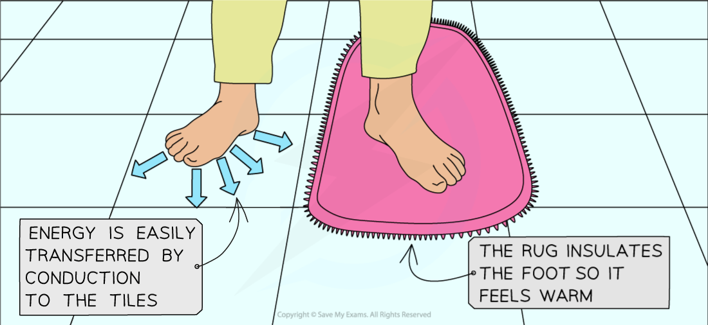
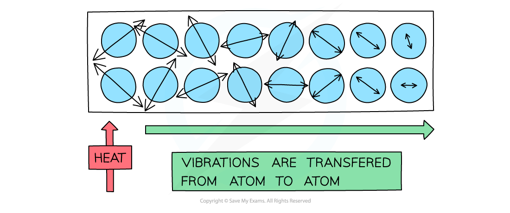
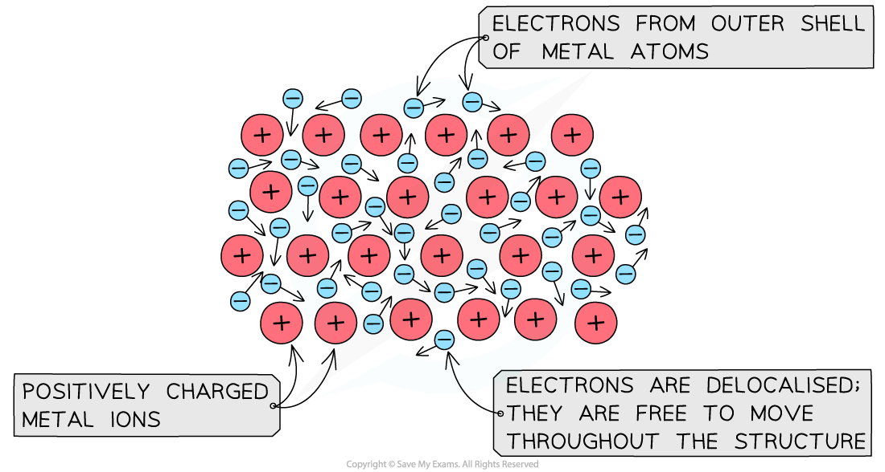
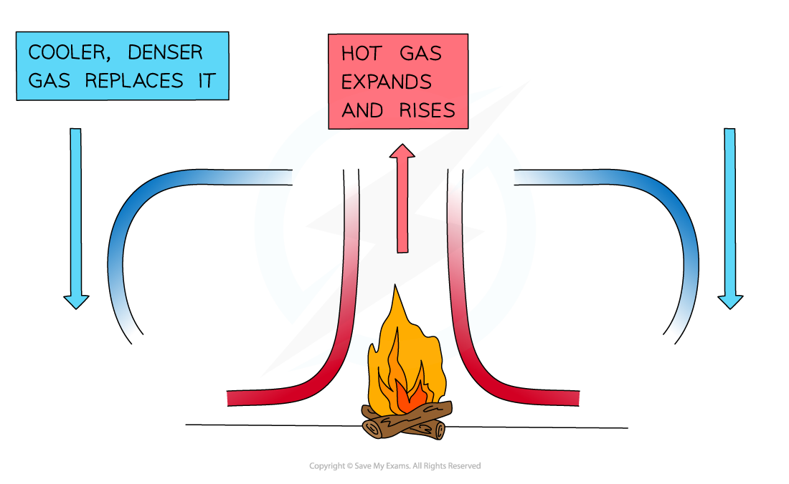
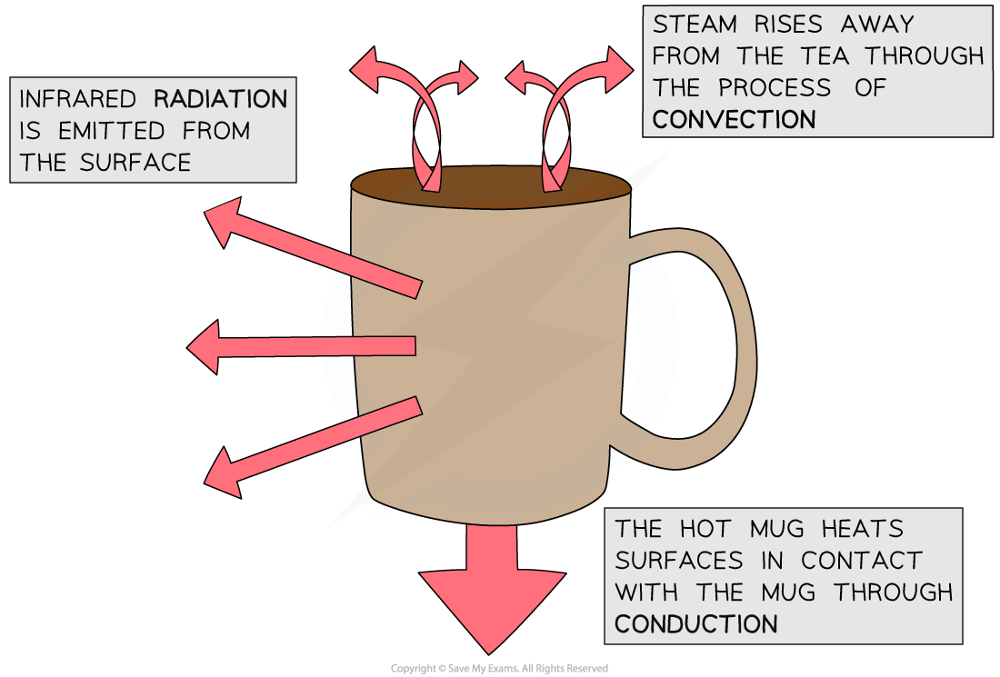

# Conduction, Convection & Radiation

## Conduction

> **Spec point** — `spcpt_mwWRBK6zCj3WnhdH` · describe how thermal energy transfer may take place by conduction, convection and radiation

## Conduction

### Conduction, convection and radiation

- Energy is transferred by heating and radiation via the processes of:

  - Conduction
  - Convection
  - Radiation

### Conduction, conductors and insulators

- Conduction is the main method of energy transfer by heating in solids

  - Metals are extremely good thermal **conductors**
  - A material is a good conductor if it transfers energy by heating

- Non-metals are poor thermal conductors whilst liquids and gases are extremely poor thermal conductors

  - Poor conductors are called **insulators **
  - A material is a good insulator if it does not transfer energy by heating
  - **Insulators **are used to **prevent **energy transfer by **conduction**

#### Example of a conductor and an insulator

***Energy is transferred by heating from the hotter foot to the cooler tiles by conduction***** **

- Materials containing small pockets of **trapped air** are especially good at **insulating** because air is a gas and hence a poor conductor

  - The air is trapped, so it cannot move and form a convection current, therefore energy transfer by conduction occurs, but it happens very slowly since air is a gas
- When a substance is heated, the atoms **start to move around (vibrate) more**

  - As they do so they** bump into each other**, transferring energy from atom to atom

#### Conduction in solids

***Conduction: the atoms in a solid vibrate and bump into each other***

- Metals are especially good at conducting heat as the **delocalised electrons** can collide with the atoms, helping to transfer the** vibrations** through the material and hence transfer heat better

#### Conduction in metals

***Delocalised electrons in metals speed up thermal conduction in metals***

> **Exam Hint**
> Make sure you learn the key terms in this topic and are comfortable using them. You may be asked to explain how conduction, convection or radiation transfers energy.

## Convection

> **Spec point** — `spcpt_vn3KzQ4mktt3rSJF` · explain the role of convection in everyday phenomena

## Convection

- Convection is the main way that thermal energy is transferred through **liquids **and** gases**

  - Convection **cannot occur in solids**

### Convection currents

- When a fluid (a liquid or a gas) is heated:

  - The molecules push each other apart, making the fluid** expand**
  - This makes the hot fluid **less dense** than the surroundings
  - The **hot fluid rises**, and the cooler (surrounding) fluid moves in to take its place
  - Eventually, the hot fluid cools, contracts and sinks back down again
  - The resulting motion is called a **convection current**

***A convection current caused by heating from the fire***

> **Exam Hint**
> If a question refers to thermal energy transfers and a **liquid or gas** (that isn’t trapped) then make sure your answer mentions that convection currents will probably form!

## Thermal radiation

> **Spec point** — `spcpt_bfY7Z7FCwWdtMSsy` · explain how emission and absorption of radiation are related to surface and temperature

## Thermal radiation

- All bodies (objects), no matter what temperature, emit infrared radiation
- The **hotter** object, the **more** infrared radiation it radiates in a given time

***The infrared emitted from a hot object can be detected using a special camera***

- The colour of an object affects how well it **emits** and **absorbs** thermal radiation

  - Black objects are the **best** at emitting and absorbing thermal radiation
  - Shiny objects are the **worst** at emitting and absorbing thermal radiation

- The table below summarises the absorbing and emitting abilities of different colours:

#### Table of the effect of coloured surfaces on absorbing and emitting ability

| **Colour** | **Absorbing** | **Emitting** |
|---|---|---|
| Black | Good absorber | Good emitter |
| Dull/dark | Reasonable absorber | Reasonable emitter |
| White | Poor absorber | Poor emitter |
| Shiny | Very poor absorber (it reflects) | Very poor emitter |

#### Conduction, convection and radiation in a mug of coffee

- For a mug of hot coffee:

  - Energy is transferred **by radiation** from the surface to the mug to the surroundings
  
    - Due to the **infrared radiation** being emitted from its surface
    - All objects (above 0 K) emit infrared radiation, but the hotter an object is, the more IR radiation it emits

- Energy is transferred** by heating** from the surface of the coffee to the surroundings

  - The most energetic particles of the coffee evaporate setting up a **convection** current

- Energy is transferred **by heating** from the bottom of the mug to any surface it is in contact with, such as a table

  - This energy transfer happens by **conduction**

***Energy is transferred by conduction, convection and radiation in a mug of hot coffee***

*** ***

- Objects will **continue **to lose heat until they reach **thermal equilibrium** (equal temperature) with their surroundings

  - For example, a mug of hot coffee will cool down until it reaches room temperature

> **Exam Hint**
> If a question refers to the colour of something (**black, white or shiny**) then the answer will probably have something to do with thermal radiation!
> 
> If the question involves a **vacuum** (empty space), then remember to mention **radiation!** Because conduction and convection require particles to transfer energy!
