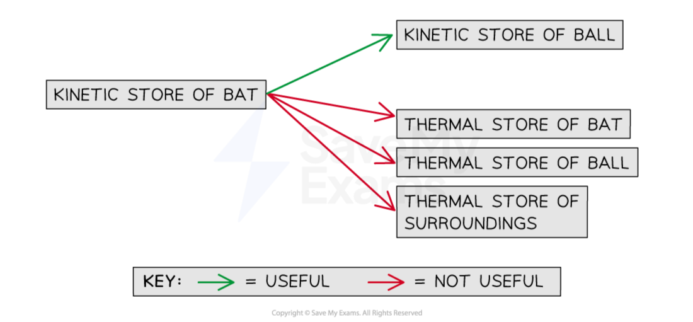
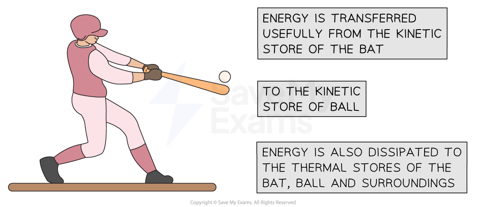
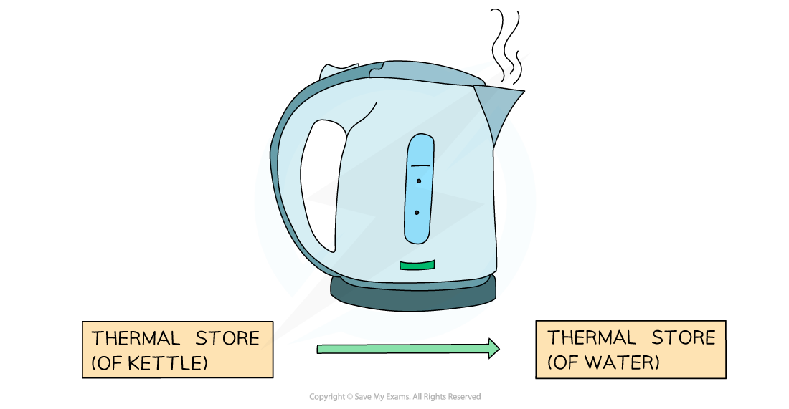
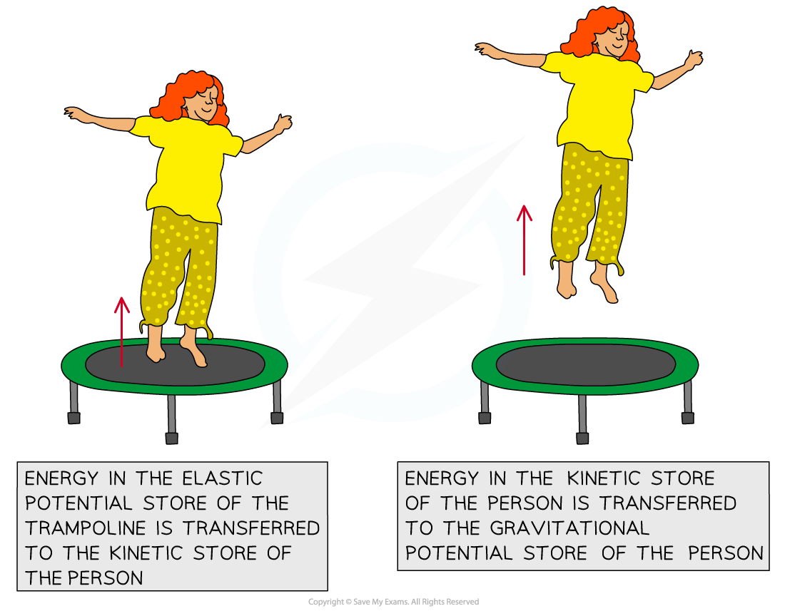

# Conservation of Energy

## Conservation of energy

> **Spec point** — `spcpt_XGW4XZFv89QRJQ5Z` · use the principle of conservation of energy

## Conservation of energy

### What is the principle of conservation of energy?

- The principle of conservation of energy states that:

**Energy cannot be created or destroyed, it can only be transferred from one store to another**

- This means the total amount of energy in a** closed system** remains **constant**
- The **total energy **transferred **in**to a system must be **equal** to the **total energy** transferred **out **of the system

- Therefore, energy is never 'lost' but it can be transferred to the surroundings

  - Energy can be **dissipated **(spread out) to the surroundings by heating and radiation
  - Dissipated energy transfers are often **not useful**, and can then be described as **wasted **energy

### Examples of the principle of conservation of energy

#### Example 1: a bat hitting a ball

- The moving bat has energy in its **kinetic **store
- Some of that energy is transferred **usefully** to the **kinetic** store of the ball
- Some of that energy is transferred from the **kinetic **store of the bat to the **thermal **store of the ball **mechanically **due to the impact of the bat on the ball

  - This energy transfer is not useful; the energy is **wasted**
- Some of that energy is **dissipated** by **heating** to the **thermal **store of the bat, the ball, and the surroundings

  - This energy transfer is not useful; the energy is **wasted**

***The principle of conservation of energy applied to a bat hitting a ball***

#### Example 2: Boiling Water in a Kettle

- When an electric kettle boils water, **energy** is transferred **electrically** from the mains supply to the **thermal store** of the heating element inside the kettle
- As the heating element gets hotter, **energy** is transferred **by heating** to the **thermal store** of the water

- Some of the energy is transferred to the **thermal** store of the plastic kettle

  - This energy transfer is not useful; the energy is **wasted**
- And some energy is **dissipated **to the **thermal store** of the surroundings due to the air around the kettle being heated

  - This energy transfer is not useful; the energy is **wasted**

***The principle of conservation of energy applied to a kettle boiling water***

#### Example 3: Trampoline

- Whilst jumping, the person has energy in their **kinetic** store
- When the person lands on the trampoline, most of that energy is transferred to the **elastic potential **store of the trampoline
- That energy is transferred usefully back to the** kinetic** store of the person as they bounce upwards
- Energy is transferred from the kinetic store of the person to the **gravitational potential** store of the person as they gain height
- Some of the energy is dissipated **by heating** to the **thermal **store of the surroundings (the person, the trampoline and the air)

- The useful energy transfers taking place are:

elastic potential energy ➝ kinetic energy ➝ gravitational potential energy

***The principle of conservation of energy applied to a person jumping on a trampoline***
