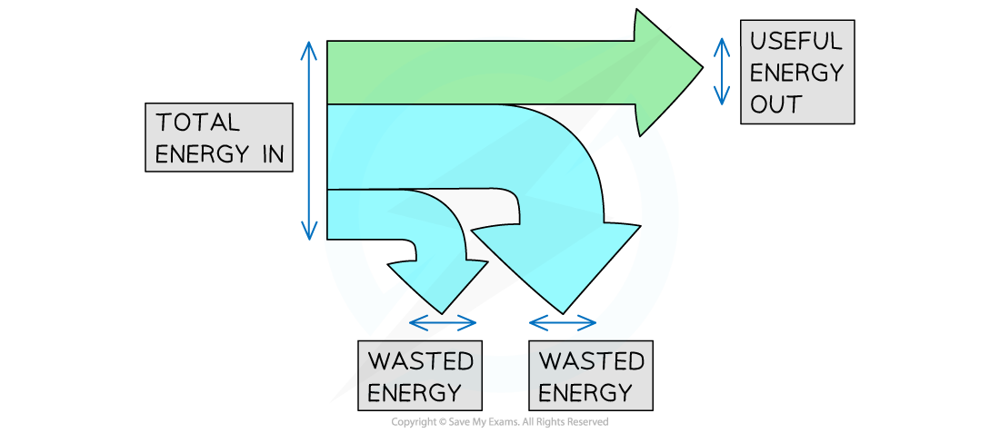
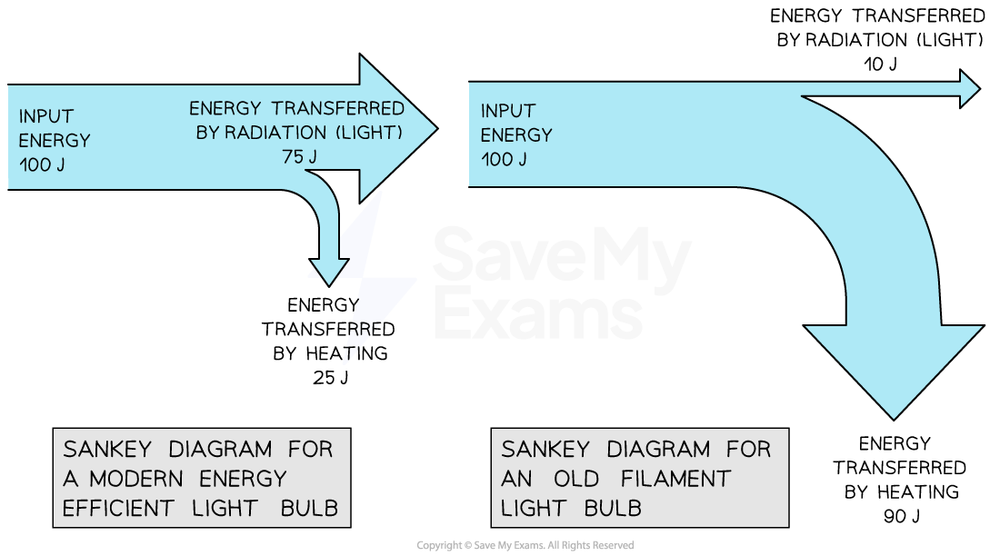

# Efficiency

## Efficiency

> **Spec point** — `spcpt_DD7SwFQWQ6h2b6fY` · know and use the relationship between efficiency, useful energy output and total energy output: 
efficiency = useful energy output / total energy output × 100%

## Efficiency

### What is efficiency in an energy transfer?

- The **efficiency **of a system is a measure of the amount of **wasted energy** in an energy transfer
- Efficiency is defined as:

**The ratio of the useful energy output from a system to its total energy output**

- If a system has **high** efficiency, this means most of the energy transferred is **useful**
- If a system has **low** efficiency, this means most of the energy transferred is **wasted**

### The equation for efficiency

- Efficiency is represented as a percentage
- The equation for efficiency is:

`efficiency space equals fraction numerator space useful space energy space output over denominator total space energy space output end fraction space cross times space 100 percent sign`

- Total energy output is equal to total energy input due to the principle of conservation of energy

**total energy input = total energy output**

- Total energy output is the sum of the useful energy output and the wasted energy

**total energy output = useful energy output + wasted energy **

> **Worked Example**
> The blades of a fan are turned by an electric motor. In one second, 300 J of energy is transferred electrically from the mains supply. 85 J is wasted due to friction and sound.
> 
> Calculate the efficiency of the motor.
> 
> **Step 1: List the known quantities**
> 
> - Total energy input = 300 J
> - Total wasted energy = 85 J
> 
> **Step 2: State the equation for efficiency**
> 
> `efficiency space equals fraction numerator space useful space energy space output over denominator total space energy space output end fraction space cross times space 100 percent sign`
> 
> **Step 3: Determine total energy output**
> 
> - Due to the conservation of energy:
> 
> total energy input = total energy output
> 
> - Therefore, total energy output = 300 J
> 
> **Step 4: Calculate the useful energy output**
> 
> total energy output = useful energy output + wasted energy
> 
> useful energy output = total energy output − wasted energy
> 
> useful energy output = 300 − 85  = 215 J
> 
> **Step 5: Substitute these values into the equation for efficiency**
> 
> `efficiency space equals fraction numerator space useful space energy space output over denominator total space energy space output end fraction space cross times space 100 percent sign`
> 
> `efficiency space equals fraction numerator space 215 space over denominator 300 end fraction space cross times space 100 percent sign`
> 
> `efficiency space equals space 72 percent sign`

> **Exam Hint**
> The equation for efficiency can be used to give a ratio (between 0 and 1) or percentage (between 0 and 100%)
> 
> If the question asks for efficiency as a ratio, give your answer as a fraction or decimal (do not multiply by 100%)
> 
> If the answer is required as a percentage, remember to multiply the ratio by 100 to convert it:
> 
> - if the ratio = 0.25, percentage = 0.25 × 100 = 25 %
> 
> Remember that efficiency has** no units **(only %)

## Sankey diagrams

> **Spec point** — `spcpt_mdx5cRjpSyjxCmxw` · describe a variety of everyday and scientific devices and situations, explaining the transfer of the input energy in terms of the above relationship, including their representation by Sankey diagrams

## Sankey diagrams

### What are Sankey diagrams?

- **Sankey diagrams** are visual representations of energy transfers

  - Sankey diagrams are characterised by the splitting arrows that show the proportions of the energy transfers taking place

- The different parts of the arrow in a Sankey diagram represent the different energy transfers:

  - The left-hand side of the arrow (the flat end) represents the energy transferred **into **the system
  - The straight arrow pointing to the right represents the energy that ends up in the desired store; this is the **useful energy output**
  - The arrows that bend away represent the **wasted energy**

#### Example of a Sankey diagram

***Total energy in, wasted energy and useful energy out shown on a Sankey diagram***

- The width of each arrow on a Sankey diagram is proportional to the amount of energy being transferred
- As a result of the conversation of energy:

**Total energy in = total energy out**

** Total energy in = Useful energy out + Wasted energy**

- A Sankey diagram for a modern efficient light bulb will look very different from that for an old filament light bulb
- A more efficient light bulb has **less** wasted energy

  - This is shown by the smaller arrow downwards representing the heat energy

#### Sankey diagram of light bulbs

***Sankey diagram for modern vs. old filament light bulb***

> **Worked Example**
> An electric motor is used to lift a weight. The Sankey diagram below represents the energy transfers in the system.
> 
> 
> 
> Calculate the amount of wasted energy.
> 
> **Answer:**
> 
> **Step 1: State the conservation of energy**
> 
> - Energy cannot be created or destroyed, it can only be transferred from one store to another
> - This means that:
> 
> total energy in = useful energy out + wasted energy
> 
> **Step 2: Rearrange the equation for the wasted energy**
> 
> wasted energy = total energy in – useful energy out
> 
> **Step 3: Substitute the values from the diagram**
> 
> 500 – 120 = **380 J**

> **Exam Hint**
> **How to draw a Sankey diagram**
> 
> - Drawing a good Sankey diagram takes practice.
> - Start by planning your diagram using graph paper or a ruler:
> 
>   - How many squares or mm wide will you make the input arrow?
>   - How many squares or mm wide will the useful energy out arrow need to be?
>   - How many squares or mm wide must the wasted arrow be?
> - Next, start drawing the diagram one step at a time:
> 
>   - Draw the left-hand side of the arrow, along with the line going across the top
>   - Next add the useful energy out arrow, making sure it is the correct width
>   - Now carefully mark the start and end of the wasted arrow – make sure your marks are the correct distance apart
>   - Finally join the markings together, finishing the wasted energy arrow
