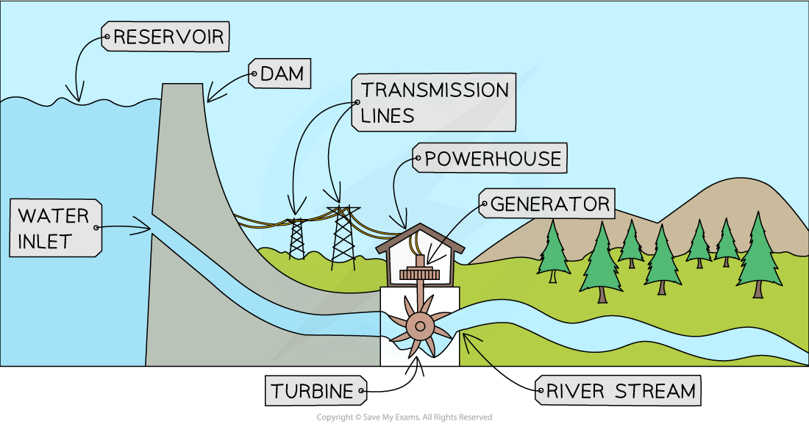
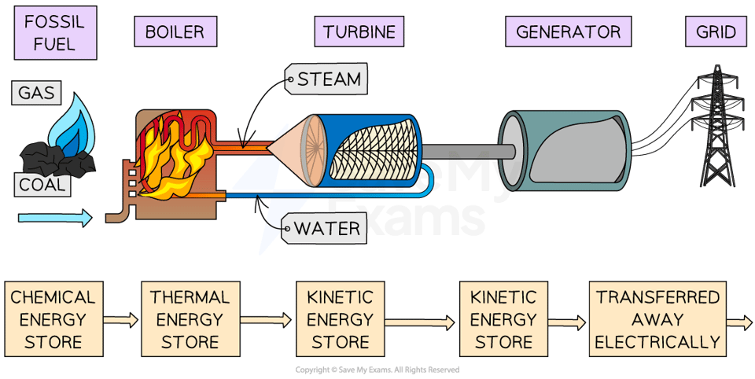
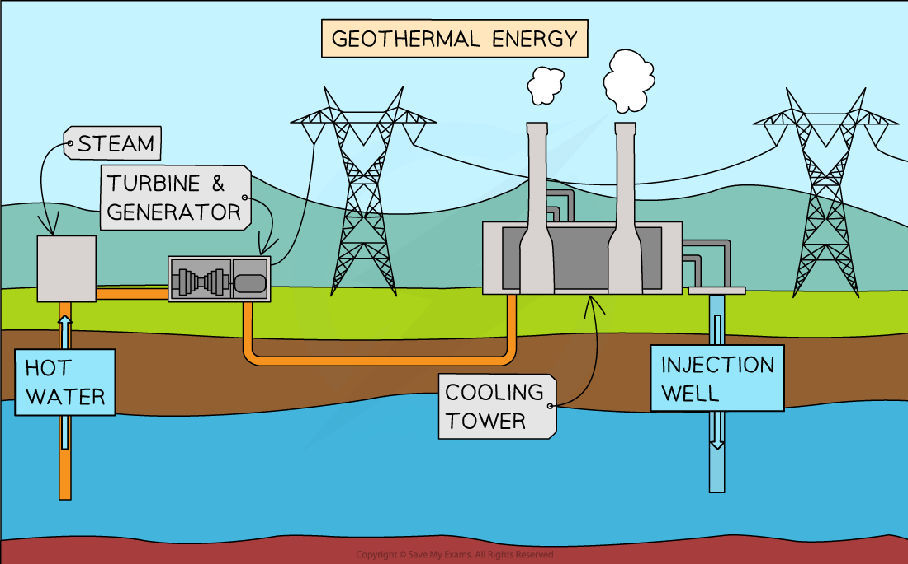

# Energy Resources

## Energy resources

> **Spec point** — `spcpt_KFXY43ph9JPC7Nbq` · describe the energy transfers involved in generating electricity using: 
• wind
• water
• geothermal resources
• solar heating systems
• solar cells
• fossil fuels
• nuclear power (physics only)

## Energy resources

- **Energy resources** in physics are large stores of energy that can be used to** generate electricity** and heat homes and businesses

  - There are sometimes also called energy sources

### Renewable and non-renewable energy resources

- Some electricity drawn from the **National Grid** is generated from **non-renewable **resources, and some is generated from **renewable** resources

- A** renewable** energy resource is defined as

**An energy source that is replenished at a faster rate than the rate at which it is being used**

- As a result of this, a renewable energy resource is one that will not run out
- Renewable resources include:

  - Solar energy
  - Wind
  - Bio-fuel
  - Hydroelectricity
  - Geothermal
  - Tidal
- **Non-renewable** energy resources include:

  - Fossil Fuels (coal, oil and natural gas)
  - Nuclear fuel

### Generating electricity from energy resources

- Electricity is generated in very similar ways, no matter what energy resource is used
- A **turbine** is turned, which turns a **generator**, which generates electricity
- The element that differs is **how** the turbine is made to turn

- **Water** can be used to turn turbines in the case of hydroelectric dams, tidal barrages and tidal turbines
- Energy in the **kinetic store** of the flowing water is transferred to the** kinetic store** of the turbine, then to the **kinetic store** of the generator and transferred **electrically **to the National Grid

#### Hydroelectric dam

***A hydroelectric dam transfers energy from the gravitational potential energy store of the water to its kinetic energy store mechanically to turn a turbine***

- **Fossil fuels** can be combusted to heat water, and the** steam** produced can be used to turn turbines
- Energy from the **chemical store** of the fuel is transferred to the **thermal store** of the water, which is then transferred to the **kinetic store** of the turbine, and then transferred to the **kinetic store** of the generator and then transferred **electrically **to the National Grid

#### Fossil fuel electricity generation

***The energy transfers involved in the production of electricity from fossil fuels***

- **Nuclear fuel** can also be used to heat water to produce **steam** to turn turbines
- The energy transfers involved in electricity generation from a nuclear power plant are:

Nuclear store of fuel → thermal store of water → kinetic store of turbine → kinetic store of generator

- **Geothermal** energy is another way to produce the **steam** that turns the turbines
- Water is pumped down to the hot rocks and returns through a fissure as steam

#### Geothermal electricity generation

***Cold water is heated by the rocks and returned as hot water or steam which can be used to turn turbines to generate electricity***

- Generating energy reliably on a national or global level requires the use of a range of different energy resources, as listed in the table below:

#### Table of energy resources

| **Energy resource** | **Description** |
|---|---|
| Fossil fuels | Fossil fuels are combusted to heat water to produce steam that turns turbines to generate electricity |
| Nuclear | Nuclear fuels are reacted to heat water to produce steam that turns turbines to generate electricity |
| Bio fuels | Crops are grown to produce ethanol or methane, which can be used in place of fossil fuels |
| Wind | Wind is used to turn turbines to generate electricity |
| Hydroelectric | Water is stored at a height, and when released the moving water is used to turn turbines to generate electricity |
| Tidal | Water is stored at a height (by a tidal barrage) at high and low tide, when released the moving water is used to turn turbines to generate electricity |
| Wave | The motion of the water due to waves is used to turn turbines to generate electricity |
| Geothermal | Hot rocks underground are used to heat water to produce steam that turns turbines to generate electricity |
| Solar cells | Solar cells use sunlight to generate electricity |
| Solar panels | Solar panels use sunlight to heat water in the panel to produce warm water for households |

> **Worked Example**
> Electricity can be generated by wind power.
> 
> Describe the energy transfers which occur when a wind turbine is used to generate electricity for the National Grid.
> 
> **Answer:**
> 
> **Step 1: Determine where the energy is transferred from **
> 
> - Energy is transferred from the kinetic store of the moving wind...
> 
> **Step 2: Determine the energy transfer involved as energy is transferred from the wind to the turbine**
> 
> - ...to the kinetic store of the turbine as the wind makes it turn.
> 
> **Step 3: Name the other energy transfers that occur in the process of generating electricity**
> 
> - Energy is transferred from the kinetic store of the turbine to the kinetic store of the generator and is transferred electrically to the National Grid.
