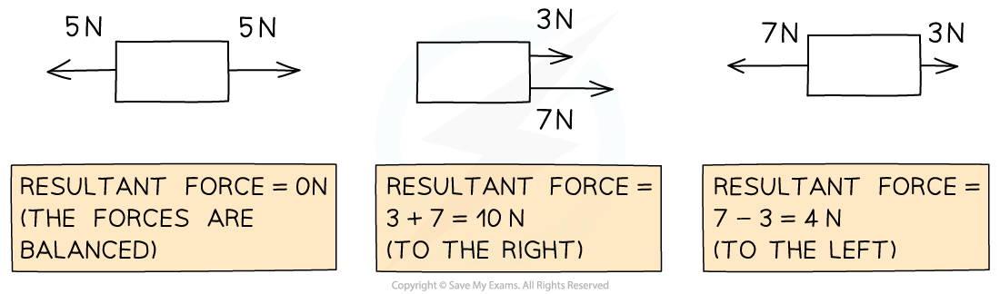
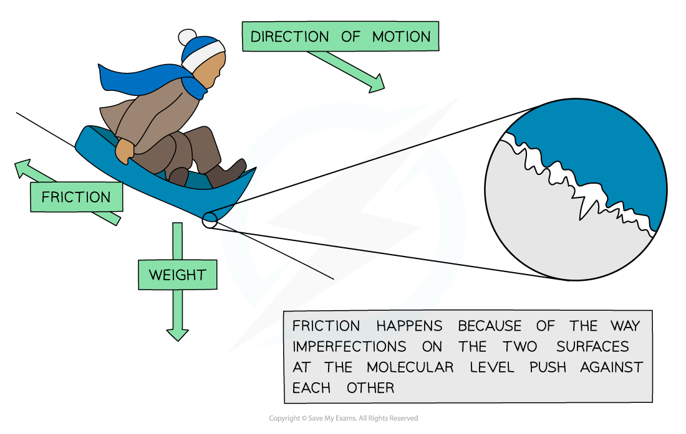

# Resultant Forces

## Calculating resultant force

> **Spec point** — `spcpt_cPV4byfHdtfCtcV4` · calculate the resultant force of forces that act along a line

## Calculating resultant force

### What is a resultant force?

- A **resultant force** is a single force that describes all of the forces operating on a body
- When multiple forces act on one object, the forces can be combined to produce one net force that describes the **combined action** of all of the forces
- This single resultant force determines:

  - The **direction** in which the object will move as a result of all of the forces
  - The **magnitude** of the net force experienced by the object

### Adding forces to find the resultant force

- Resultant forces can be calculated by adding all of the forces acting on the object

  - Forces working in opposite directions are **subtracted** from each other
  - Forces working in the same direction are **added** together

- If the forces acting in opposite directions are equal in size, then there will be no resultant force – the forces are said to be **balanced**

***Diagram showing the resultant forces on three different objects***

- Imagine the forces on the boxes as two people pushing on either side

  - In the first scenario, the two people are evenly matched - the box **doesn't move**
  - In the second scenario, the two people are pushing on the same side of the box, it moves to the right with their combined strength
  - In the third scenario, the two people are pushing against each other and are not evenly matched, so there is a **resultant force to the left**

> **Worked Example**
> Calculate the magnitude and direction of the resultant force in the diagram below.
> 
> 
> 
> **Answer:**
> 
> **Step 1: Add up all of the forces directed to the right**
> 
> 4 N + 8 N = 12 N
> 
> **Step 2: Subtract the forces on the right from the forces on the left**
> 
> 14 N – 12 N = 2 N
> 
> **Step 3: Evaluate the direction of the resultant force**
> 
> - The force to the left is **greater** than the force to the right therefore the resultant force is directed to the left
> 
> **Step 4: State the magnitude and direction of the resultant force**
> 
> - The resultant force is 2 N to the left

> **Exam Hint**
> When calculating resultant forces, always remember to provide **units** for your answer and to state whether the force is to the left, to the right, or maybe up or down. Always provide your final answer as a description of the **magnitude** and the **direction**, for example:
> 
> - Resultant Force = **4 N to the right**

## Friction

> **Spec point** — `spcpt_C68Rs82SXMQjQhXX` · know that friction is a force that opposes motion

## Friction

- Friction is defined as:

**A force which opposes the motion of an object**

- Frictional forces always act in the opposite direction to the object's motion
- Friction occurs when two (or more) surfaces rub against each other

  - At a molecular level, both surfaces contain **imperfections **- i.e. they are not perfectly smooth
  - These imperfections tend to push against each other

#### Friction acting between the surface of a sledge and the surface of the snow

***Friction is a force which opposes an objects motion, acting in the opposite direction to the motion of the object***

> **Exam Hint**
> Remember from the revision note [Types of Forces](https://www.savemyexams.com/igcse/physics/edexcel/19/revision-notes/1-forces-and-motion/1-2-forces-movement-and-changing-shape/1-2-1-types-of-forces/) that drag force is a type of friction that acts to oppose the motion of objects moving through a fluid (a liquid or a gas).
> 
> Air resistance is a type of drag force, and therefore a type of friction, that acts to oppose the motion of objects moving through air.
