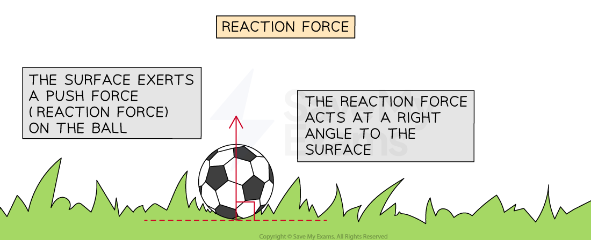
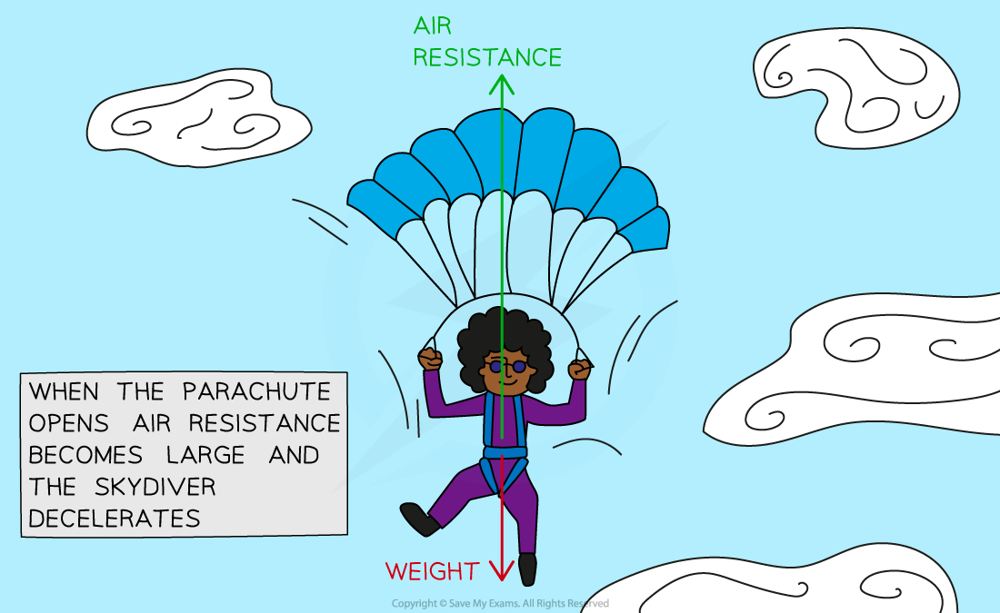
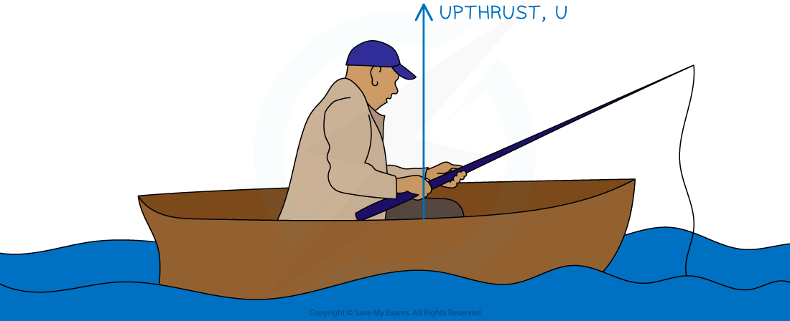
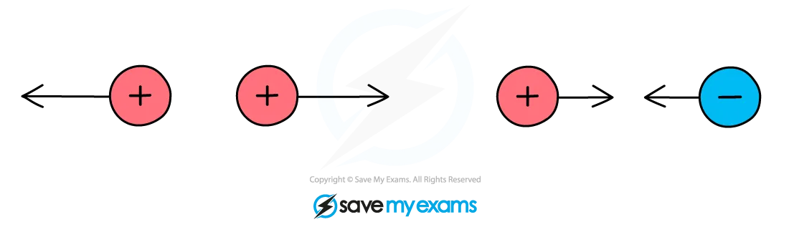
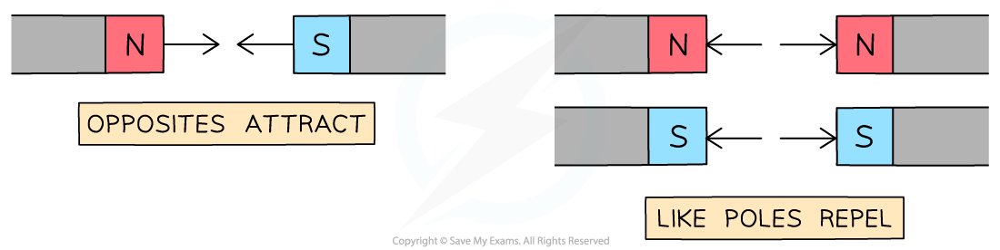
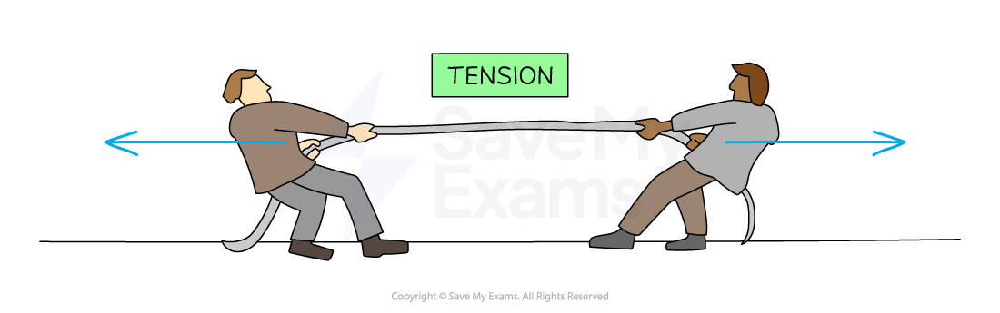
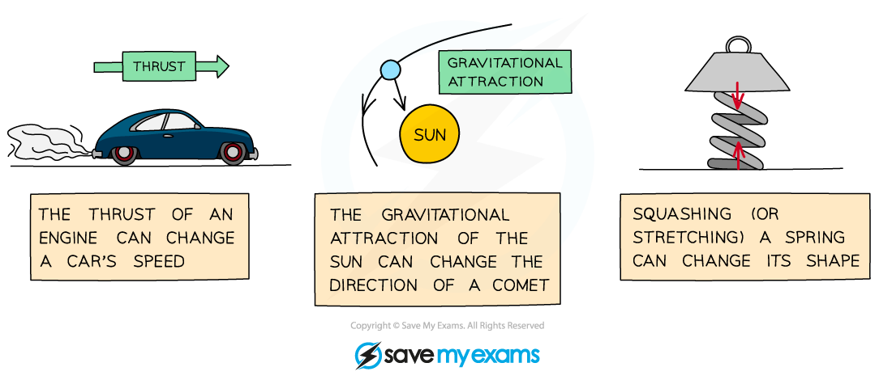

# Types of Forces

## Types of forces

> **Spec point** — `spcpt_xsXFBb3KKWT8QJ7J` · identify different types of force such as gravitational or electrostatic

## Types of forces

- A **force **is a **push** or **pull **that arises from the **interaction **between objects

- There are lots of different types of forces that occur when objects interact

### What are the different types of forces?

- **Gravitational **force (**weight**)

  - There is a **gravitational force** of attraction between all objects with **mass**
  - The more massive the object, the greater the gravitational force exerted by it
  - When a football is thrown (or kicked), the gravitational pull of the Earth on the football pulls it toward the (centre of the) Earth

- **Reaction** force

  - When an object rests on a surface, the **surface **exerts a push force on the **object**
  - This **reaction **force acts at **right angles** (perpendicular) to the surface
  - When a football rests on the horizontal surface of the grass, the grass exerts a push force (reaction force) vertically upwards on the football

#### Reaction force acting on a football

***The push force exerted on an object by a surface is called the reaction force***

- **Friction**

  - Frictional forces always **oppose **the **motion **of an object, causing it to **slow down**
  - Friction occurs when two **surfaces **move over one another
  - When a box is pushed across a carpet, the carpet exerts a frictional force on the box, slowing its motion

- **Drag** force

  - Drag force is a type of **frictional force** that occurs when an object moves through a **fluid **(a gas or a liquid)
  - The particles in the fluid **collide **with the object moving through it and **slow **its **motion**
  - When a pebble is thrown into water, the water molecules flow against its solid surface, causing it to slow down

- **Air resistance**

  - Air resistance is a specific type of **drag **force and is therefore also a **frictional **force
  - Air resistance occurs when particles of air **collide **with an object moving through it and **slows **its **motion**
  - When a skydiver opens their parachute, air resistance opposes their motion and reduces their speed so it is safe to land

#### Air resistance acting on a skydiver

***A skydiver uses air resistance to reduce their speed so that they can land safely***

- **Thrust**

  - Thrust is a force produced by an engine that **speeds up** the motion of an object
  - The engine of a car exerts a thrust force and increases its speed

- **Upthrust**

  - When an object is fully or partially **submerged **in a **fluid**, the fluid exerts an **upward-acting** push force on the object
  - A boat floats on a lake due to the **upthrust **exerted by the water on the boat
  - A ball held underwater will shoot upwards when released due to the upthrust exerted by the water pushing it back to the surface

#### Upthrust acting on a boat

***The water pushes up on the boat, this is the force of upthrust ***

- **Electrostatic **force

  - There is an **electrostatic **force between two objects with **charge**
  - **Like charges repel** one another, and **opposite charges attract** one another
  - When an electron gets close to a positively charged ion, the ion exerts a pull force on the electron (**attraction**)
  - When an electron gets close to another electron, the electrons experience a push force from one another (**repulsion**)

#### Electrostatic forces acting on charged particles

***Like charges experience a repulsive push force and opposite charges experience an attractive pull force ***

- **Magnetic** force

  - There is a **magnetic **force between objects with **magnetic poles**
  - **Like poles repel** one another, **opposite poles attract** one another
  - When a north pole gets close to a south pole, they experience a pull force from one another (**attraction**)
  - When a north pole gets close to a north pole, they experience a push force from one another (**repulsion**)

#### Magnetic forces acting on magnets

***Opposite poles experience an attractive pull force, and like poles experience a repulsive push force***

- **Tension**

  - Tension occurs in an object (like a rope or spring) that is **stretched**
  - When a **pull **force is exerted on **each end** of an object, **tension **acts across the length of the object
  - When two people pull a rope in opposite directions, tension acts along the rope and pulls back on each person

#### Tension force in a rope

***Two people exert a pull force on the rope from each end, creating tension in the rope***

> **Exam Hint**
> The force of gravitational attraction on an object is called its **weight**. Remember not to refer to this force as simply 'gravity', as this term can mean several different things, and examiners will probably mark it as wrong.
> 
> Similarly, when referring to **air resistance**, avoid using terms like 'wind resistance' (there is no such thing!) or 'air pressure', which is a different concept. **Drag** is an acceptable alternative to the force of air resistance because air resistance is a special type of drag.

## Effects of forces

> **Spec point** — `spcpt_8CPTRrf54RrjrXHK` · describe the effects of forces between bodies such as changes in speed, shape or direction

## Effects of forces

- When a force acts on an object, the force can affect the object in a variety of ways
- The object could:

  - change **speed**
  - change **direction**
  - change **shape**

- The effects of forces on an object often depend on the type of force acting

  - The push force (**thrust**) of an engine can cause a car to speed up, whilst the force exerted by the brakes (**friction**) can cause it to slow down
  - The gravitational pull of the Sun on a comet causes the comet to change direction
  - When two opposing forces push on each end of a spring, the spring changes shape (it **compresses**)

#### The effects of different forces on objects

***Forces can change the speed or direction of motion of an object, or even change its shape***
