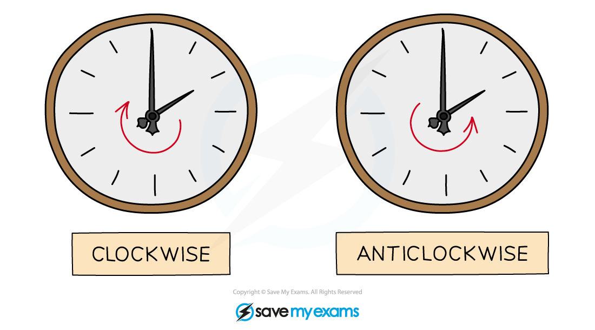
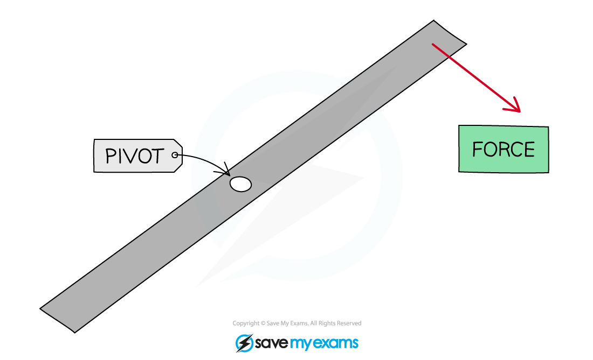
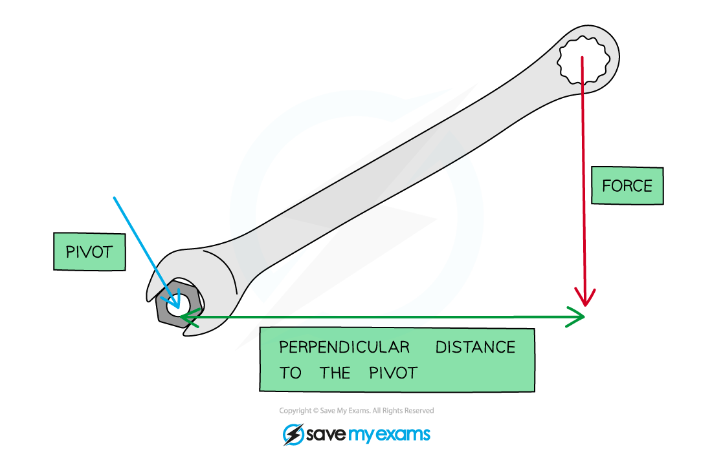
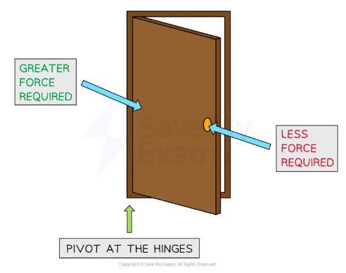

# Moments

## The moment of a force

> **Spec point** — `spcpt_tT4wvRSjRXCgWcyP` · know and use the relationship between the moment of a force and its perpendicular distance from the pivot: 
moment = force × perpendicular distance from the pivot (physics only)

## The moment of a force

- The **moment **of a force is the **turning effect** produced when a force is exerted on an object

- Examples of the rotation caused by the moment of a force are:

  - A child on a see-saw
  - Turning the handle of a spanner
  - A door opening and closing
  - Using a crane to move building supplies
  - Using a screwdriver to open a tin of paint
  - Turning a tap on and off
  - Picking up a wheelbarrow
  - Using scissors

- Forces can cause the **rotation** of an object about a fixed **pivot**
- This rotation can be **clockwise **or **anticlockwise**

#### Clockwise and anti-clockwise rotation

***Consider the hands of a clock when deciding if an object will rotate in a clockwise or anti-clockwise direction***

- A force applied on one side of the pivot will cause the object to rotate

#### An object rotating clockwise about a pivot

***The force applied will cause the object to rotate clockwise about the pivot***

- A **moment** is defined as:

**The turning effect of a force about a pivot**

- The size of a moment is defined by the equation:

***M***** = *****F***** × *****d***

- Where:

  - *M* = moment in newton metres (Nm)
  - *F* = force in newtons (N)
  - *d* = perpendicular distance of the force to the pivot in metres (m)

- The forces should be **perpendicular** to the distance from the pivot

  - For example, on a horizontal beam, the forces which will cause a moment are those directed upwards or downwards

#### The moment of a force exerted on a spanner

***The moment depends on the force and perpendicular distance to the pivot***

- **Increasing** the **distance** a force is applied from a pivot **decreases** the **force** required

  - If you try to push open a door right next to the hinge it is very difficult, as it requires a lot of force
  - If you push the door open at the side furthest from the hinge then it is much easier, as less force is required

#### Forces required to open a door

***A greater force is required to push open a door next to the hinges than at the door handle***

> **Exam Hint**
> The moment of a force is measured in newton metres (N m), but can also be newton centimetres (N cm) if the distance is measured in cm instead.
> 
> If your IGCSE exam question doesn't ask for a specific unit, always convert the distance into **metres**
