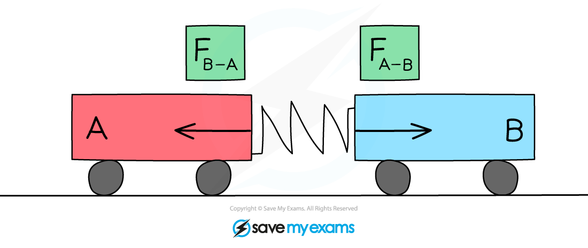

# Newton's Third Law

## Newton's third law

> **Spec point** — `spcpt_zjhSSnPyGSK8jQYw` · demonstrate an understanding of Newton’s third law (physics only)

## Newton's third law

### What is Newton's third law?

- **Newton's third law of motion** can be defined as follows:

**Whenever two objects interact, the forces they exert on each other are equal in magnitude and opposite in direction**

- Newton's third law explains the forces that enable someone to walk

  - The **foot **exerts a push force on the **ground**
  - The **ground **exerts a push force force on the **foot**
  - The forces are **equal **in **magnitude **and **opposite **in **direction**

#### Newton's third law of motion applied to walking

***The foot pushes the ground backwards, and the ground pushes the foot forwards. Newton's third law explains the forces that enable people to walk***

### Recognising Newton's third law

- Force diagrams can be used to represent Newton's third law
- Use the following** three rules** to help you identify a **third law pair**:

1. The two forces in a third law pair act on **different objects**
2. The two forces in a third law pair **always **are equal in size but act in opposite directions
3. The two forces are always the **same type**: weight, reaction force, etc.

> **Worked Example**
> A physics textbook is at rest on a table. Student A draws a free body force diagram for the book and labels the forces acting on it as weight and rection force.
> 
> 
> 
> Student A says the diagram is an example of Newton's third law of motion. Student B disagrees with Student A.
> 
> By referring to the vector diagram, state and explain who is correct.
> 
> **Answer:**
> 
> **Step 1: Identify the forces and objects involved**
> 
> - The gravitational pull of the Earth acts downwards on the book (weight) and the push force of the table acts upwards on the book (normal contact force)
> 
> **Step 2: State Newton's third law of motion**
> 
> - Whenever two objects interact, the forces they exert on each other are equal in magnitude and opposite in direction
> 
> **Step 3: Check if the diagram satisfies the two conditions for identifying Newton's third law**
> 
> - Newton's third law identifies pairs of equal and opposite forces, of the same type, acting on two different objects
> - In this example:
> 
>   - both forces are acting on the book
>   - the forces acting on the book are different forces: normal contact force and weight
>   - the image below shows how to apply Newton's third law correctly in this case, considering the pairs of forces acting:
> 
> 
> 
> - The third law pairs in this scenario would be:
> 
>   - The gravitational pull of the Earth on the book (weight) and the gravitational pull of the book on the Earth (weight)
>   - Both forces are the same type (weight)
>   - Both forces are equal and opposite
> - The arrows in the vector diagram of the book on the table are equal and opposite which is where lots of students get confused
> 
>   - This is because the forces are balanced
> 
> **Step 4: Conclude who is correct**
> 
> - In this case, **Student B is correct**
> 
>   - The vector diagram in the question is an example of Newton's first law
>   - In the vector diagram of the book on the table, both forces are acting on one object and the forces are not the same type

### Newton's third law in collisions

- According to **Newton's Third Law**:
- When two objects collide, both objects will react, generally causing one object to speed up (gain momentum) and the other object to slow down (lose momentum)

#### Newton's third law applied to a collision

***The force of Trolley A on Trolley B is equal and opposite to the force of Trolley B on Trolley A***

- Consider the collision between two trolleys, **A** and **B**:

  - When trolley **A** exerts a force on trolley **B**, trolley **B** will exert an equal force on trolley **A** in the opposite direction
- In this case:

**F****B–A**** = –F****A–B**

- While the forces are equal in magnitude and opposite in direction, the accelerations of the objects are not necessarily equal in magnitude
- From *F = ma*, acceleration depends upon both force and mass, this means:

  - For objects of equal mass, they will have equal accelerations
  - For objects of unequal mass, they will have unequal accelerations

> **Exam Hint**
> Remember that pairs of equal and opposite forces in Newton's third law act on **two different objects.** It's a really common mistake to confuse Newton's third law with Newton's first law, so applying this check will help you distinguish between them. Newton's first law involves forces acting on a **single** object.
> 
> These differences are shown in Scenario 1 (Newton's first law) vs. Scenario 2 (Newton's third law)
> 
> 
