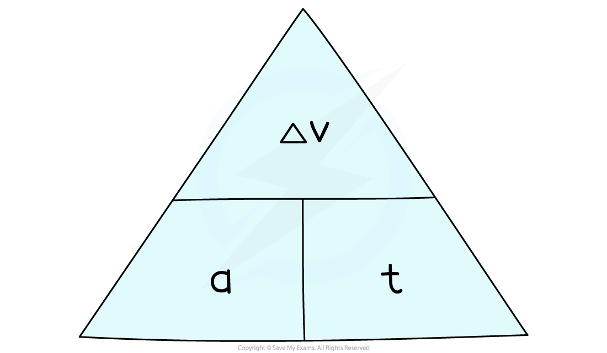
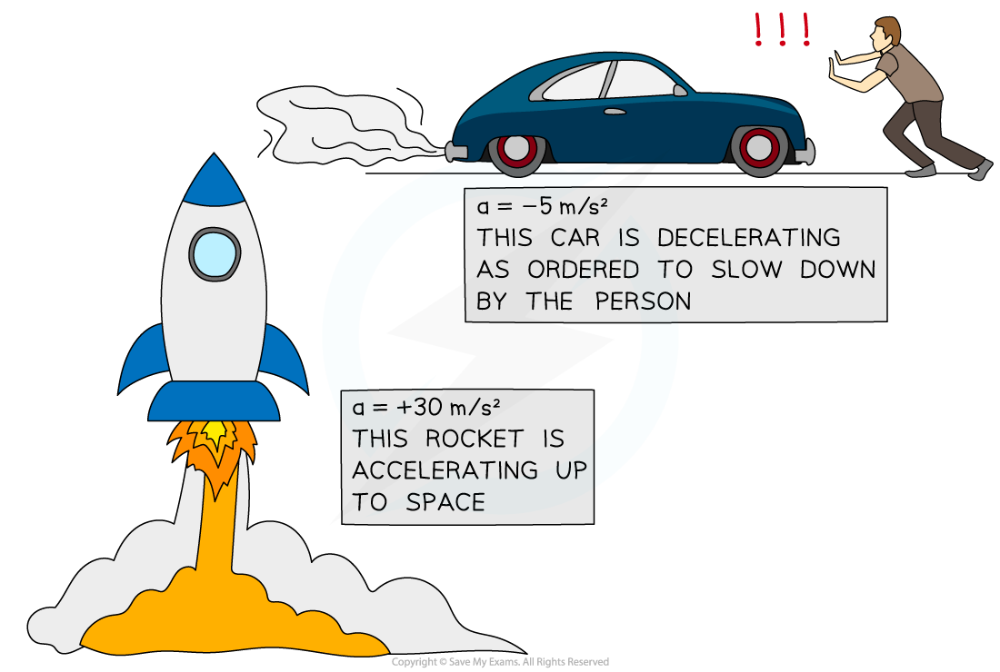

# Acceleration

## Acceleration

> **Spec point** — `spcpt_k2Mt2ksQ5m4nb6nZ` · know and use the relationship between acceleration, change in velocity and time taken: 
a = (v − u) / t

## Acceleration

### Rate of change in velocity

- **Acceleration** is defined as the **rate of change in velocity**

  - In other words, it describes how much an object's velocity **changes** every **second**
- The equation below is used to calculate the average acceleration of an object:

$\mathrm{acceleration}=\frac{\mathrm{change} \mathrm{in} \mathrm{velocity}}{\mathrm{time} \mathrm{taken}}$

$a=\frac{\Deltav}{t}$

- Where:

  - $a$ = acceleration in metres per second squared (m/s2)
  - $\Deltav$ = change in velocity in metres per second (m/s)
  - $t$* *= time taken in seconds (s)

#### Formula triangle for acceleration, change in velocity and time

***To use an equation triangle, simply cover up the value you wish to calculate and the structure of the equation will be revealed***

- The **change in velocity** is found by the **difference** between the initial and final velocity:

$\mathrm{change} \mathrm{in} \mathrm{velocity}=\mathrm{final} \mathrm{velocity}-\mathrm{initial} \mathrm{velocity}$

$\Deltav=v-u$

- Where:

  - $v$ = final velocity in metres per second (m/s)
  - $u$ = initial velocity in metres per second (m/s)
- Therefore, the acceleration, or the rate of change in velocity, equation can be written as:

`a space equals space fraction numerator open parentheses v space minus space u close parentheses over denominator t end fraction`

### Speeding up and slowing down

- An object that speeds up is **accelerating**
- An object that slows down is **decelerating**
- The **acceleration** of an object can be **positive** or **negative**, depending on whether the object is speeding up or slowing down

  - If an object is **speeding up**, its acceleration is **positive**
  - If an object is **slowing down**, its acceleration is **negative** (also known as **deceleration**)

#### Examples of acceleration and deceleration

***A rocket speeding up (accelerating) and a car slowing down (decelerating)***

> **Worked Example**
> A Japanese bullet train decelerates at a constant rate in a straight line. The velocity of the train decreases from 50 m/s to 42 m/s in 30 seconds.
> 
> (a) Calculate the change in velocity of the train.
> 
> (b) Calculate the deceleration of the train, and explain how your answer shows the train is slowing down.
> 
> **Answer:**
> 
> **Part (a)**
> 
> **Step 1: List the known quantities**
> 
> - Initial velocity, $u=50m/s$
> - Final velocity, $v=42m/s$
> 
> **Step 2: Write the relevant equation**
> 
> $\Deltav=v-u$
> 
> **Step 3: Substitute values for final and initial velocity**
> 
> $\Deltav=42-50$
> 
> $\Deltav=-8m/s$
> 
> **Part (b)**
> 
> **Step 1: List the known quantities**
> 
> - Change in velocity, $\Deltav=-8m/s$
> - Time taken, $t=30s$
> 
> **Step 2: Write the relevant equation**
> 
> `a space equals space fraction numerator open parentheses v space minus space u close parentheses over denominator t end fraction space equals space fraction numerator increment v over denominator t end fraction`
> 
> **Step 3: Substitute the values for change in velocity and time**
> 
> $a=\frac{-8}{30}$
> 
> $a=-0.27m/s^{2}$
> 
> **Step 4: Interpret the value for deceleration**
> 
> - The answer is **negative**, which indicates the train is **slowing down**

> **Exam Hint**
> Remember, the units for acceleration are **metres per second squared**, m/s2
> 
> In other words, acceleration measures how much the velocity (in m/s) changes every second, m/s/s.
