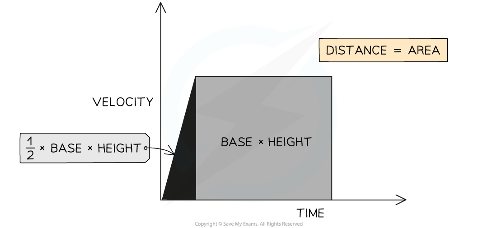
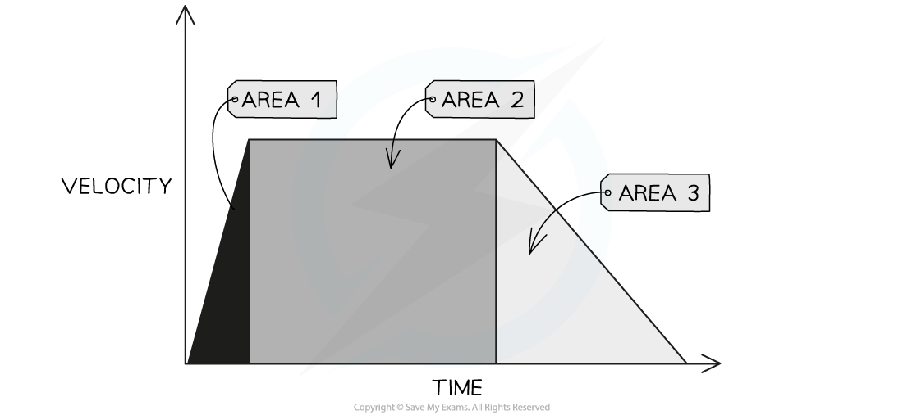

# Area under a Velocity-Time Graph

## Area under a velocity-time graph

> **Spec point** — `spcpt_9SkCRhsPjTJCM4g2` · determine the distance travelled from the area between a velocity−time graph and the time axis

## Area under a velocity-time graph

### How to find the area under a velocity-time graph

- The area under a **velocity-time graph** represents the **displacement** (or **distance travelled**) by an object

***The displacement, or distance travelled, is represented by the area beneath the graph***

*** ***

- If the area beneath the velocity-time graph forms a **triangle** (i.e. the object is **accelerating** or **decelerating**), then the area can be determined by using the following formula:

**Area = ½ × Base × Height**

- If the area beneath the velocity-time graph forms a **rectangle** (i.e. the object is moving at a **constant velocity**), then the area can be determined by using the following formula:

**Area = Base × Height**

### How to find distance from a velocity-time graph

- **Enclosed** areas under velocity-time graphs represent **total displacement** (or **total distance travelled**) in a time interval

***Three enclosed areas (two triangles and one rectangle) under this velocity-time graph represent the total distance travelled in the total time***

- If an object moves with **constant acceleration**, its velocity-time graph will consist of **straight lines**

  - In this case, calculate the distance travelled by working out the **area** of **enclosed rectangles and triangles**
  - The area of each enclosed section represents the distance travelled in that particular interval of time
  - The **total **distance travelled is the **sum **of all the individual enclosed areas

> **Worked Example**
> The velocity-time graph below shows a car journey that lasts for 160 seconds.
> 
> 
> 
> Calculate the total distance travelled by the car.
> 
> **Answer:**
> 
> **Step 1: Recall that the area under a velocity-time graph represents the distance travelled**
> 
> - In order to calculate the total distance travelled, the total area underneath the line must be determined
> 
> **Step 2: Identify each enclosed area**
> 
> - In this example, there are **five** enclosed areas under the line
> - These can be labelled as areas 1, 2, 3, 4 and 5, as shown in the image below:
> 
> 
> 
> **Step 3: Calculate the area of each enclosed shape under the line**
> 
> - Area 1 = area of a triangle
> 
> $A_{1}=\frac{1}{2}\times\mathrm{base}\times\mathrm{height}$
> 
> $A_{1}=\frac{1}{2}\times40\times17.5$
> 
> $A_{1}=350m$
> 
> - Area 2 = area of a rectangle
> 
> $A_{2}=\mathrm{base}\times\mathrm{height}$
> 
> $A_{2}=30\times17.5$
> 
> $A_{2}=525m$
> 
> - Area 3 = area of a triangle
> 
> $A_{3}=\frac{1}{2}\times\mathrm{base}\times\mathrm{height}$
> 
> $A_{3}=\frac{1}{2}\times20\times7.5$
> 
> $A_{3}=75m$
> 
> - Area 4 = area of a rectangle
> 
> $A_{4}=\mathrm{base}\times\mathrm{height}$
> 
> $A_{4}=20\times17.5$
> 
> $A_{4}=350m$
> 
> - Area 5 = area of a triangle
> 
> $A_{5}=\frac{1}{2}\times\mathrm{base}\times\mathrm{height}$
> 
> $A_{5}=\frac{1}{2}\times70\times25$
> 
> $A_{5}=875m$
> 
> **Step 4: Calculate the total distance travelled by finding the total area under the line**
> 
> - Add up each of the five areas enclosed:
> 
> $\mathrm{total} \mathrm{distance}=A_{1}+A_{2}+A_{3}+A_{4}+A_{5}$
> 
> $\mathrm{total} \mathrm{distance}=350+525+75+350+875$
> 
> $\mathrm{total} \mathrm{distance}=2175m$

> **Exam Hint**
> Some areas will need to be split into a triangle and a rectangle to determine the area for a specific time interval, like areas 3 & 4 in the worked example above.
> 
> If you are asked to find the distance travelled for a specific time interval, then you just need to find the area of the section above that time interval.
> 
> For example, the distance travelled between 70 s and 90 s is the sum of Area 3 + Area 4
