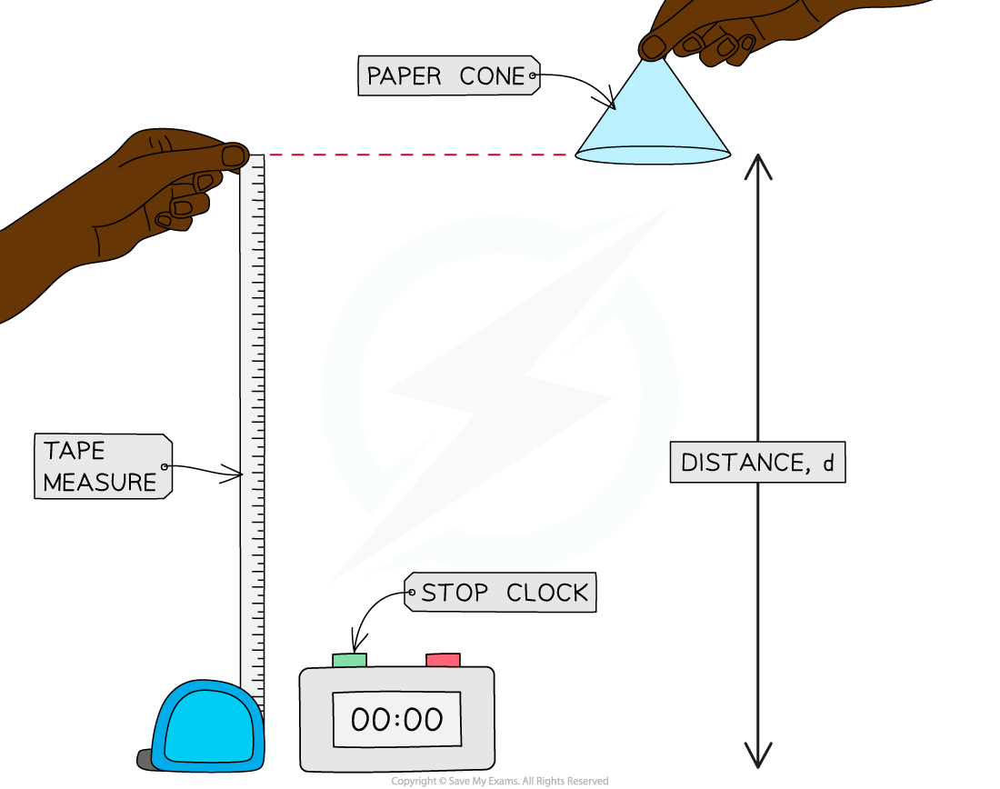

# Core Practical: Investigating Motion

## Core practical 1: investigating motion

> **Spec point** — `spcpt_spjN2m5GM3FNN3Yh` · Core practical 1: investigate the motion of everyday objects such as toy cars or tennis balls

## Core practical 1: Investigating motion

### Aim of the experiment

- The aim of this experiment is to investigate the motion of some everyday objects, by measuring their speed
- Examples of objects that could be used are:

  - a **paper cone**
  - a **tennis ball**
- Measuring speed **directly **is difficult to do; therefore, by measuring distance moved and time taken, the average speed of the object can be calculated

- This is just one method of measuring the speed of different objects - some methods involve the use of light gates to measure speed and acceleration, e.g. for a **toy car** moving down a slope

### Variables

- ***Independent variable*** = Distance, *d*
- ***Dependent variable*** = Time, *t*
- Control variables:

  - Use the same object (paper cone, tennis ball etc.) for each measurement

### Equipment

#### Equipment list

| **Equipment** | **Purpose** |
|---|---|
| Paper cone / tennis ball | To measure the speed of |
| Stop watch | To measure time taken |
| Tape measure / metre rule | To measure distance moved |

- ***Resolution*** of measuring equipment:

  - Ruler = 1 mm
  - Stop clock = 0.01 s

### Method

***Investigating the motion of a falling paper cone***

1. Measure out a height of 1.0 m using the tape measure or metre ruler
2. Drop the object (paper cone or tennis ball) from this height, which is the distance travelled by the object
3. Use the stop clock to measure how long the object takes to travel this distance
4. Record the distance travelled and time taken
5. Repeat steps 2-3 three times, calculating an average time taken for the object to fall a certain distance
6. Repeat steps 1-4 for heights of 1.2 m, 1.4 m, 1.6 m, and 1.8 m

### Results

#### Example results table

***A results table should include spaces for all the measurements taken and space to perform any necessary calculations, such as averages***

#### Analysis of results

- The average speed of the falling object can be calculated using the equation:

$\mathrm{average} \mathrm{speed}=\frac{\mathrm{distance} \mathrm{moved}}{\mathrm{time} \mathrm{taken}}$

- Where:

  - Average speed is measured in metres per second (m/s)
  - Distance moved is measured in metres (m)
  - Time taken is measured in seconds (s)

- Therefore, calculate the average speed at each distance by dividing the distance by the average time taken

### Evaluating the experiment

*Systematic errors*

- Make sure the measurements on the tape measure or metre rule are taken at eye level to avoid **parallax error**

- The average human reaction time is 0.25 s, which is equivalent to half a second per when starting and stopping the timer

  - This is likely to be significant when small intervals of time are measured
  - To reduce this systematic error, larger distances could be used resulting in larger time intervals
  - Using a **ball bearing** and an **electronic data logger**, like a trap door, is a good way to remove the error due to human **reaction time** for this experiment

- Consider using an electronic sensor, such as light gates, to obtain highly accurate measurements of time

  - The timer on a light gate starts and stops automatically as it passes the sensors positioned at the start and stop points

*Random errors*

- Ensure the experiment is done in a space with no draft or breeze, as this could affect the motion of the falling object

#### Safety considerations

- Place a mat or a soft material below any falling object to cushion its fall
