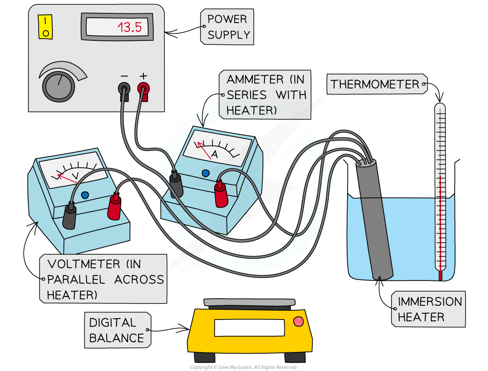
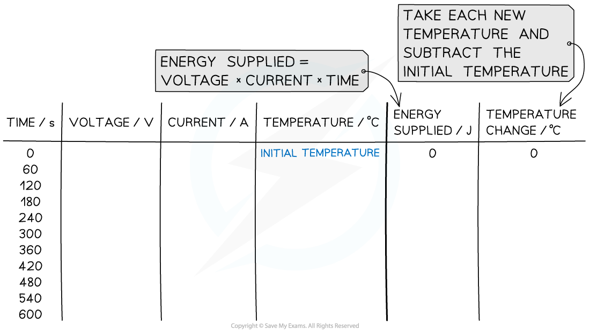
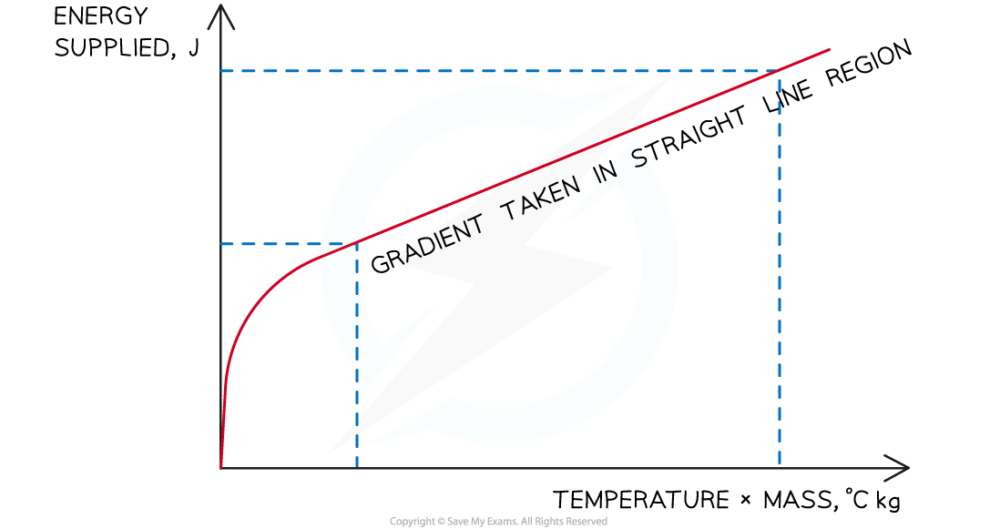

# Core Practical: Investigating Specific Heat Capacity

## Core practical 11: investigating specific heat capacity

> **Spec point** — `spcpt_CQknND628WkvmpsR` · Core practical 11: investigate the specific heat capacity of materials including water and some solids (physics only)

## Core practical 11: investigating specific heat capacity

### Aims of the experiment

- This experiment aims to determine the specific heat capacity of a solid and of water by measuring the energy required to increase the temperature of a known amount by one degree

### Variables

- ***Independent variable*** = Time, *t*
- ***Dependent variable*** = Temperature, *T*
- Control variables:

  - Potential difference from the power supply, *V*

### Equipment list

| **Equipment** | **Purpose** |
|---|---|
| Thermometer | To measure the temperature change of the solid / the water |
| Solid block of aluminium | To investigate temperature changes |
| Beaker of water (400 ml) | To investigate temperature changes |
| Immersion heater | To heat the solid / the water |
| Voltmeter | To measure the voltage across the immersion heater |
| Ammeter | To measure the current through the immersion heater |
| Power supply | To supply power to the immersion heater |
| Digital balance | To measure the mass of the solid / the water |
| Stopwatch | To time the heating of the solid / the water |

- ***Resolution*** of measuring equipment:

  - Thermometer = 0.1 °C
  - Voltmeter = 0.1 V
  - Ammeter = 0.1 A
  - Stopwatch = 0.01 s
  - Digital balance = 0.1 g

### Method

#### The experiment set up for the specific heat capacity practical

***Apparatus for heating water and measuring energy supplied***

1. Place the beaker on the digital balance and press 'zero'
2. Add approximately 250 ml of water and record the mass of the water using the digital balance
3. Place the immersion heater and thermometer in the water
4. Connect up the circuit as shown in the diagram, with the ammeter in series with the power supply and immersion heater, and the voltmeter in parallel with the immersion heater
5. Record the initial temperature of the water at time 0 s
6. Turn on the power supply, set it at approximately 10 V, and start the stopwatch
7. Record the voltage from the voltmeter and the current from the ammeter
8. Continue to record the temperature, voltage and current every 60 seconds for 10 minutes
9. Repeat steps 2-8, replacing the beaker of water for the solid block of aluminium and starting with recording its mass using the digital balance

### Results

#### An example of a results table for the specific heat capacity practical

***An example of a suitable results table for the specific heat capacity experiment looks like this. Energy supplies = voltage x current x time.***

#### Analysis of specific heat capacity practical results

- Calculate the energy supplied every 60 seconds using the electrical energy transfer formula: ***Electrical energy = voltage × current × time***
- This formula is explained in the [Calculating energy transfers](https://www.savemyexams.com/igcse/physics/edexcel/modular/24/unit-1/revision-notes/electricity/electrical-power-mains-electricity/calculating-energy-transfers/) revision note

- Calculate the temperature change by subtracting the temperature at time 0 s from the temperature recorded each minute
- Then use the specific heat capacity equation to calculate the specific heat capacity of the material

  - The specific heat capacity equation is explained in the revision note [Specific heat capacity](https://www.savemyexams.com/igcse/physics/edexcel/modular/24/unit-1/revision-notes/solids-liquids-gases/changes-of-state/specific-heat-capacity/)

- Plot a graph of the energy supplied (y-axis) against the temperature change multiplied by the average mass (x-axis)
- Calculate the gradient of this graph in the straight line region to obtain the specific heat capacity of the water or solid block

#### An example graph for the specific heat capacity practical

***The gradient of the graph is equal to the specific heat capacity of the substance, assuming a perfectly efficient immersion heater***

### Evaluating the specific heat capacity practical

***Systematic Errors:***

- Ensure the digital balance is set to zero before taking measurements of mass
- Some water may be lost to the surroundings by evaporation. Calculate an average mass of water (using the mass before the experiment and the mass after) to account for this
- Remember to only take gradients on the straight-line region

  - Before this point the energy supplied is being used to heat the immersion heater itself

***Random Errors:***

- Stir the water constantly whilst heating it to ensure the temperature measured is the temperature throughout the fluid
- When the current or voltage values appear to be changing between two values next to one another then be consistent in choosing the higher value

#### Safety considerations for the specific heat capacity practical

- The immersion heater will get very **hot**

  - Make sure not to touch it, and have a heatproof mat ready to place it on
- Make sure that the immersion heater is connected to a **Direct Current** supply
- The beaker may become **unstable** with an immersion heater and thermometer resting in it

  - If you feel this is the case then use a clamp stand to hold both
- Wear goggles while heating water
- Make sure to stand up during the whole experiment, to react quickly to any spills

> **Exam Hint**
> Although there is a lot of detail here, if you can begin any questions about this experiment by writing down the equation for specific heat capacity then you will have given yourself some clues about how best to proceedTaking a gradient is a more reliable way of determining an answer than just using a single value, so take time to understand the process of plotting graphs and using their gradients to make conclusions
