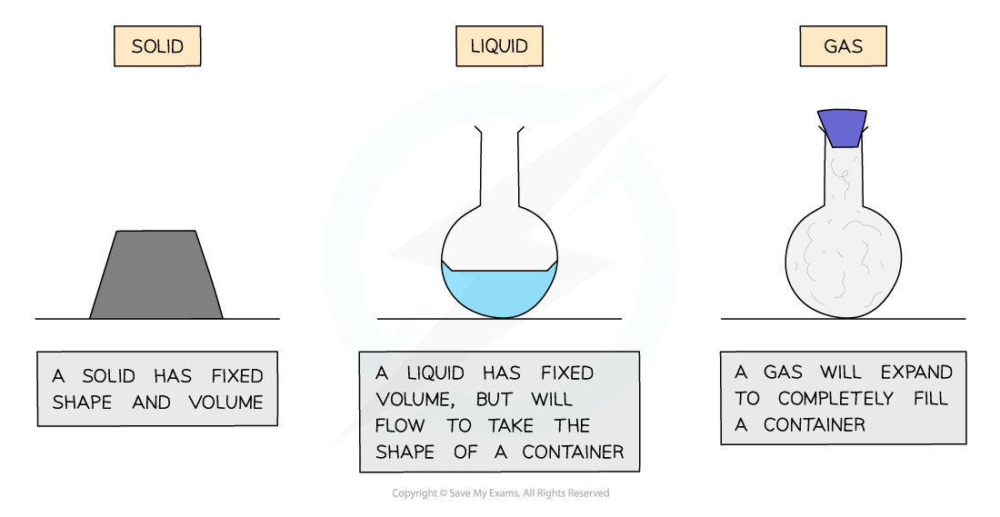

# Solids, Liquids & Gases

## Solids, liquids & gases

> **Spec point** — `spcpt_MYfJQPfbBkVcR7wh` · describe the arrangement and motion of particles in solids, liquids and gases (physics only)

## Solids, liquids & gases

- There are three different states of matter: **solid**, **liquid**, or **gas**

### Solid state of matter

- In a solid state of matter:

  - The particles are **closely packed**
  - The particles **vibrate** about fixed positions
- Solids have:

  - A definite **shape** (they are **rigid**)
  - A definite **volume**

### Liquid state of matter

- In a liquid state of matter:

  - The particles are **closely packed**
  - The particles can** flow **over one another
- Liquids have:

  - No definite shape – they are able to **flow** and will take the shape of a container
  - A definite **volume**

### Gas state of matter

- In a gas state of matter:

  - The particles are **far apart**
  - The particles move **randomly**
- Gases have:

  - No definite shape – they will take the shape of their container
  - No fixed volume – if placed in an evacuated container they will expand to fill the container
- Gases are highly **compressible**, this is because:

  - There are large **gaps** between the particles
  - It is easier to **push** the particles closer together than in solids or liquids

#### The three states of matter

***Diagram showing the three states of matter in terms of shape and volume***

#### Properties of states of matter

| **State** | **Solid** | **Liquid** | **Gas** |
|---|---|---|---|
| Density | High | Medium | Low |
| Arrangement of particles | Regular pattern | Randomly arranged | Randomly arranged |
| Movement of particles | Vibrate around a fixed position | Move around each other | Move quickly in all directions |
| Energy of particles | Low energy | Greater energy | Highest energy |

> **Exam Hint**
> In your exam, you may be asked to explain the particle arrangement and behaviour for each state of matter. These are easy marks but make sure you learn all the possible things you can say.
