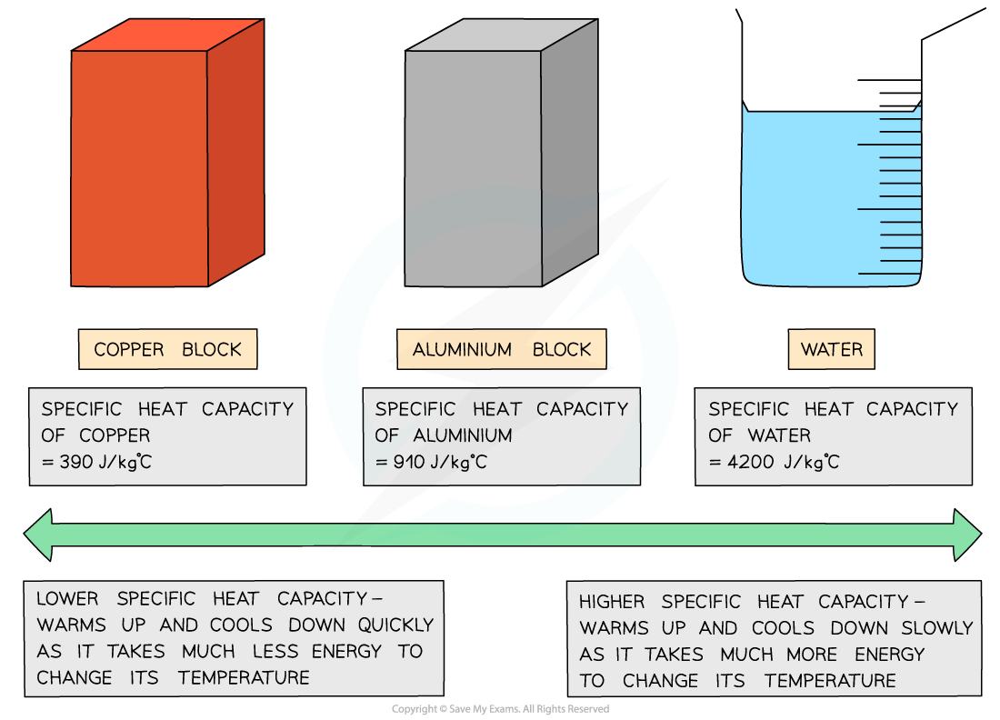

# Specific Heat Capacity

## Specific heat capacity

> **Spec point** — `spcpt_4X2xkPkQWS7ckQNQ` · know that specific heat capacity is the energy required to change the temperature of an object by one degree Celsius per kilogram of mass (J/kg °C) (physics only)

## Specific heat capacity

- The **specific heat capacity**, *c* of a substance is defined as:

**The amount of energy required to raise the temperature of 1 kg of the substance by 1 °C per kilogram of mass (J/kg °C)**

- Different substances have different specific heat capacities

  - If a substance has a **low** specific heat capacity, it heats up and cools down quickly (ie. it takes less energy to change its temperature)
  - If a substance has a **high** specific heat capacity, it heats up and cools down slowly (ie. it takes more energy to change its temperature)

#### Examples of specific heat capacity

***Low vs high specific heat capacity***

- How much the temperature of a system increases depends on:

  - The **mass** of the substance heated
  - The **type** of material
  - The amount of **energy** put into the system in the form of **thermal **energy

## Calculating specific heat capacity

> **Spec point** — `spcpt_P8mx5KjsVR62qNxr` · use the equation: 
change in thermal energy = mass × specific heat capacity × change in temperature 
ΔQ = m × c × ΔT (physics only)

## Calculating specific heat capacity

- The specific heat capacity of a substance can be calculated using the equatiion:

$\mathrm{change} \mathrm{in} \mathrm{thermal} \mathrm{energy}=\mathrm{mass}\times\mathrm{specific} \mathrm{heat} \mathrm{capacity}\times\mathrm{change} \mathrm{in} \mathrm{temperature}$

$ΔQ=mcΔT$

- Where:

  - Δ*Q* = change in thermal energy, in joules (J)
  - *m = *mass, in kilograms (kg)
  - *c = *specific heat capacity, in joules per kilogram per degree Celsius (J/kg °C)
  - Δ*T = *change in temperature, in degrees Celsius (°C)

> **Worked Example**
> Water of mass 0.48 kg is increased in temperature by 0.7 °C. The specific heat capacity of water is 4200 J / kg °C.
> 
> Calculate the amount of thermal energy transferred to the water.
> 
> **Answer:**
> 
> **Step 1: Write down the known quantities**
> 
> - Mass, *m* = 0.48 kg
> - Change in temperature, Δ*T* *= *0.7 °C
> - Specific heat capacity, *c* = 4200 J/kg °C
> 
> **Step 2: Write down the relevant equation **
> 
> $ΔQ=mcΔT$
> 
> **Step 3: Calculate the thermal energy transferred by substituting in the values**
> 
> $ΔQ=(0.48)\times(4200)\times(0.7)=1411.2$
> 
> **Step 4: Round the answer to 2 significant figures**
> 
> $ΔQ=1400J$

> **Exam Hint**
> This equation will be given on your equation sheet, so don't worry if you cannot remember it, but it is important that you understand how to use it. You will always be given the specific heat capacity of a substance, so you do not need to memorise any values.
