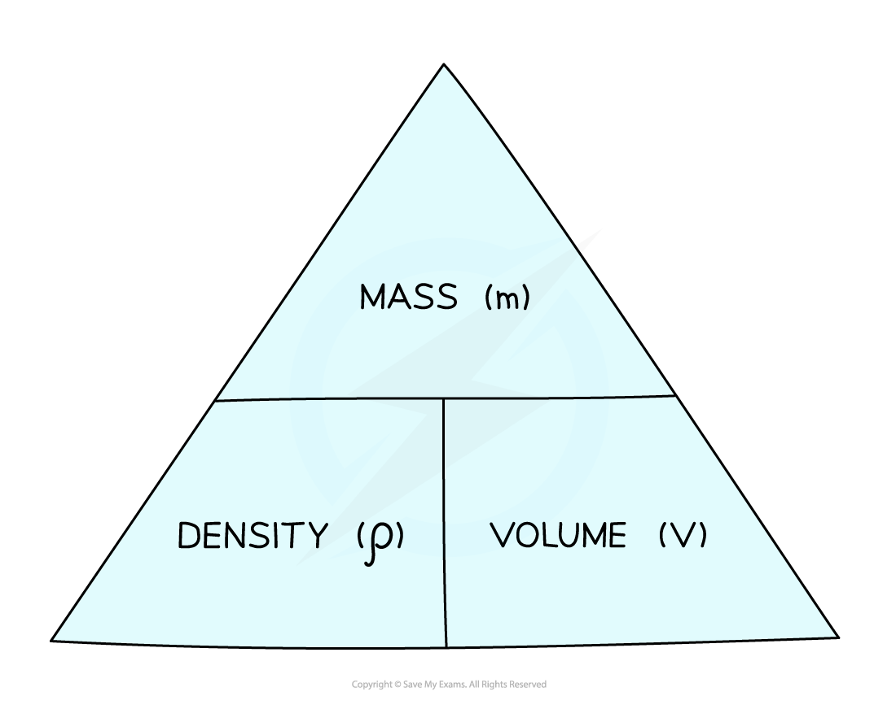
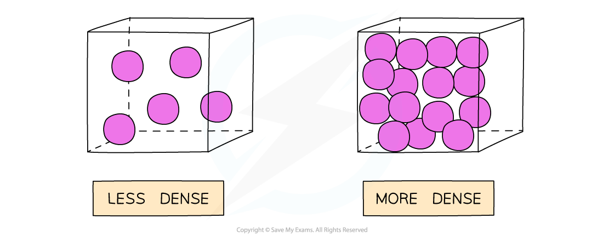

# Density

## Density

> **Spec point** — `spcpt_F663z5SwnCj792YX` · know and use the relationship between density, mass and volume: 
density = mass /volume
ρ = m / V

## Density

- Density is defined as:

**The mass per unit volume of a material**

- Density is related to mass and volume by the following equation:

$ρ=\frac{m}{V}$

- Where:

  - *ρ *= density, measured in kilograms per metre cubed (kg m−3)
  - *m *= mass, measured in kilograms (kg)
  - *V *= volume, measured in metres cubed (m3)

#### Formula triangle for density, mass and volume

***To use a formula triangle, simply cover up the quantity you wish calculate and the structure of the equation is revealed***

- For more information on how to use a formula triangle, refer to the revision note on [Speed](https://www.savemyexams.com/igcse/physics/edexcel/19/revision-notes/1-forces-and-motion/1-1-movement-and-position/1-1-2-speed/)

- Objects made from **low density** materials typically have a **low mass**
- Similarly sized objects made from **high density** materials have a **high mass**

  - For example, a bag full of feathers is far lighter compared to the same bag full of metal
  - Or another example, a balloon is less dense than a small bar of lead despite occupying a larger volume

- Gases, for example, are less generally dense than solids because the particles in a gas are more spread out (same mass, over a larger volume)

#### Comparing the density of solids and gases

***A gas is less dense than the same substance in liquid or solid form***

- The units of density depend on what units are used for mass and volume:

  - If the mass is measured in g and volume in cm3, then the density will be in g/cm3
  - If the mass is measured in kg and volume in m3, then the density will be in kg/m3

### Calculating volume to help obtain density values

- The volume of an object may not always be given directly but can be calculated with the appropriate equation depending on the object’s shape

#### Common formulae required to calculate the volumes of objects to then obtain their density

***Volumes of common 3D shapes***

> **Worked Example**
> A paving slab has a mass of 73 kg and dimensions 0.04 m × 0.5 m × 0.85 m.
> 
> Calculate the density, in kg/m3, of the material from which the paving slab is made.
> 
> **Answer:**
> 
> **Step 1: List the known quantities**
> 
> - Mass of slab, *m* = 73 kg
> - Volume of slab, *V* = 0.04 m × 0.5 m × 0.85 m = 0.017 m3
> 
> **Step 2: Write out the equation for density**
> 
> $ρ=\frac{m}{V}$
> 
> **Step 3: Substitute in values**
> 
> $ρ=\frac{73}{0.017}$
> 
> $ρ=4294$ kg/m3
> 
> **Step 4: Round the answer to two significant figures**
> 
> $ρ=4300$ kg/m3

> **Exam Hint**
> Make sure you are comfortable converting between units such as metres (m) and centimetres (cm) or grams (g) and kilograms (kg).
> 
> - When converting a **larger** unit to a **smaller** one, you **multiply (×)**
> 
>   - E.g. 125 m = 125 × 100 = 12 500 cm
> - When you convert a **smaller** unit to a **larger** one, you **divide (÷)**
> 
>   - E.g. 5 g = 5 ÷ 1000 = 0.005 or 5 × 10-3 kg
