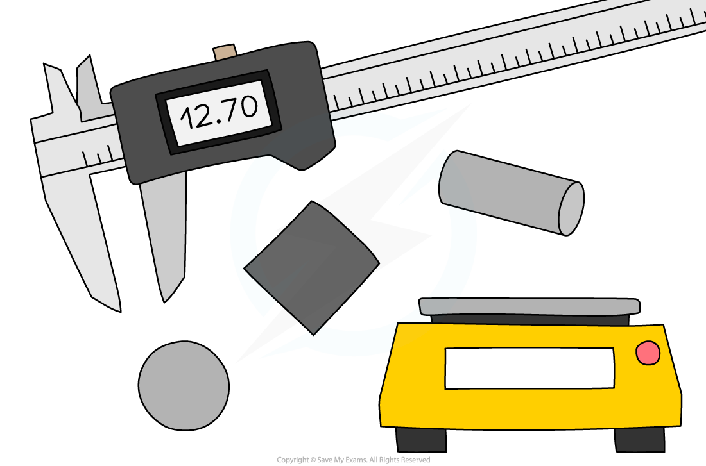
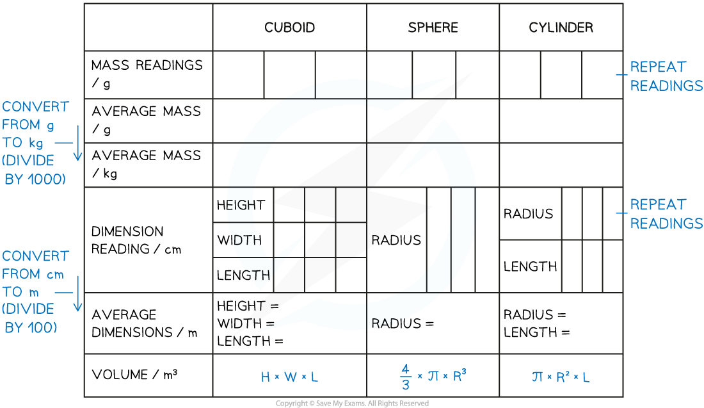
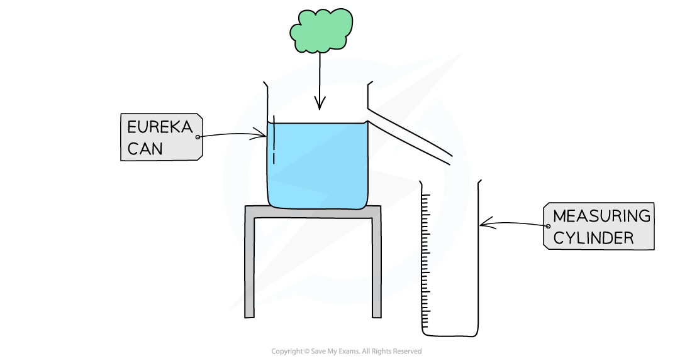
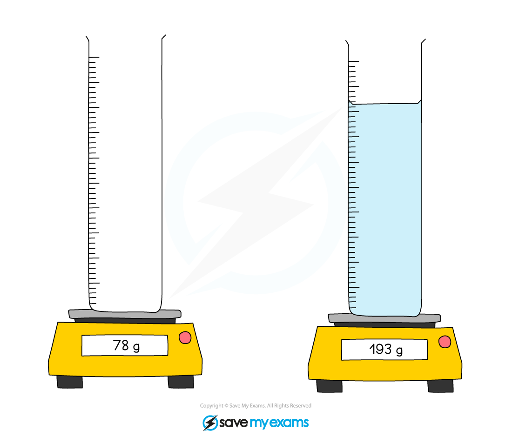

# Core Practical: Determining Density

## Core practical 9: determining density

> **Spec point** — `spcpt_PzkhFxJbdbkzH7m8` · Core practical 9: investigate density using direct measurements of mass and volume

## Core practical 9: Determining density

### Equipment

#### Equipment list

| **Apparatus** | **Purpose** |
|---|---|
| Regular and irregularly shaped objects | Objects used to determine the density of |
| A suitable liquid (e.g. sugar or salt solution) | Liquid to use to determine the density |
| A 30 cm ruler | To measure objects up to 30 cm in length |
| Vernier Calipers | To measure objects to around 15 cm in length |
| Micrometer | To measure objects to around 3 cm in length |
| Digital Balance | To measure the mass of objects |
| Displacement "Eureka" can | To measure the displacement of water of irregularly shaped objects |
| Measuring cylinders | To measure the volume of liquid |

- ***Resolution*** of measuring equipment:

  - 30 cm ruler = 1 mm
  - Vernier calipers = 0.01 mm
  - Micrometer = 0.001 mm
  - Digital balance = 0.01 g

### Experiment 1: measuring the density of regularly shaped objects

- The aim of this experiment is to determine the densities of regular objects by using measurements of their dimensions

#### Variables:

- ***Independent variable*** = Type of shape / volume
- ***Dependent variable*** = Mass of the object

#### Method

#### Equipment needed to determine the density of regularly shaped objects

1. Place the object on a digital balance and note down its mass
2. Use either the ruler, Vernier callipers or micrometer to measure the object’s dimensions (width, height, length, radius) – the apparatus will depend on the size of the object
3. Repeat these measurements and take an average of these readings before calculating the density

#### Results

#### An example results table to determine the density of regularly shaped objects

***A suitable results table must contain space for multiple readings to reduce random error and make the results more accurate***

#### Analysis of results

- Calculate the volume of the object depending on whether it is a cube, sphere, cylinder (or other regular shape)
- Then use the formula for density to calculate the density of each object

  - The formulae for volume and density are explained in the revision note [Density](https://www.savemyexams.com/igcse/physics/edexcel/19/revision-notes/5-solids-liquids-and-gases/5-1-density-and-pressure/5-1-1-density/)

### Experiment 2: measuring the density of irregularly shaped objects

- This experiment aims to determine the densities of irregular objects using a displacement technique

#### Variables:

- ***Independent variable*** = Different irregular shapes / mass
- ***Dependent variable*** = Volume of displaced water

#### Method

#### Equipment needed to determine the density of irregularly shaped objects

***Apparatus for measuring the density of irregular objects***

1. Place the object on a digital balance and note down its mass
2. Fill the eureka can with water up to a point just below the spout
3. Place an empty measuring cylinder below its spout
4. Carefully lower the object into the eureka can
5. Measure the volume of the displaced water in the measuring cylinder
6. Repeat these measurements and take an average before calculating the density

#### Results

#### An example results table to determine the density of irregularly shaped objects

| **Object** | **Mass of object / g** | **Average mass / kg** | **Volume of water displaced / m****3** | **Average volume of water displaced / m****3** |   |   |   |   |
|---|---|---|---|---|---|---|---|---|
| **1** | **2** | **3** | **1** | **2** | **3** |   |   |   |
| 100 |   |   |   |   |   |   |   |   |
| 120 |   |   |   |   |   |   |   |   |
| 140 |   |   |   |   |   |   |   |   |
| 160 |   |   |   |   |   |   |   |   |
| 180 |   |   |   |   |   |   |   |   |

#### Analysis of results

- The volume of the water displaced is equal to the volume of the object
- Once the mass and volume of the shape are known, the density can be calculated using:

### Experiment 3: measuring the density of liquids

- This experiment aims to determine the density of a liquid by finding a difference in its mass

#### Variables:

- ***Independent variable*** = Volume of water added
- ***Dependent variable*** = Mass of cylinder

#### Method

#### Equipment needed to determine the density of liquid

***Apparatus for determining the density of a liquid***

1. Place an empty measuring cylinder on a digital balance and note down the mass
2. Fill the cylinder with the liquid and note down the volume
3. Note down the new reading on the digital balance
4. Repeat these measurements and take an average before calculating the density

#### Results

#### An example results table to determine the density of a liquid

| **Mass of cylinder before / g** | **Average mass / kg** | **Volume of water added / m****3** | **Mass of cylinder with water / g** | **Average mass of cylinder with water / kg** |   |   |   |   |
|---|---|---|---|---|---|---|---|---|
| **1** | **2** | **3** | **1** | **2** | **3** |   |   |   |
|   |   |   |   |   |   |   |   |   |
|   |   |   |   |   |   |   |   |   |
|   |   |   |   |   |   |   |   |   |
|   |   |   |   |   |   |   |   |   |
|   |   |   |   |   |   |   |   |   |

#### Analysis of results

- Find the mass of the liquid by subtracting the final reading from the original reading

**Mass of liquid = Mass of cylinder with water – mass of cylinder**

- Once the mass and volume of the liquid are known, the density can be calculated using the equation for calculating density

  - This is explained in the revision note [Density](https://www.savemyexams.com/igcse/physics/edexcel/19/revision-notes/5-solids-liquids-and-gases/5-1-density-and-pressure/5-1-1-density/)

#### Evaluating the experiments

*Systematic errors*

- Ensure the digital balance is set to zero before taking measurements of mass

  - This includes when measuring the density of the liquid – remove the measuring cylinder and zero the balance before adding the liquid

*Random errors*

- A main cause of error in this experiment is in the measurements of length

  - Ensure to take repeat readings and calculate an average to keep this error to a minimum
- Place the irregular object in the displacement can carefully, as dropping it from a height might cause water to splash, which will lead to an incorrect volume reading

#### Safety considerations

- There is a lot of glassware in this experiment, ensure this is handled carefully
- Water should not be poured into the measuring cylinder when it is on the electric balance

  - This could lead to an electric shock
- Make sure to stand up during the whole experiment, to react quickly to any spills

> **Exam Hint**
> There is a lot of information to take in here! When writing about experiments, a good sequence is as follows:
> 
> - If you need to use an equation to calculate something, start off by giving it as this will give you some hints about what you need to mention later
> - List the apparatus that you need
> - State what measurements you need to make (your equation will give you some hints) and how you will measure them
> - Finally, state that you will repeat each measurement several times and take averages
