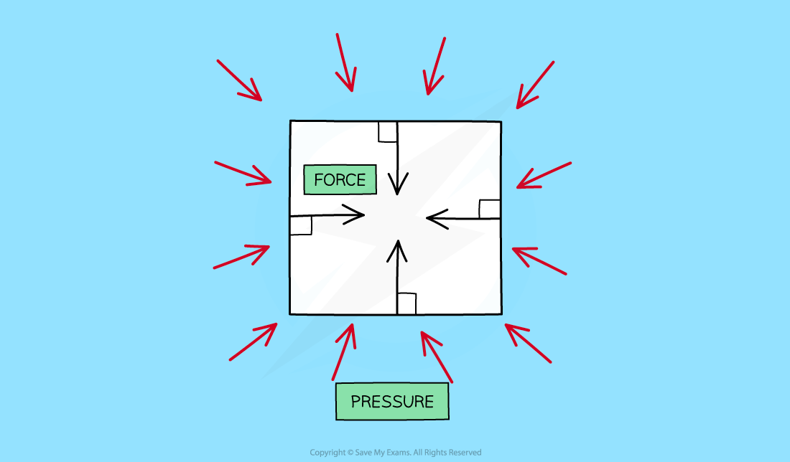
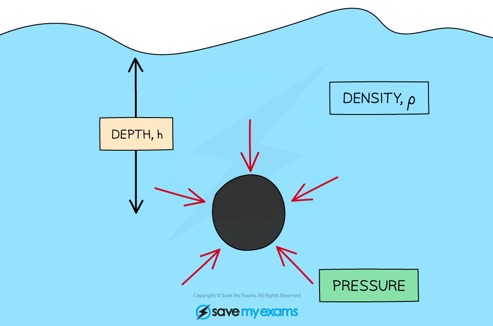

# Pressure in Liquids

## Pressure in liquids

> **Spec point** — `spcpt_cxWskbqkqX7pfPgr` · understand how the pressure at a point in a gas or liquid at rest acts equally in all directions

## Pressure in liquids

- A fluid is either a **liquid** or a **gas**
- When an object is immersed and stationary in a fluid, the fluid will exert pressure, squeezing the object

  - This pressure is exerted evenly across the whole surface of the fluid and in **all directions**
  - The pressure exerted on objects in fluids creates **forces** against surfaces
  - These forces act at **90 degrees** (at right angles) to the surface

#### Pressure in a liquid

***The pressure of a fluid on an object creates a force normal (at right angles) to the surface***

## Calculating pressure in a liquid

> **Spec point** — `spcpt_z7Yj4f3Kb2rqmGYQ` · know and use the relationship for pressure difference: 
pressure difference = height × density × gravitational field strength p = h × ρ × g

## Calculating pressure in a liquid

- The pressure acting on an object in a fluid changes with **depth**

  - The **deeper **the object then the higher the pressure exerted upon it and vice versa
- The equation for the pressure difference, at different depths, in a fluid is given by the equation:

$P=h\timesρ\timesg$

- Where:

  - *p* = pressure in pascals (Pa)
  - *h* = height or depth of the fluid column above the object in metres (m)
  - *ρ *= density of the fluid in kilograms per metre cubed (kg/m3)
  - *g* = gravitational field strength on Earth in newtons per kilogram (N/kg)

#### Pressure in a liquid with a density is applied at a depth

***The force from the pressure of objects in a liquid is exerted evenly across its whole surface***

> **Worked Example**
> Calculate the depth of water in a swimming pool where a pressure of 20 kPa is exerted. The density of water is 1000 kg/m3 and the gravitational field strength on Earth is 9.8 N/kg.
> 
> **Answer:**
> 
> **Step 1: List the known quantities**
> 
> - Pressure, *P *= 20 kPa
> - Density of water, *ρ *= 1000 kg/m3
> - Gravitational field strength, *g *= 9.8 N/kg
> 
> **Step 2: List the relevant equation**
> 
> $P=h\timesρ\timesg$
> 
> **Step 3: Rearrange for height, *****h***
> 
> $h=\frac{P}{ρ\timesg}$
> 
> **Step 4: Convert any units**
> 
> $20\mathrm{kPa}=20000\mathrm{Pa}$
> 
> **Step 5: Substitute in the values**
> 
> $h=\frac{20000}{1000\times9.8}$
> 
> $h=2.0408=2.0m$

> **Exam Hint**
> This pressure equation will be given on your formula sheet, however, make sure you are comfortable with rearranging it for the variable required in the question!
