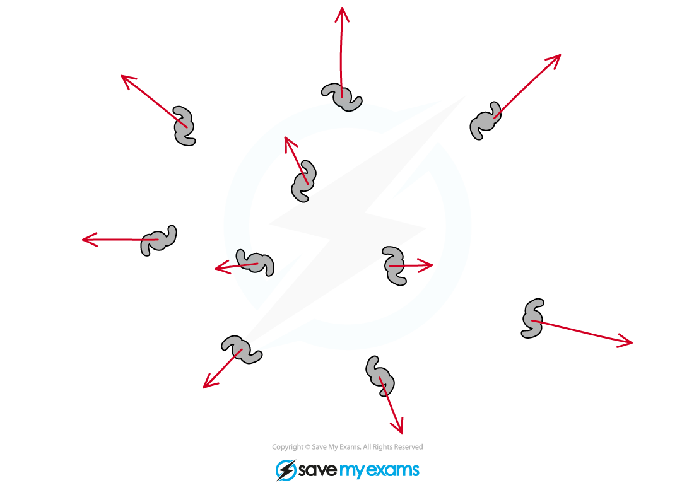
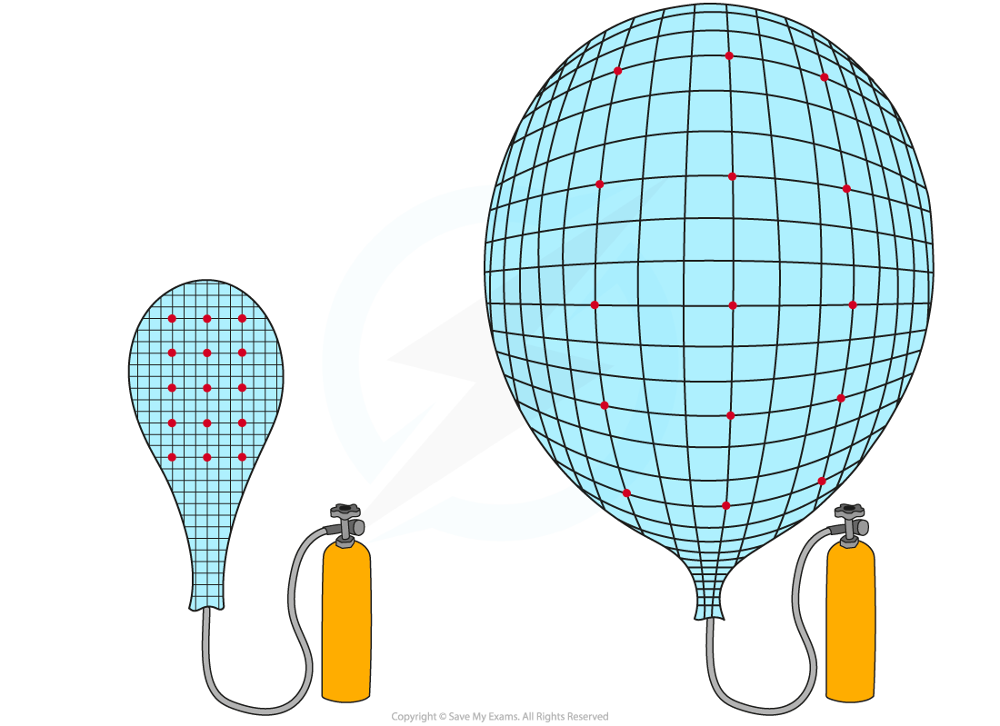
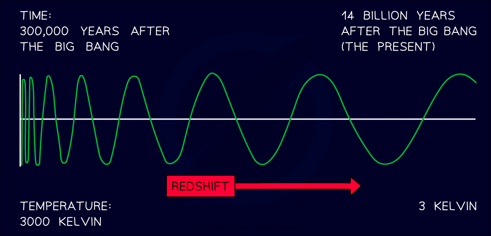
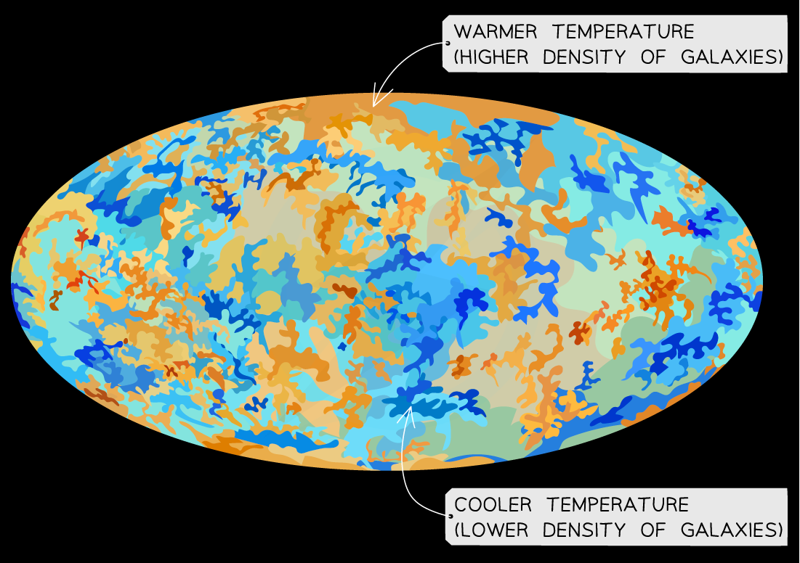

# The Big Bang Theory

## The Big Bang theory

> **Spec point** — `spcpt_TfnQPJdTbyq38Vqz` · describe the past evolution of the universe and the main arguments in favour of the Big Bang (physics only)

## The Big Bang theory

- Around **14 billion years ago, **the Universe began from a **very small region** that was **extremely hot** and **dense**
- Then there was a **giant** **explosion**, which is known as the **Big Bang**
- This caused the universe to **expand **from a single point, cooling as it does so, to form the universe today
- Each point **expands away** from the others

  - This is seen from ***galaxies*** moving away from each other, and the further away they are the faster they move
- As a result of the initial explosion, the Universe **continues to expand**

***All galaxies are moving away from each other, indicating that the universe is expanding***

- An analogy of this is points drawn on a balloon where the balloon represents space and the points as galaxies
- When the balloon is deflated, all the points are close together and an equal distance apart
- As the balloon expands, all the points become further apart **by the same amount**
- This is because the **space itself** has expanded between the galaxies

  - Therefore, the **density** of galaxies **falls** as the Universe expands

***A balloon inflating is similar to the stretching of the space between galaxies***

## Evidence for the Big Bang

> **Spec point** — `spcpt_6YXNC6mcqBjQwvhs` · describe evidence that supports the Big Bang theory (red-shift and cosmic microwave background (CMB) radiation) (physics only)

## Evidence for the Big Bang

### What are two pieces of evidence that support the Big Bang theory?

- Since there is more evidence supporting the Big Bang theory than the Steady State theory, it is the currently **accepted model** for the origin of the Universe
- The two main pieces of evidence supporting the Big Bang are

  - Galactic red-shift
  - Cosmic Microwave Background (CMB) radiation

#### Evidence from galactic red-shift

- By observing the **light spectrums** from ***supernovae*** in other galaxies there is evidence to suggest that distant galaxies are **receding** (moving further apart) even faster than nearby galaxies

  - These observations were first made in 1998

- The light spectrums show that light from distant galaxies is ***redshifted***, which is evidence that the **universe is expanding**
- As a result, astronomers have concluded that:

  - All galaxies are moving away from the Earth
  - Galaxies are moving away from each other

- This is what is expected after an **explosion**

  - Matter is first **densely packed** and as it explodes it, it moves out in **all** directions getting further and further from the source of the explosion
  - Some matter will be **lighter** and travel at a **greater **speed, **further** from the source of the explosion
  - Some matter will be **heavier** and travel at a **slower** speed, **closer** to the source of the explosion

- If someone were to **travel back in time** and compare the separation distance of the galaxies:

  - It would be seen that galaxies would become **closer and closer together** until the entire universe was a **single point**
- If the **galaxies** were originally all grouped together at a single point and were then exploded a similar effect would be observed

  - The galaxies that are the **furthest **are moving the **fastest** - their distance is proportional to their speed
  - The galaxies that are **closer** are moving **slower**

***Tracing the expansion of the universe back to the beginning of time leads to the idea the universe began with a “big bang”***

#### Evidence from CMB radiation

- The discovery of the CMB (Cosmic Microwave Background) led to the Big Bang theory becoming the currently accepted model

  - The CMB is a type of electromagnetic radiation which is a remnant from the early stages of the Universe
  - It has a wavelength of around 1 mm making it a microwave, hence the name Cosmic **Microwave** Background

- In 1964, Astronomers discovered radiation in the microwave region of the electromagnetic spectrum coming from **all directions** and at a generally **uniform temperature** of 2.73 K

  - They were unable to do this any earlier since microwaves are **absorbed** by the atmosphere
  - Around this time, space flight was developed which enabled astronomers to send telescopes into orbit above the atmosphere

- According to the Big Bang theory, the early Universe was an extremely **hot** and **dense** environment

  - As a result of this, it must have emitted **thermal radiation**

- The radiation is in the **microwave** region

  - This is because over the past 14 billion years or so, the radiation initially from the Big Bang has become redshifted as the Universe has expanded
  - Initially, this would have been **high energy** radiation, towards the gamma end of the spectrum
  - As the Universe expanded, the wavelength of the radiation **increased**
  - Over time, it has increased so much that it is now in the **microwave** region of the spectrum

***The CMB is a result of high energy radiation being redshifted over billions of years***

- The CMB radiation is very **uniform** and has the exact profile expected to be emitted from a **hot body** that has cooled down over a very long time

  - This phenomenon is something that other theories (such as the Steady State Theory) **cannot** explain

- The CMB is represented by the following map:

***The CMB map with areas of higher and lower temperature. Places with higher temperature have a higher concentration of galaxies, Suns and planets***

- This is the closest image to a map of the Universe
- The different colours represent different temperatures

  - The **red **/ orange / brown regions represent **warmer** temperature indicating a **higher density** of galaxies
  - The **blue** regions represents **cooler** temperature indicating a **lower density** of galaxies

- The temperature of the CMB is mostly uniform, however, there are minuscule temperature fluctuations (on the order of 0.00001 K)

  - This implies that all objects in the Universe are more or less **uniformly spread out**
