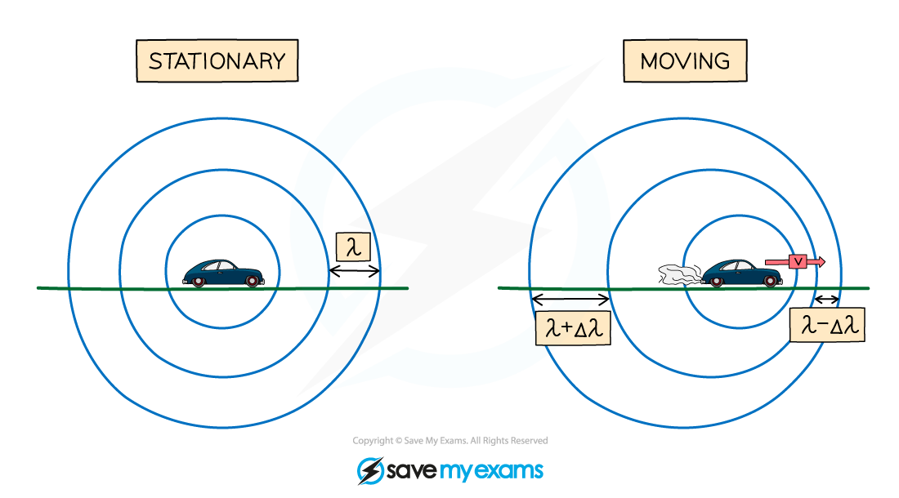

# Doppler Shift

## Doppler shift

> **Spec point** — `spcpt_zMqtz7BHrBMP9TFf` · describe that if a wave source is moving relative to an observer there will be a change in the observed frequency and wavelength (physics only)

## Doppler shift

- Usually, when an object emits waves, the wavefronts spread out **symmetrically**

  - If the wave source moves, the waves can become squashed together or stretched out
- Therefore, when a wave source moves relative to an observer there will be a change in the observed **frequency** and **wavelength**

***Wavefronts are even in a stationary object but are closer together in the direction of the moving wave source***

- A moving object will cause the **wavelength**, λ, (and frequency) of the waves to change:

  - The **wavelength** of the waves** in front** of the source **decreases** (λ – Δλ) and the **frequency** **increases**
  - The wavelength **behind** the source **increases** (λ + Δλ) and the** frequency decreases**
  - This effect is known as the** Doppler effect** or **Doppler shift**

- Note: Δλ means '**change in wavelength**'

## Calculating Doppler shift of light

> **Spec point** — `spcpt_q8Bqtbg3thZCTdMw` · use the equation relating change in wavelength, wavelength, velocity of a galaxy and the speed of light: 
change in wavelength / reference wavelength = velocity of a galaxy / speed of light
λ − λ / λ0 = Δλ / λ0 = v / c
(physics only)

## Calculating Doppler shift of light

- Doppler shift can be calculated using the Doppler effect equation:

$\frac{\mathrm{change} \mathrm{in} \mathrm{wavelength}}{\mathrm{reference} \mathrm{wavelength}}=\frac{\mathrm{velocity} \mathrm{of}a\mathrm{galaxy}}{\mathrm{speed} \mathrm{of} \mathrm{light}}$

$\frac{λ-λ_{0}}{λ_{0}}=\frac{Δλ}{λ_{0}}=\frac{v}{c}$

- Where:

  - λ = observed wavelength of the source in metres (m)
  - λ0 = reference wavelength in metres (m)
  - Δλ = change in wavelength in metres (m)
  - *v* = velocity of a galaxy in metres per seconds (m/s)
  - *c* = ***the speed of light*** in metres per second (m/s)

- This means that the change in wavelength, Δλ:

Δλ = λ – λ0

- The doppler shift equation can be used to calculate the velocity of a galaxy if its wavelength can be measured and compared to a reference wavelength
- Since the fractions have the same units on the numerator (top number) and denominator (bottom number), the Doppler shift has **no units**

> **Worked Example**
> Light emitted from a star has a wavelength of 435 × 10-9 m. A distance galaxy emits the same light but has a wavelength of 485 × 10-9 m.
> 
> Calculate the speed at which the galaxy is moving relative to Earth.
> 
> The speed of light = 3 × 108 m/s.
> 
> **Step 1: List the known quantities**
> 
> - Observed wavelength, *λ *= 485 × 10−9 m
> - Reference wavelength, *λ*0 = 435 × 10−9 m
> 
> **Step 2: Write out the Doppler effect equation**
> 
> $\frac{λ-λ_{0}}{λ_{0}}=\frac{Δλ}{λ_{0}}=\frac{v}{c}$
> 
> **Step 3: Rearrange for the relative speed of the galaxy, *****v***
> 
> $v=c\times\frac{λ-λ_{0}}{λ_{0}}$
> 
> **Step 4: Substitute the values into the equation for *****v***
> 
> `v space equals space open parentheses 3 space cross times space 10 to the power of 8 close parentheses space cross times space fraction numerator open parentheses 485 space cross times space 10 to the power of negative 9 end exponent close parentheses space minus space open parentheses 435 space cross times space 10 to the power of negative 9 end exponent close parentheses over denominator 435 space cross times space 10 to the power of negative 9 end exponent end fraction`
> 
> $v=3.4\times10^{7}m/s$

> **Exam Hint**
> This Doppler effect equation will be provided for you in the exam, but make sure you understand how to use it, in particular, make sure you know the difference between shifted λ and unshifted λ0 wavelength terms and get lots of practice using it!
