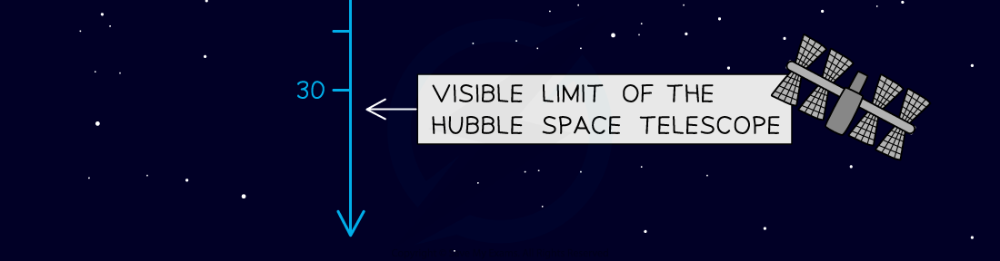

# The Brightness of Stars

## Absolute magnitude

> **Spec point** — `spcpt_5dh24BWtbjrv82dq` · understand how the brightness of a star at a standard distance can be represented using absolute magnitude (physics only)

## Absolute magnitude

### Luminosity

- The luminosity of a star is defined as

**The total amount of light energy emitted by the star**

- Luminosity is a measure of a star's **brightness** or **power output**

### Apparent magnitude

- The brightness, or apparent magnitude, of a star depends on two main factors:

  - the **luminosity **of the star
  - the **distance** the star is from Earth (more distant stars are usually fainter than nearby stars)

- Apparent magnitude is defined as

**The perceived brightness of a star as seen from Earth**

- The apparent magnitude scale runs back to front:

  - the **brighter** the star, the **lower **the magnitude
  - the **dimmer** the star, the **higher **the magnitude

#### The apparent magnitude scale

***Examples of the apparent magnitude of different astronomical bodies***

### Absolute magnitude

- Astronomers describe the brightness of stars at a standard distance using the **absolute magnitude scale**

  - a bright star which is far away can look the same as a dim star which is nearby
  - therefore, it is difficult to measure the brightness of stars directly

- Absolute magnitude is defined as

**A measure of how bright stars would appear if they were all placed the same distance away from the Earth**

- The standard distance astronomers use is 10 parsecs, 32.6 light-years or 3.04 × 1014 km away from the Earth
