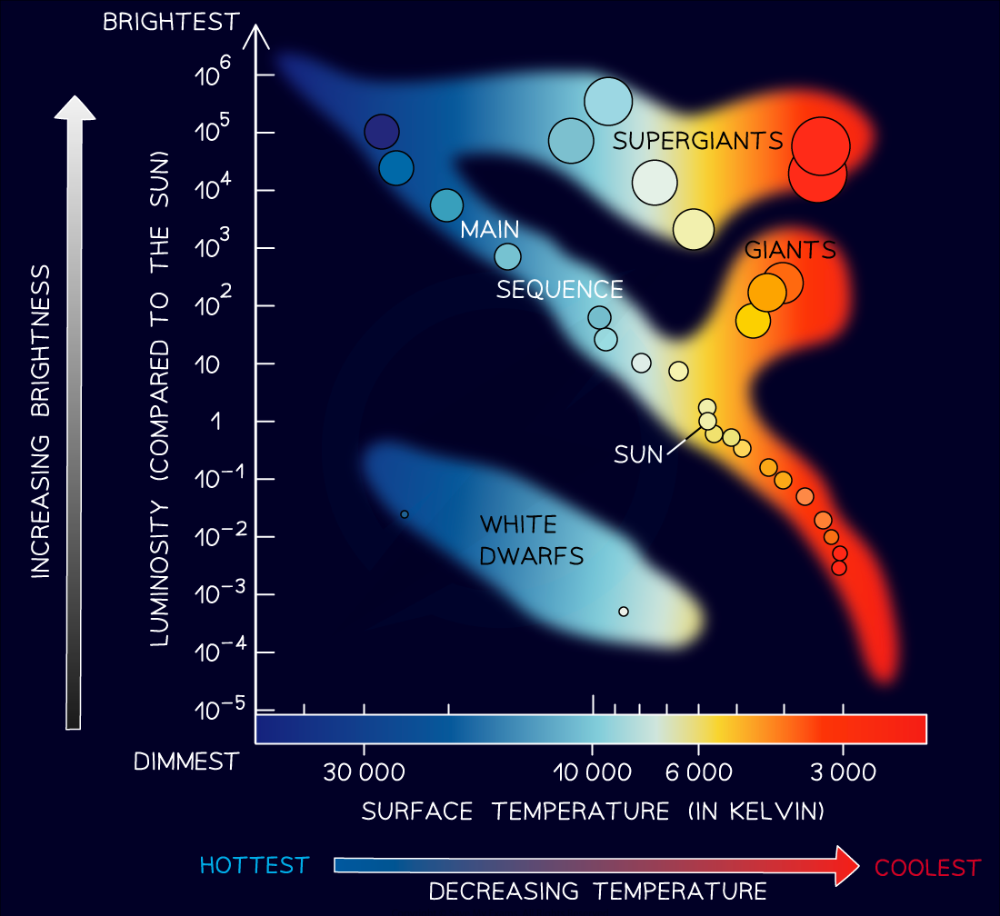

# Hertzsprung-Russell Diagrams

## Hertzsprung-Russell diagrams

> **Spec point** — `spcpt_XYJMcwGJznzmpr3r` · draw the main components of the Hertzsprung–Russell diagram (HR diagram) (physics only)

## Hertzsprung-Russell diagrams

- The properties of stars can be classified using the Hertzsprung-Russell (HR) diagram
- This is a plot of **luminosity** on the y-axis and **temperature **on the x-axis
- Usually, it is given in solar units, where the luminosity of the Sun = 1, so

  - For stars which are **brighter **than the Sun, luminosity > 1
  - For stars which are **dimmer** than the Sun, luminosity < 1

- Surface temperature is measured in kelvin (K) and is plotted backwards from hottest to coolest
- It can also be displayed as a colour where

  - The **hottest **stars are blue
  - The **coolest **stars are red

#### The Hertzsprung-Russell diagram

***The Hertzsprung-Russell (HR) diagram is a way of displaying the properties of stars and representing their life cycles***

- The key areas of the H-R diagram are:

  - The **brightest **stars (high luminosity) are found near the top
  - The **dimmest **stars (low luminosity) are found near the bottom
  - The **hottest **stars (high temperature) are found towards the left
  - The **coolest **stars (low temperature) are found towards the right

- The [life cycle of a star](https://www.savemyexams.com/igcse/physics/edexcel/modular/24/unit-2/revision-notes/astrophysics/stellar-evolution/life-cycle-of-solar-mass-stars/) can be shown on a Hertzsprung-Russell diagram
- The main features of the Hertzsprung-Russell diagram are:

  - Most stars are found to lie on the **main** **sequence**. This is the band of stars going from top left to bottom right
  - Below the main sequence (and slightly to the left) are the **white dwarfs**
  - Above the main sequence on the right-hand side are the **red giants**
  - Directly above the red giants are the **red supergiants**

- This means that

  - The **hottest, brightest** stars are the largest main sequence stars, also called supergiant stars
  - The **coolest, brightest** stars are red supergiants
  - The **hottest, dimmest** stars are white dwarfs
  - the **coolest, dimmest** stars are the smallest main sequence stars, also called red dwarfs

> **Worked Example**
> Stars can be classified using the Hertzsprung-Russell (H-R) Diagram.
> 
> 
> 
> (a)  State the types of stars found in areas A, B, C and D
> 
> (b)  On the H-R diagram, plot the star with a surface temperature of 20 000 K and a luminosity 10 000 times greater than the Sun and label it Star X.
> 
> **Answer:**
> 
> **(a)**
> 
> - **A** = white dwarf stars
> - **B** = main sequence stars
> - **C **= red supergiant stars
> - **D** = red giant stars
> 
> **(b)**
> 
> **Step 1: List the known quantities**
> 
> - Surface temperature of Star **X** = 20 000 K
> - Luminosity of Star **X** = 10 000 times that of the Sun
> 
> **Step 2: Use the graph to find the value for the luminosity of the Sun**
> 
> - Use a ruler and pencil to draw a line from the position of the sun to the luminosity axis (y-axis)
> - The Sun’s luminosity on this scale is 1 because the luminosities given are relative to the luminosity of the sun
> 
> 
> 
> **Step 3: Calculate the luminosity of Star X**
> 
> - Star **X** is 10 000 times that of the Sun
> - The luminosity of the Sun is 1
> 
> 10 000 × 1 = 10 000 or 104
> 
> **Step 4: Plot the position of Star X on the HR diagram**
> 
> - Locate the surface temperature of Star **X** at 20 000 K
> - Locate the luminosity of Star **X** at 104
> 
> 
> 
> - Plot the point and label it Star X:
> 
> 

> **Exam Hint**
> Make sure you remember the key components of this diagram to be able to draw it from memory, more specifically which way around the axis goes - the x-axis is the opposite way round to what you might be used to!
> 
> If you forget how where the different types of stars are found on the HR diagram, try and think about it logically:
> 
> - The **main sequence** is the easiest to recognise as it is the long band diagonally central to the diagram where the majority of stars are found
> - **White dwarf **stars are hot, but very small, so they are not very luminous, so you need to identify the area with a lower luminosity than the main sequence
> - **Red giants **and **supergiants **have clues in their names - they are giant, so they are very luminous and they are red, so they tend to be on the cooler end of the temperature scale
