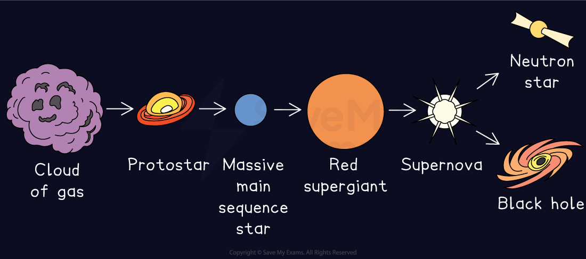

# The Life Cycle of Larger Stars

## The life cycle of larger stars

> **Spec point** — `spcpt_kzfGQ76PPCcH8cC7` · describe the evolution of stars with a mass larger than the Sun

## The life cycle of larger stars

- After the main sequence, a high-mass star finishes its life cycle in the following evolutionary stages:

**Red supergiant → supernova → neutron star or black hole**

*The life cycle of a star much larger than the Sun*

- The key **differences **between a lower mass and a higher mass star at this stage are:

  - A higher mass star will stay on the main sequence for a **shorter time** before it becomes a red supergiant
  - A lower mass star fuses helium into heavy elements, such as **carbon**, whereas a higher mass star fuses helium into even heavier elements, such as **iron**

### Red supergiant

- After several **million** years, the hydrogen causing the fusion reactions in the star will begin to run out
- Once this happens, the fusion reactions in the core will start to **die down**
- The star will begin to fuse helium which causes the outer part of the star to **expand**
- As the star expands, its surface cools and it becomes a **red supergiant**

### Supernova

- Once the fusion reactions inside the red supergiant cannot continue, the core of the star will **collapse suddenly** and cause a **gigantic explosion** called a **supernova**
- At the centre of this explosion, a **dense **body called a **neutron star** will form
- The **outer remnants** of the star are **ejected** into space forming **new clouds **of dust and gas (**nebula**)

  - The heaviest elements are formed during a supernova, and these are ejected into space
  - These nebulae** **may form** new planetary systems**

### Neutron star (or black hole)

- In the case of the **most massive stars**, the neutron star that forms at the centre will continue to **collapse** under the force of **gravity** until it forms a **black hole**

  - A black hole is an **extremely dense** object which has a gravitational pull so strong that not even **light** can escape from it

> **Exam Hint**
> Make sure you remember the life cycle for a high-mass star and that you can describe the sequence logically in case a 6-marker comes up in the exam!
> 
> Ensure you can clearly remember the end stages for a high-mass star (red supergiant, supernova, neutron star/black hole), as this is different from a star that is a similar size to the Sun!
