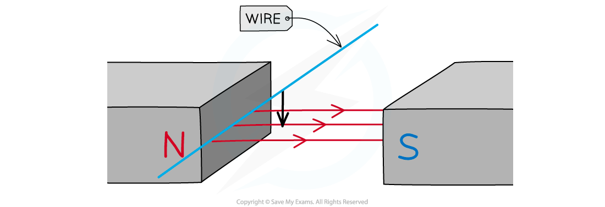
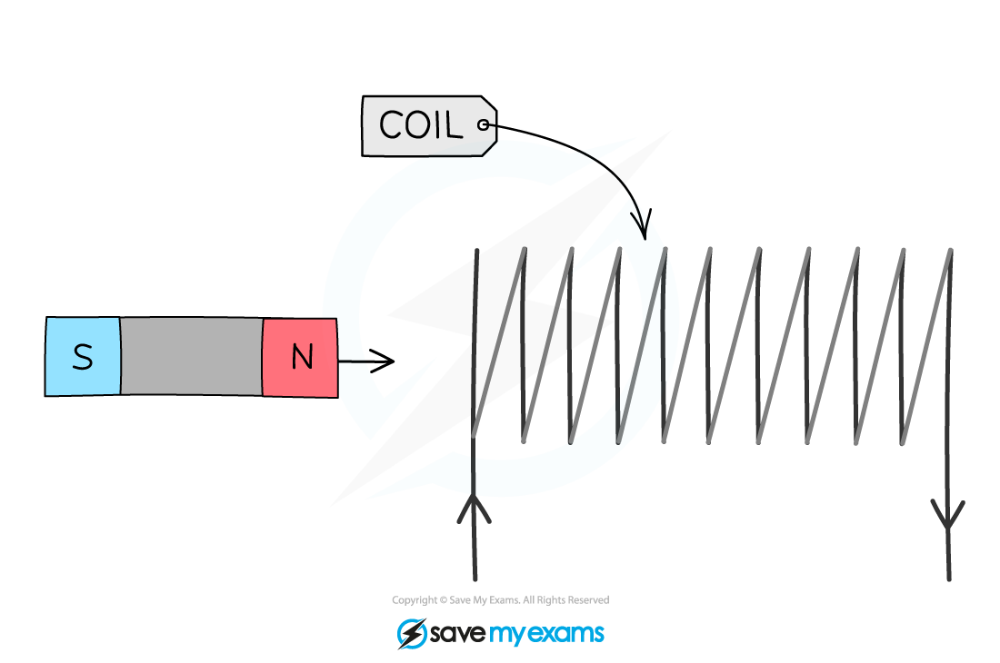

# Electromagnetic Induction

## Electromagnetic induction

> **Spec point** — `spcpt_cFwJhrmB466WjKy5` · know that a voltage is induced in a conductor or a coil when it moves through a magnetic field or when a magnetic field changes through it and describe the factors that affect the size of the induced voltage

## Electromagnetic induction

- Electromagnetic (EM) induction is used to generate electricity
- EM induction is when:

**A voltage is induced in a conductor or a coil when it moves through a magnetic field or when a magnetic field changes through it**

- This is done by the conductor or coil **cutting through **the magnetic field lines of the magnetic field
- This is often referred to as the **generator effect** and is the opposite to the motor effect

  - In the motor effect, there is already a current in the conductor which experiences a force
  - In the generator effect, there is **no initial current** in the conductor but one is induced (created) when it moves through a magnetic field

- This is done by the conductor or coil **cutting through **the magnetic field lines of the magnetic field

### Generating potential difference

- A potential difference will be induced in the conductor if there is **relative movement** between the conductor and the magnetic field
- Moving the electrical conductor in a fixed magnetic field

  - When a conductor (such as a wire) is moved through a magnetic field, the wire **cuts** through the fields lines
  - This **induces a potential difference** in the wire

#### Electromagnetic induction diagram

***Moving an electrical conductor in a magnetic field to induce a potential difference***

- Moving the magnetic field relative to a fixed conductor

  - As the magnet moved through the coil, the field lines **cut** through the turns on the coil
  - This **induces a potential difference** in the coil

#### Diagram of electromagnetic induction in a coil

***When the magnet enters the coil, the field lines cut through the turns, inducing a potential difference***

- A **sensitive voltmeter** can be used to measure the size of the induced potential difference
- If the conductor is part of a **complete circuit** then a **current** is induced in the conductor

### Factors affecting the induced potential difference

- The **size** of the induced potential difference is determined by:

  - The **speed** at which the wire, coil or magnet is moved
  - The **number** **of** **turns** on the coils of wire
  - The **size **of the coils
  - The **strength **of the magnetic field

- The **direction** of the induced potential difference is determined by:

  - The **orientation** of the poles of the magnet

1. The **speed** at which the wire, coil or magnet is moved:

- **Increasing the speed** will increase the rate at which the magnetic field lines are cut
- This will **increase the induced potential difference**

2. The **number **of turns on the coils in the wire:

- **Increasing the number of turns on the coils** in the wire will **increase the potential difference** induced
- This is because each coil will cut through the magnetic field lines and the total potential difference induced will be the result of all of the coils cutting the magnetic field lines

3. The **size **of the coils:

- **Increasing the area** of the coils will **increase the potential difference** induced
- This is because there will be more wire to cut through the magnetic field lines

4. The **strength **of the magnetic field:

- Increasing the** strength** of the magnetic field will **increase **the** potential difference induced**

5. The **orientation** of the poles of the magnet:

- Reversing the direction in which the wire, coil or magnet is moved

> **Exam Hint**
> When discussing factors affecting the induced potential difference:
> 
> - Make sure you state:
> 
>   - “Add more **turns** to the coil” instead of “Add more coils”
>   - This is because these statements do not mean the same thing
> - Likewise, when referring to the magnet, use the phrase:
> 
>   - “**A stronger magnet** instead of “A bigger magnet”
>   - This is because larger magnets are not necessarily stronger
