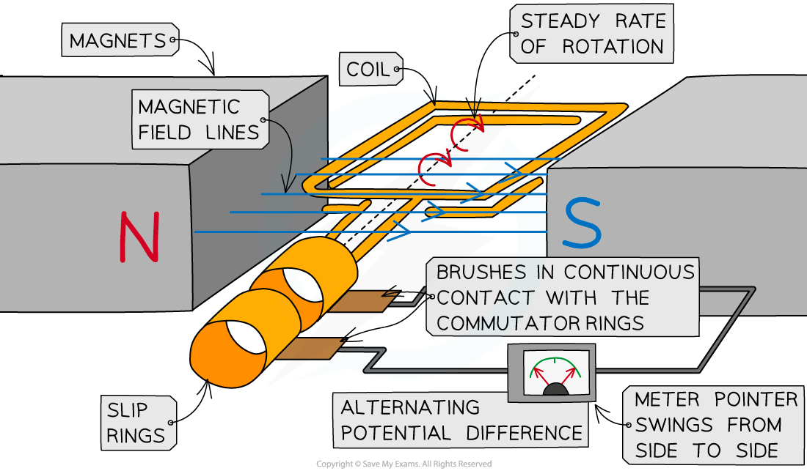
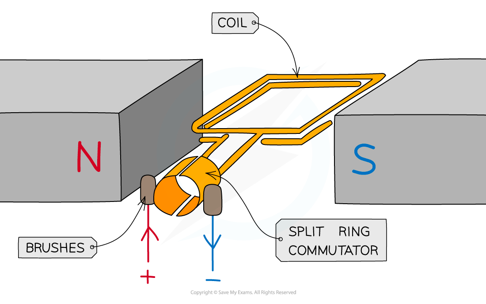
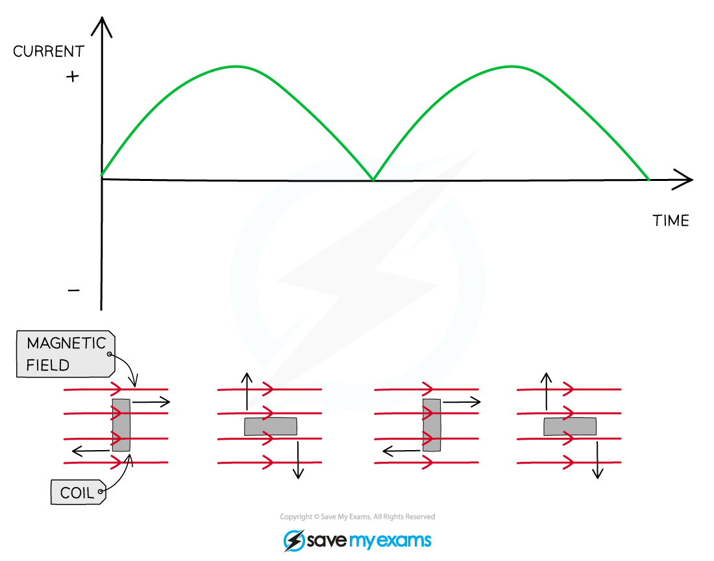

# Generators & Dynamos

## Generators & dynamos

> **Spec point** — `spcpt_JMzvX3j4Q6kYs292` · describe the generation of electricity by the rotation of a magnet within a coil of wire and of a coil of wire within a magnetic field, and describe the factors that affect the size of the induced voltage

## Generators & dynamos

- The ***generator effect*** can be used to:

  - Generate ***a.c*** in an **generator**
  - Generate ***d.c*** in a **dynamo**

### Alternator

- A simple alternator is a type of generator that converts mechanical energy to electrical energy in the form of alternating current

***An alternator is a rotating coil in a magnetic field with slip rings***

- A rectangular coil that is forced to spin in a **uniform magnetic field**
- The coil is connected to a centre-reading meter by **metal brushes** that press on two metal **slip rings**

  - The slip rings and brushes provide a continuous connection between the coil and the meter
- When the coil turns in one direction:

  - The pointer deflects first one way, then the opposite way, and then back again
  - This is because the coil **cuts through** the magnetic field lines and an alternating **potential difference,** and therefore current, is **induced** in the coil
- An alternating current may also be produced when a **magnet rotates within a stationary coil**

  - Both methods operate on the principle that p.d. is induced when a coil experiences a **changing **external magnetic field

- The induced potential difference and the current **alternate** because they repeatedly** change direction**

***a.c output from an alternator - the current is both in the positive and negative region of the graph***

### Dynamos

- A dynamo in physics is the name for a a **direct current generator**
- A simple dynamo is the **same** as an **alternator** except that the dynamo has a **split-ring commutator **instead of two separate slip rings

***A dynamo is a rotating coil in a magnetic field connected to a split ring commutator***

- As the coil rotates, it **cuts** through the field lines

  - This **induces a potential difference** between the end of the coil
- The split ring commutator changes the connections between the coil and the brushes every half turn in order to keep the current leaving the dynamo in the **same direction**

  - This happens each time the coil is perpendicular to the magnetic field lines

- Therefore, the induced potential difference **does not reverse** its direction as it does in the alternator
- Instead, it varies from zero to a maximum value twice each cycle of rotation, and never changes polarity (positive to negative)

  - This means the current is always **positive** (or always **negative**)

***D.C output from a dynamo - the current is only in the positive region of the graph***

> **Exam Hint**
> Motors and generators look very similar, but they do very different things. When tackling a question on either of them, make sure you are writing about the right one!
> 
> You are also expected to know that alternating current can be produced when a coil rotates in a magnetic field, or when a magnet rotates within a coil. The key is **relative motion** between the coil and the magnet.
