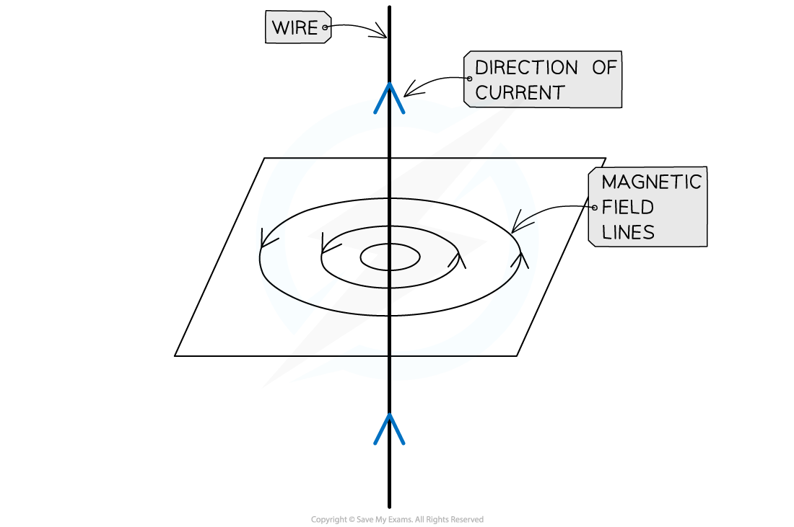
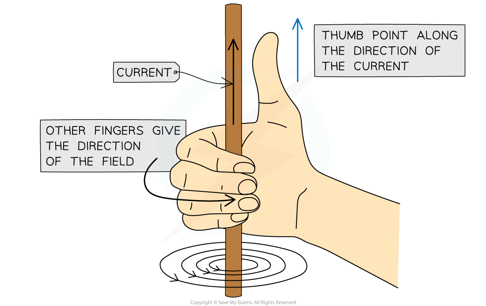
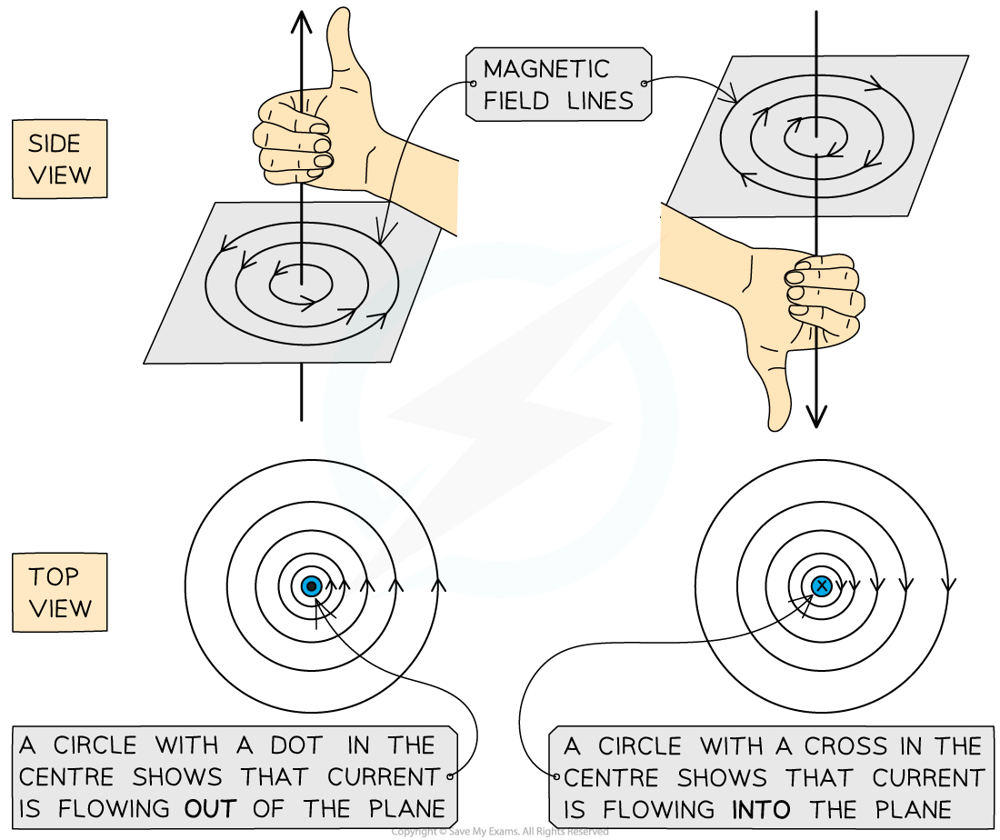
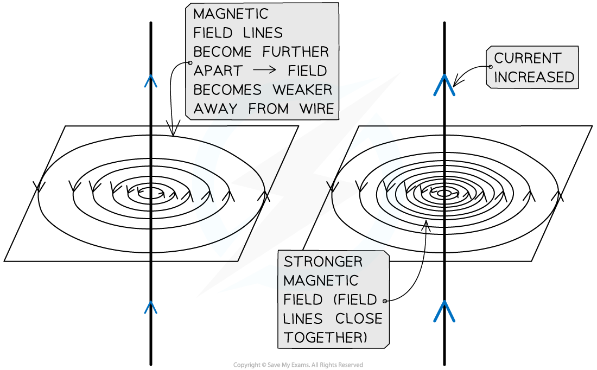

# Electromagnetism

## Electromagnetism

> **Spec point** — `spcpt_5XHYjtMhbvX2ktKd` · know that an electric current in a conductor produces a magnetic field around it

## Electromagnetism

### Magnetic field of a wire carrying current

- When a **current** flows through a conducting wire a ***magnetic field*** is produced around the wire
- The shape and direction of the magnetic field can be investigated using plotting compasses

***Diagram showing the magnetic field around a current-carrying wire***

- The magnetic field is made up of ***concentric circles***

  - A circular field pattern indicates that the magnetic field around a current-carrying wire has **no poles**
- As the distance from the wire increases the circles get further apart

  - This shows that the magnetic field is strongest closest to the wire and gets weaker as the distance from the wire increases
- The **right-hand thumb rule** can be used to work out the **direction** of the magnetic field

***The right-hand thumb rule shows the direction of current flow through a wire and the direction of the magnetic field around the wire***

- Reversing the direction in which the current flows through the wire will **reverse the direction** of the magnetic field

***Side and top view of the current flowing through a wire and the magnetic field produced***

- If there is **no current** flowing through the conductor there will be **no magnetic field**
- Increasing the amount of current flowing through the wire will increase the strength of the magnetic field

  - This means the field lines will become **closer together**

### Factors affecting field strength

- The strength of the magnetic fields field depends on:

  - The size of the current
  - The distance from the long straight conductor (such as a wire)
- A larger **current** will produce a larger **magnetic field** and vice versa
- The greater the **distance** from the conductor, the **weaker** the **magnetic field** and vice versa

***The greater the current, the stronger the magnetic field. This is shown by more concentrated field lines***
