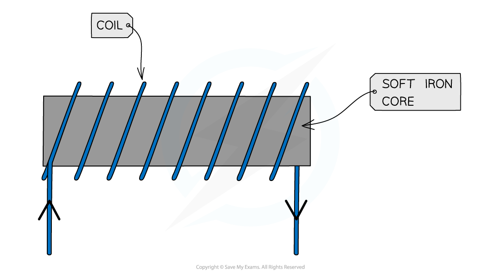

# Electromagnets

## Electromagnets

> **Spec point** — `spcpt_JXcBSCh26Dtx5t5Y` · describe the construction of electromagnets (physics only)

## Electromagnets

- When an electric current flows in a wire it creates a **magnetic field** around the wire
- By winding the wire into a **coil** we can **strengthen** the magnetic field by concentrating the field lines
- If this wire is wound around a soft magnet, such as an iron, then an electromagnet is made (see the electromagnet diagram below)

  - The electromagnet is magnetic **only **when current flows through the wire

#### Electromagnet diagram

***Electromagnets are made up of a coil of wire wrapped around an iron core***

- The strength of an electromagnet’s magnetic field may be increased by:

  - Increasing the **current** in the coil
  - Adding more **turns** to the coil

- The magnetic field around an electromagnet has the same shape as the one around a bar magnet
- The field can be **reversed** by reversing the direction of the **current**

  - However, bar magnets are always magnetic, unlike electromagnets
