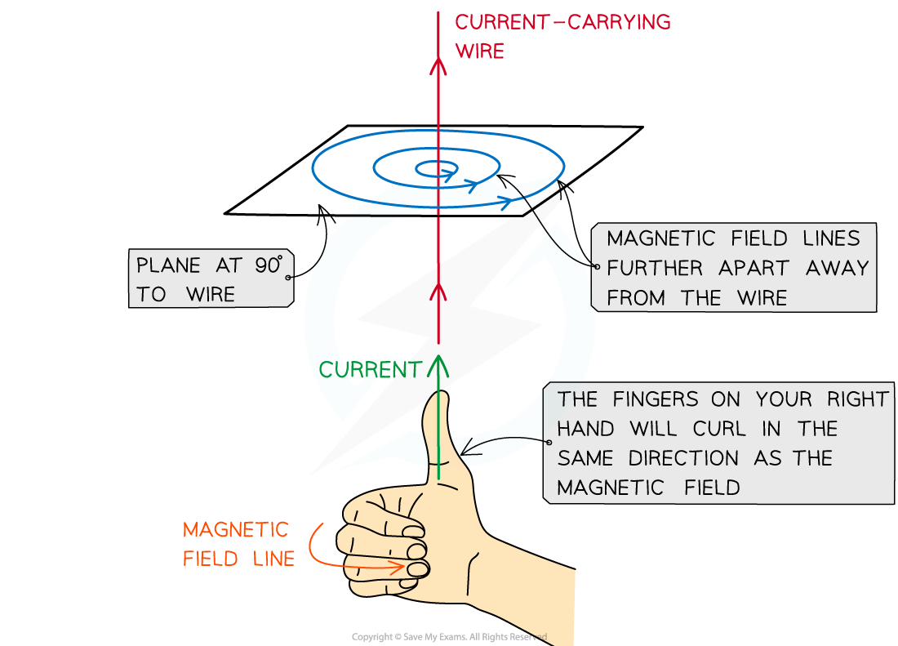
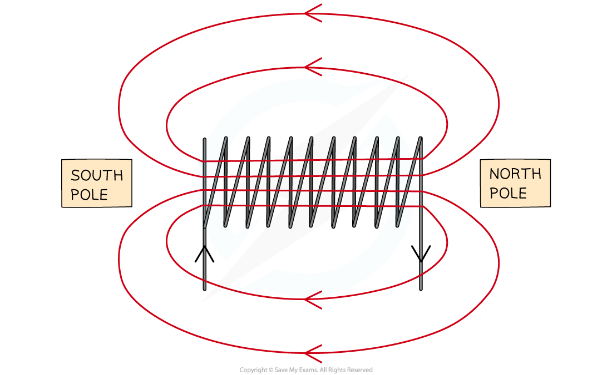
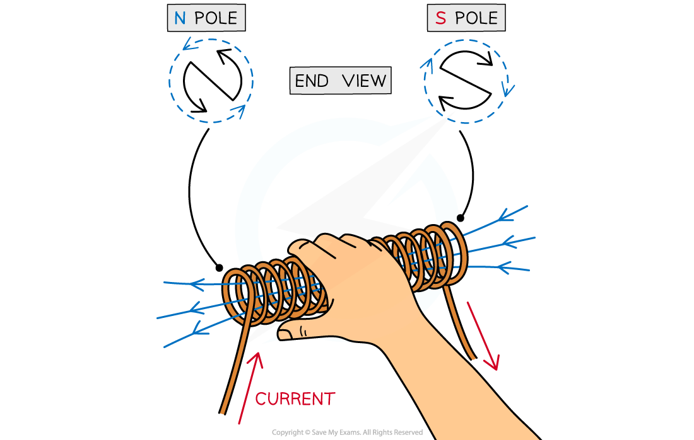

# Magnetic Field Patterns

## Magnetic field patterns

> **Spec point** — `spcpt_vdMmzCSP7DVBj5HG` · draw magnetic field patterns for a straight wire, a flat circular coil and a solenoid when each is carrying a current (physics only)

## Magnetic field patterns

- Magnetic field line patterns are all slightly different around:

  - Straight wires
  - Flat circular coils
  - Solenoids

### Magnetic field in a straight wire

- When a **current** flows through a conducting wire a ***magnetic field*** is produced around the wire
- The shape and direction of the magnetic field can be investigated using plotting compasses

- The magnetic field is made up of ***concentric circles***

  - A circular field pattern indicates that the magnetic field around a current-carrying wire has **no poles**
- As the distance from the wire increases the circles get further apart

  - This shows that the magnetic field is strongest closest to the wire and gets weaker as the distance from the wire increases
- The **right-hand thumb rule** can be used to work out the **direction** of the magnetic field

***The direction of the magnetic field around a wire is given by the right-hand thumb rule***

- Reversing the direction in which the current flows through the wire will **reverse the direction** of the magnetic field
- If there is **no current** flowing through the conductor there will be **no magnetic field**
- **Increasing** the amount of current flowing through the wire will **increase** the strength of the magnetic field

  - This means the field lines will become **closer together**

### Magnetic field in a flat circular coil

- When a wire is looped into a **coil**, the magnetic field lines circle around each part of the coil, passing through the centre of it

***The magnetic field around a flat circular coil***

- To increase the strength of the magnetic field around the wire it should be coiled to form a ***solenoid***
- The magnetic field around the solenoid is similar to that of a **bar magnet**
- Using this, we can draw the pattern of magnetic field lines of a current carrying solenoid

***Magnetic field around and through a solenoid. This is similar to the field of a bar magnet.***

### Magnetic field in a solenoid

- The magnetic field inside the solenoid is strong and ***uniform***
- Inside a solenoid (an example of an electromagnet) the fields from individual coils

  - **Add together** to form a very **strong** almost uniform field along the **centre** of the solenoid
  - **Cancel** to give a **weaker** field **outside** the solenoid

- One end of the solenoid behaves like the **north pole** of a magnet; the other side behaves like the **south pole**

  - To work out the polarity of each end of the solenoid it needs to be viewed from the end
  - If the current is travelling around in a **clockwise** direction then it is the **south pole**
  - If the current is travelling around in an **anticlockwise** direction then it is the north pole
- If the **current changes direction** then the north and south **poles will be reversed**
- If there is **no current** flowing through the wire then there will be **no magnetic field** produced around or through the solenoid

***Poles of a solenoid. The right hand rule can be adapted for this situation, with fingers following the direction of current and the thumb pointing in the direction of the central magnetic field lines.***

#### Factors affecting magnetic field strength of a solenoid

- The strength of the magnetic field produced around a solenoid can be increased by:

  - Increasing the **size of the current** which is flowing through the wire
  - Increasing the **number of coils**
  - Adding an **iron core** through the centre of the coils

- The iron core will become an ***induced magnet*** when current is flowing through the coils
- The magnetic field produced from the solenoid and the iron core will create a much **stronger** magnet overall

> **Exam Hint**
> Remember the term ‘uniform field’ means a field which has the same strength and direction at all points. This is represented by parallel field lines.When discussing the strength of an electromagnet, avoid saying “add more coils”:
> 
> The coil describes the overall object – the individual loops of wire should be referred to as **turns**.
> 
> The correct phrase to use is “add more **turns** to the coil”.
