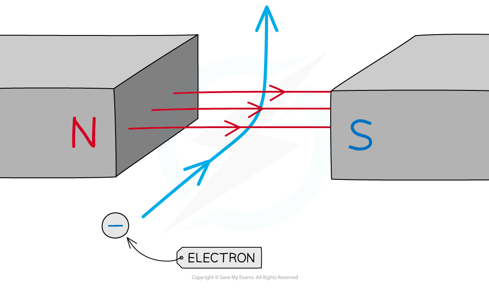

# Magnetic Force on a Charge

## Magnetic force on a charge

> **Spec point** — `spcpt_fjXZbp4wbXTtVj8r` · know that there is a force on a charged particle when it moves in a magnetic field as long as its motion is not parallel to the field (physics only)

## Magnetic force on a charge

- When a current-carrying wire is placed in a magnetic field, it will experience a force if the wire is perpendicular

  - This is because the magnetic field exerts a force on each individual electron flowing through the wire
- Therefore, when a charged particle passes through a magnetic field, the field can exert a **force** on the particle, causing it to **deflect**

  - The force is always at** 90 degrees** to both the direction of travel and the magnetic field lines
  - The direction can be worked out by using ***Fleming's left-hand rule***

***The electron experiences a force upwards when it travels through the magnetic field between the two poles. Remember that conventional current flows in the opposite direction to electrons.***

- If the particle is travelling **perpendicular** to the field lines:

  - It will experience the **maximum** force
- If the particle is travelling **parallel** to the field lines:

  - It will experience **no** force
- If the particle is travelling at an **angle** to the field lines:

  - It will experience a **small** force

> **Exam Hint**
> Remember that the direction of current flow in Fleming's Left-Hand Rule is from **positive** to **negative**. This means it is in the **opposite** direction to the direction of travel of an electron (which is negatively charged)
