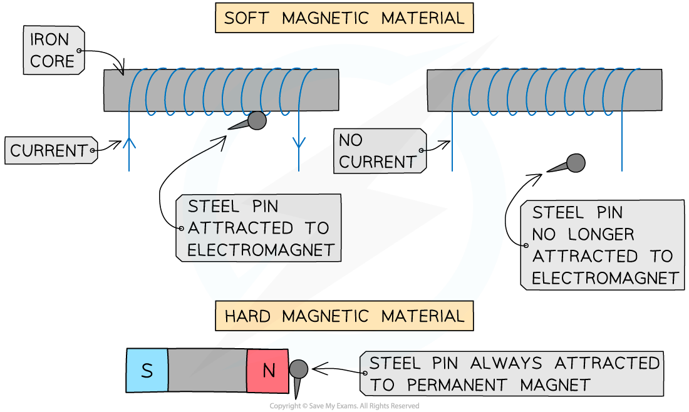

# Magnetism

## The law of magnetism

> **Spec point** — `spcpt_f77qyH7vc8Tk7qWF` · know that magnets repel and attract other magnets and attract magnetic substances

## The law of magnetism

### Poles of a magnet

- The ends of a magnet are called **poles**
- Magnets have two poles: a **north** and a **south**

***Poles of a Magnet***

### The law of magnetism

- When two magnets are held close together, there will be an attractive or repulsive force between the magnets depending on how they are arranged:

***Opposite poles attract; like poles repel***

- The law of magnetism states that:

  - Two **like** poles repel (e.g. S and S or N and N)
  - Two **opposite** poles attract (e.g. S and N)
- The attraction or repulsion between two magnetic poles occurs due to the **magnetic force**

## Magnetic materials

> **Spec point** — `spcpt_KGmkpjKQgVYDgtcJ` · describe the properties of magnetically hard and soft materials

## Magnetic materials

- Magnetic materials can be **soft** or **hard**
- Magnetically soft materials (e.g. iron):

  - Are **easy** to magnetise
  - Easily lose their magnetism (temporarily magnetised)
- Magnetically hard materials (e.g. steel):

  - Are **difficult** to magnetise
  - Do not easily lose their magnetism (permanently magnetised)
- Permanent magnets are made out of magnetically **hard** materials
- Electromagnets are made out of magnetically **soft** materials

  - This means that electromagnets can be made magnetic or non-magnetic as an when required

***A steel pin will be attracted when an electromagnet switches on but not when it switches off. It is always attracted to a permanent magnet ***
