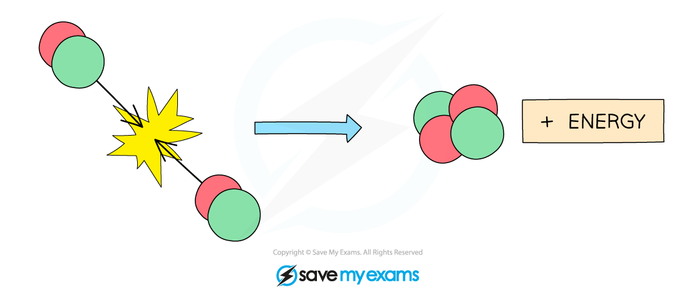

# Nuclear Fusion

## Fusion

> **Spec point** — `spcpt_5n5hj4GytSQNvRXC` · describe nuclear fusion as the creation of larger nuclei resulting in a loss of mass from smaller nuclei, accompanied by a release of energy

## Fusion

- Small nuclei can react to release energy in a process called **nuclear fusion**
- Nuclear fusion is defined as:

**When two light nuclei join to form a heavier nucleus**

- This process requires extremely **high temperatures** to maintain

  - This is why nuclear fusion has proven very hard to reproduce on Earth

- Stars, including the Sun, use nuclear fusion to produce energy

  - Therefore, fusion reactions are very important to life on Earth

- In most stars, hydrogen atoms are fused together to form helium and produce lots of energy

***Two hydrogen nuclei are fusing to form a helium nuclei***

- The energy produced during nuclear fusion comes from a very small amount of the particle’s mass being **converted** into energy
- The amount of energy released during nuclear fusion is huge

  - The energy from 1 kg of hydrogen that undergoes fusion is equivalent to the energy from burning about 10 million kilograms of coal

## Fusion vs fission

> **Spec point** — `spcpt_VxtV2WC8RNqwMdYW` · explain the difference between nuclear fusion and nuclear fission

## Fusion vs fission

- The following table summarises some of the key differences between fusion and fission:

#### Comparison of fusion and fission table

|   | **Fusion** | **Fission** |
|---|---|---|
| the process of... | nuclei joining together | nuclei splitting |
| nuclei are | small e.g. hydrogen | large e.g. uranium |
| occurs in | stars | nuclear reactors |
| produces | a large amount of energy  larger nuclei (usually stable and not radioactive) | a large amount of energy  smaller daughter nuclei (usually unstable and radioactive)  2 or 3 neutrons |
| requires | very high temperatures  very high pressures | thermal neutrons to induce fission |

- Nuclear fission reactors are an increasingly common method of electricity generation on Earth
- Nuclear fusion reactors are not yet a commercially viable method for generating electricity, but they are in development
- In the future, fusion reactors are likely to have several **advantages** over fission reactors

### Advantages of fusion reactors

- Nuclear fusion reactions are capable of generating **more energy** than fission reactions (per kilogram of fuel)
- The nuclear** **fuel required for fusion (isotopes of hydrogen found in water) is more **abundant **than the fuel required for fission (uranium and plutonium)
- Nuclear fusion produces **no** long-lived nuclear waste products

### Disadvantage of fusion reactors

- The **conditions **for nuclear fusion are much harder to achieve and maintain on Earth than fission
