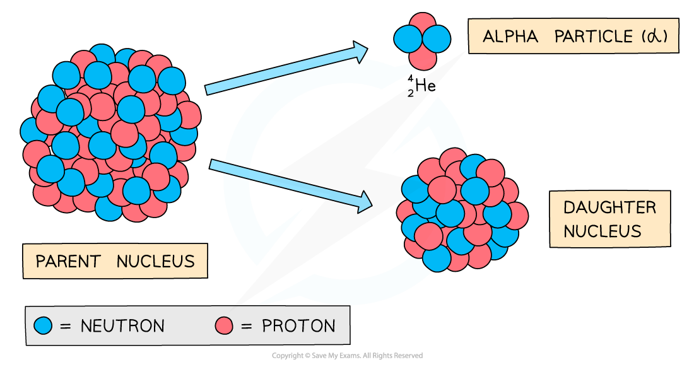
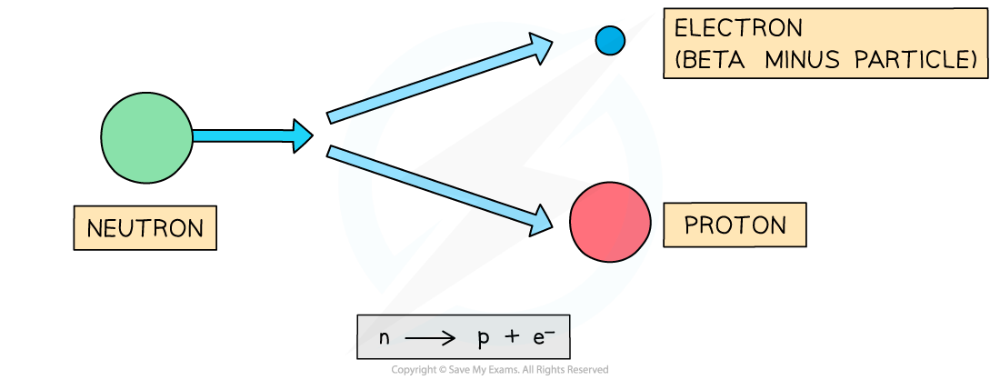

# Decay Equations

## Alpha, beta, gamma & neutron emission

> **Spec point** — `spcpt_fNQmdwQyt6x866bb` · describe the effects on the atomic and mass numbers of a nucleus of the emission of each of the four main types of radiation (alpha, beta, gamma and neutron radiation)

## Alpha, beta, gamma & neutron emission

### Alpha decay

- During alpha decay, an alpha particle is emitted from an unstable nucleus
- A completely **new element** is formed in the process

***Alpha decay usually happens in large unstable nuclei, causing the overall mass and charge of the nucleus to decrease***

- An alpha particle is a **helium nucleus**

  - It is made of 2 protons and 2 neutrons

- When the alpha particle is emitted from the unstable nucleus, the mass number and atomic number of the nucleus changes

  - The mass number **decreases** by 4
  - The atomic number **decreases** by 2
- Alpha decay can be represented by the following nuclear equation:

`straight X presubscript straight Z presuperscript straight A space rightwards arrow space straight Y presubscript straight Z minus 2 end presubscript presuperscript straight A minus 4 end presuperscript space plus thin space straight alpha presubscript 2 presuperscript 4`

- Where:

  - `straight X presubscript straight Z presuperscript straight A` is the initial element X with mass number A and atomic number Z
  - `Y presubscript Z minus sign 2 end presubscript presuperscript A minus sign 4 end presuperscript` is the new element Y
  - `straight alpha presubscript 2 presuperscript 4` is an alpha particle

### Beta decay

- During **beta** decay, a **neutron** changes into a **proton** and an **electron**

  - The electron is **emitted** and the proton **remains** in the nuclei
- A completely new element is formed because the **atomic number** changes

***Beta decay often happens in unstable nuclei that have too many neutrons. The mass number stays the same, but the atomic number increases by one***

- A beta particle is a high-speed **electron**
- It has a mass number of 0

  - This is because the electron has a negligible mass, compared to neutrons and protons
- Therefore, the **mass number** of the decaying nuclei **remains the same**
- Electrons have an atomic number of -1

  - This means that the atomic number of the new nucleus will **increase by 1** to balance the overall atomic number before and after the decay
- Beta decay can be represented by the following nuclear equation:

`straight X presubscript straight Z presuperscript straight A space rightwards arrow space straight Y presubscript straight Z plus 1 end presubscript presuperscript straight A space plus thin space straight beta presubscript negative 1 end presubscript presuperscript 0`

- Where:

  - `straight X presubscript straight Z presuperscript straight A` is the initial element X with mass number A and atomic number Z
  - `Y presubscript Z plus 1 end presubscript presuperscript A` is the new element Y
  - `straight beta presubscript negative 1 end presubscript presuperscript 0` is a beta particle

### Gamma decay

- During gamma decay, a gamma ray is emitted from an unstable nucleus
- The process that makes the nucleus less energetic but does not change its structure

***Gamma decay does not affect the mass number or the atomic number of the radioactive nucleus, but it does reduce the energy of the nucleus***

- The gamma ray that is emitted has a lot of energy, but no mass or charge
- Gamma decay can be represented by the following nuclear equation:

`straight X presubscript straight Z presuperscript straight A space rightwards arrow space straight X presubscript straight Z presuperscript straight A space plus thin space straight gamma presubscript 0 presuperscript 0`

- Where:

  - `straight X presubscript straight Z presuperscript straight A` is the element X with mass number A and atomic number Z
  - `straight gamma presubscript 0 presuperscript 0` is a gamma ray

- Notice that the mass number and atomic number of the unstable nucleus remains the **same **during the decay

### Neutron emission

- A small number of isotopes can decay by emitting neutrons
- When a nucleus emits a neutron:

  - The **atomic **number (number of protons) does not change
  - The **mass **number (total number of nucleons) decreases by 1

- Neutron emission can be represented by the following nuclear equation:

`straight X presubscript straight Z presuperscript straight A space rightwards arrow space straight X presubscript straight Z presuperscript straight A minus 1 end presuperscript space plus thin space straight n presubscript 0 presuperscript 1`

- Where:

  - `straight X presubscript straight Z presuperscript straight A` is the element X with mass number A and atomic number Z
  - `straight n presubscript 0 presuperscript 1` is a neutron

- Notice that the atomic number remains the **same **during the decay but the mass number has changed

  - This means an **isotope **of the original element has formed

> **Exam Hint**
> It is easy to forget that an alpha particle **is** a helium nucleus. The two are interchangeable, so don’t be surprised to see either used in the exam.
> 
> You are not expected to know the names of the elements produced during radioactive decays, but you do need to be able to calculate the mass and atomic numbers by making sure they are balanced on either side of the reaction.

## Decay equations

> **Spec point** — `spcpt_KdkKfX3VPWj7gJN6` · understand how to balance nuclear equations in terms of mass and charge

## Decay equations

- Radioactive decay events can be shown using **nuclear decay equations**
- A decay equation is similar to a chemical reaction equation as

  - the particles present before the decay are shown **before** the arrow
  - the particles produced in the decay are shown **after** the arrow

- In a decay equation:

  - the sum of the mass numbers **before **and **after** the reaction must be the **same**
  - the sum of the atomic numbers **before **and **after** the reaction must be the **same**

- The following decay equation shows polonium-212 undergoing alpha decay

`Po presubscript 84 presuperscript 212 space rightwards arrow space Pb presubscript 82 presuperscript 208 space plus space straight alpha presubscript 2 presuperscript 4`

- When a nucleus of polonium-212 decays, a nucleus of lead-208 forms and an alpha particle is emitted
- To check if the equation is balanced:

  - mass number:  212 = 208 + 4
  - atomic number:  84 = 82 + 2

- The sum of the numbers are the **same **on each side, so the equation is **balanced**

> **Worked Example**
> A nucleus with 84 protons and 126 neutrons undergoes alpha decay. It forms lead, which has the element symbol Pb.
> 
> **A.**   `Pb presubscript 82 presuperscript 206`
> 
> **B.**   `Pb presubscript 82 presuperscript 208`
> 
> **C.**   `Pb presubscript 84 presuperscript 210`
> 
> **D.**   `Pb presubscript 86 presuperscript 214`
> 
> Which of the isotopes of lead pictured is the correct one formed during the decay?
> 
> **ANSWER:   A**
> 
> **Step 1: Calculate the mass number of the original nucleus**
> 
> - The mass number is equal to the number of protons plus the number of neutrons
> - The original nucleus has 84 protons and 126 neutrons
> 
> 84 + 126 = 210
> 
> - The mass number of the original nucleus is 210
> 
> **Step 2: Calculate the new atomic number**
> 
> - The alpha particle emitted is made of two protons and two neutrons
> - Protons have an atomic number of 1, and neutrons have an atomic number of 0
> - Removing two protons and two neutrons will reduce the atomic number by 2
> 
> 84 – 2 = 82
> 
> - The new nucleus has an atomic number of **82**
> 
> **Step 3: Calculate the new mass number**
> 
> - Protons and neutrons both have a mass number of 1
> - Removing two protons and two neutrons will reduce the mass number by 4
> 
> 210 – 4 = 206
> 
> - The new nucleus has a mass number of **206**

> **Worked Example**
> A nucleus with 11 protons and 13 neutrons undergoes beta decay. It forms magnesium, which has the element symbol Mg.
> 
> **A.**   `Mg presubscript 9 presuperscript 20`
> 
> **B.**   `Mg presubscript 10 presuperscript 24`
> 
> **C.**   `Mg presubscript 11 presuperscript 23`
> 
> **D.**   `Mg presubscript 12 presuperscript 24`
> 
> Which is the correct isotope of magnesium formed during the decay?
> 
> **ANSWER:  D**
> 
> **Step 1: Calculate the mass number of the original nucleus**
> 
> - The mass number is equal to the number of protons plus the number of neutrons
> - The original nucleus has 11 protons and 13 neutrons
> 
> 11 + 13 = 24
> 
> - The mass number of the original nucleus is 24
> 
> **Step 2: Calculate the new atomic number**
> 
> - During beta decay a neutron changes into a proton and an electron
> - The electron is emitted as a beta particle
> - The neutron has an atomic number of 0 and the proton has an atomic number of 1
> - So the atomic number increases by 1
> 
> 11 + 1 = 12
> 
> - The new nucleus has an atomic number of 12
> 
> **Step 3: Calculate the new mass number**
> 
> - Protons and neutrons both have a mass number of 1
> - Changing a neutron to a proton will not affect the mass number
> - The new nucleus has a mass number of 24 (the same as before)
