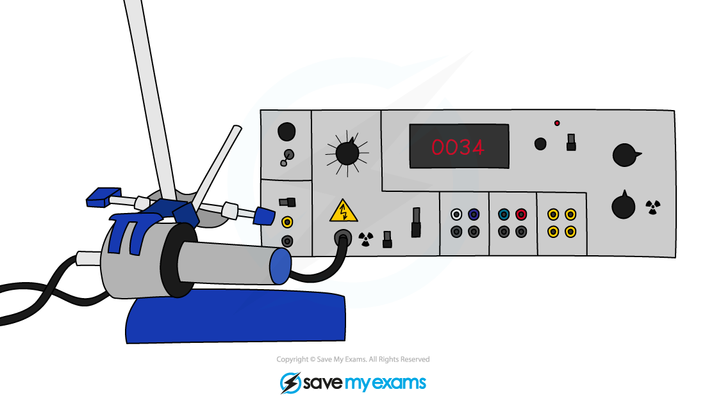
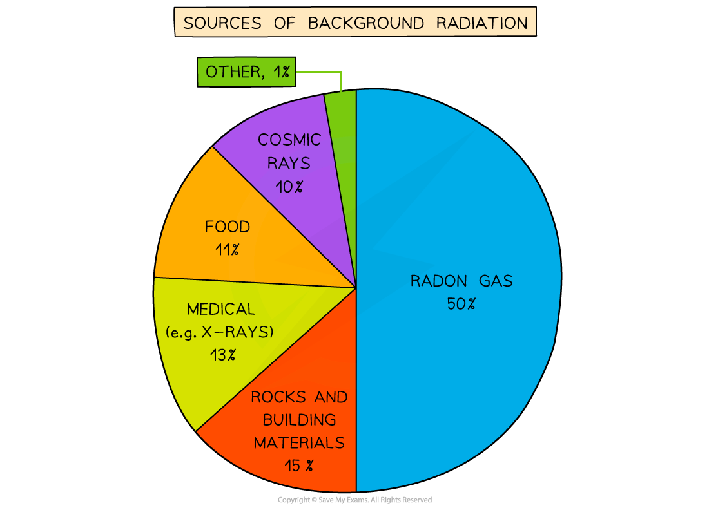
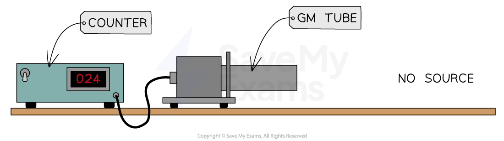
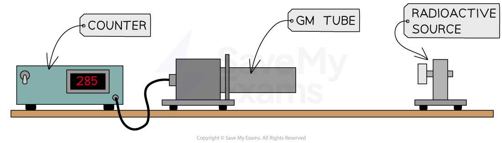

# Detecting Radiation

## Detecting radiation

> **Spec point** — `spcpt_F47Gfd3vKxPHSh8K` · know that photographic film or a Geiger−Müller detector can detect ionising radiations

## Detecting radiation

- Ionising radiation can be **detected **using

  - photographic film
  - a Geiger–Müller tube

### Photographic film

- Photographic films detect radiation by becoming darker when it absorbs radiation, similar to when it absorbs visible light

  - The **more **radiation the film absorbs, the **darker **it is when it is developed

- People who work with radiation, such as radiographers, wear film badges which are checked regularly to monitor the levels of radiation absorbed
- To get an accurate measure of the dose received, the badge contains different materials that the radiation must penetrate to reach the film

  - These materials may include aluminium, copper, paper, lead and plastic

- The diagram shows what a typical radiation badge looks like:

***A badge containing photographic film can be used to monitor a person’s exposure to radiation***

### Geiger-Müller tube

- The Geiger-Müller tube is the most common device used to measure and detect radiation
- Each time it absorbs radiation, it transmits an electrical pulse to a counting machine
- This makes a clicking sound or displays the **count rate**
- The greater the frequency of clicks, or the higher the count rate, the more radiation the Geiger-Müller tube is absorbing

  - Therefore, it matters how close the tube is to the radiation source
  - The further away from the source, the lower the count rate detected

***A Geiger-Müller tube (or Geiger counter) is a common type of radiation detector***

> **Worked Example**
> A Geiger-Müller tube is used to detect radiation in a particular location. If it counts 16,000 decays in 1 hour, what is the count rate?
> 
> **Answer:**
> 
> **Step 1: Identify the different variables**
> 
> - The number of decays is 16 000
> - The time is 1 hour
> 
> **Step 2: Determine the time period in seconds**
> 
> - 1 hour is equal to 60 minutes, and 1 minute is equal to 60 seconds
> 
> Time period = 1 × 60 × 60 = 3600 seconds
> 
> **Step 3: Divide the total counts by the time period in seconds**
> 
> Counts ÷ Time period = 16 000 ÷ 3600 = 4.5
> 
> - Therefore, it detects **4.5 decays per second**

> **Exam Hint**
> If asked to name a device for detecting radiation, the Geiger-Müller tube is a good example to give. You can also refer to it as a GM tube, a GM detector, GM counter, Geiger counter etc. (The examiners will allow some level of misspelling, providing it is readable). Don’t, however, refer to it as a ‘radiation detector’ as this is too vague and may simply restate what was asked for in the question.

## Background radiation

> **Spec point** — `spcpt_SVsPmKN3NJ3VRbXr` · explain the sources of background (ionising) radiation from Earth and space

## Background radiation

- It is important to remember that radiation is a natural phenomenon
- Radioactive elements have **always** existed on Earth and in outer space
- However, human activity has added to the amount of radiation that humans are exposed to on Earth

- Background radiation is defined as:

**The radiation that exists around us all the time**

- Every second of the day there is some radiation emanating from **natural sources** such as:

  - Rocks
  - Cosmic rays from space
  - Foods

#### Chart of Background Radiation Sources

***Background radiation is the radiation that is present all around in the environment. Radon gas is given off from some types of rock***

- There are two types of background radiation:

  - Natural sources
  - Artificial (man-made) sources

### Natural Sources of Background Radiation

#### Radon gas from rocks and buildings

- Airborne radon gas comes from rocks in the ground, as well as building materials e.g. stone and brick
- This is due to the presence of radioactive elements, such as uranium, which **occur naturally** in small amounts in all rocks and soils

  - Uranium decays into radon gas, which is an alpha emitter
  - This is particularly dangerous if inhaled into the lungs in large quantities

- Radon gas is tasteless, colourless and odourless so it can only be detected using a Geiger counter
- Levels of radon gas are generally very low and are not a health concern, but they can vary significantly from place to place

#### Cosmic rays from space

- The sun emits an enormous number of protons every second
- Some of these enter the Earth’s atmosphere at high speeds
- When they collide with molecules in the air, this leads to the production of gamma radiation
- Other sources of cosmic rays are supernovae and other high energy cosmic events

#### Carbon-14 in biological material

- All organic matter contains a tiny amount of carbon-14
- Living plants and animals constantly replace the supply of carbon in their systems hence the amount of carbon-14 in the system stays almost constant

#### Radioactive material in food and drink

- Naturally occurring radioactive elements can get into food and water since they are in contact with rocks and soil containing these elements
- Some foods contain higher amounts such as potassium-40 in bananas
- However, the amount of radioactive material is minuscule and is not a cause for concern

### Artificial Sources of Background Radiation

#### Nuclear medicine

- In medical settings, nuclear radiation is utilised all the time
- For example, X-rays, CT scans, radioactive tracers, and radiation therapy all use radiation

#### Nuclear waste

- While nuclear waste itself does not contribute much to background radiation, it can be dangerous for the people handling it

#### Nuclear fallout from nuclear weapons

- Fallout is the residue radioactive material that is thrown into the air after a nuclear explosion, such as the bomb that exploded at Hiroshima
- While the amount of fallout in the environment is presently very low, it would increase significantly in areas where nuclear weapons are tested

#### Nuclear accidents

- Nuclear accidents, such as the incident at Chornobyl, contribute a large dose of radiation to the environment
- While these accidents are now extremely rare, they can be catastrophic and render areas devastated for centuries

### Accounting for background radiation

- Background radiation must be accounted for when taking readings in a laboratory
- This can be done by taking readings with no radioactive source present and then subtracting this from readings with the source present
- This is known as the **corrected count rate**

#### Measuring background count rate

***The background count rate can be measured using a Geiger-Müller (GM) tube with no source present***

- For example, if a Geiger counter records 24 counts in 1 minute when no source is present, the background radiation count rate would be:

  - 24 counts per **minute **(cpm)
  - 24/60 = 0.4 counts per **second **(cps)

#### Measuring the corrected count rate of a source

***The corrected count rate can be determined by measuring the count rate of a source and subtracting the background count rate***

- Then, if the Geiger counter records, for example, 285 counts in 1 minute when a source is present, the corrected count rate would be:

  - 285 − 24 = 261 counts per **minute **(cpm)
  - 261/60 = 4.35 counts per **second **(cps)

- When measuring count rates, the **accuracy **of results can be improved by:

  - Repeating readings and taking averages
  - Taking readings over a long period of time

> **Worked Example**
> A student uses a Geiger counter to measure the counts per minute at different distances from a source of radiation. Their results and a graph of the results are shown below.
> 
> 
> 
> Determine the background radiation count.
> 
> **Answer:**
> 
> **Step 1: Determine the point at which the source radiation stops being detected**
> 
> - The background radiation is the amount of radiation received all the time
> - When the source is moved back far enough it is all absorbed by the air before reaching the Geiger counter
> - Results after 1 metre do not change
> - Therefore, the amount after 1 metre is only due to background radiation
> 
> **Step 2: State the background radiation count **
> 
> - The background radiation count is **15 counts per minute**

> **Exam Hint**
> The sources that make the most significant contribution are the natural sources:
> 
> - Radon gas from rocks and buildings
> - Food and drink
> - Cosmic rays
> 
> Make sure you remember these for your exam!
