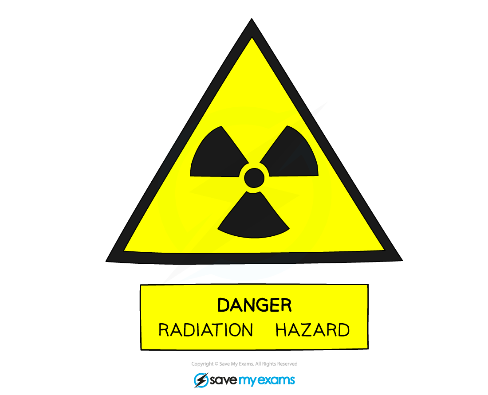
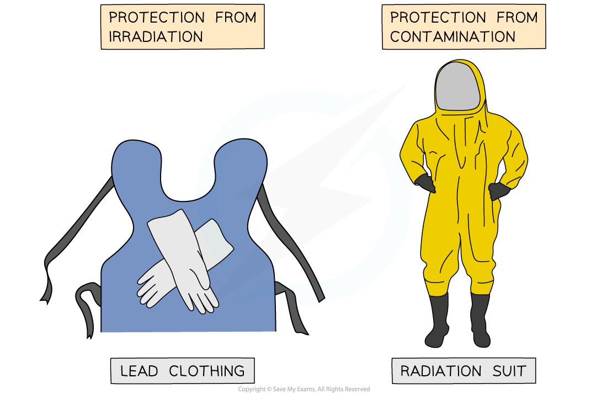

# Contamination & Irradiation

## Contamination & irradiation

> **Spec point** — `spcpt_rNHHCKfdcPPf3sYJ` · describe the difference between contamination and irradiation

## Contamination & irradiation

### Contamination

- Contamination is defined as:

**The accidental transfer of a radioactive substance onto or into a material**

- A substance is only radioactive if it contains a source of ionising radiation
- Contamination occurs when a radioactive isotope gets onto a material where it should not be

  - It is almost always a mistake or an accident e.g. a radiation leak
- As a result of this, the small amounts of the isotope in the contaminated areas will emit radiation and the material **becomes radioactive**

### Irradiation

- Irradiation is defined as:

**The process of exposing a material to ionising radiation**

- Irradiating a substance **does not **make it radioactive

  - However, it **can** kill living cells

- Irradiation is usually a deliberate process, such as in the **sterilisation** of food or medical equipment

  - Surgical equipment is irradiated before being used in order to kill any micro-organisms on it before surgery
  - Food can be irradiated to kill any micro-organisms within it to make it last longer

***This sign is the international symbol indicating the presence of a radioactive material***

### Protection from irradiation and contamination

- Radiation can mutate DNA in cells and cause cancer through both irradiation and contamination

  - Therefore, it is important to reduce the risk of exposure to radiation

- Contamination is particularly dangerous if a radioactive source gets **inside **the human body

  - For example, through the inhalation of radioactive gas particles, or ingesting contaminated food
  - The internal organs will be irradiated as the source emits radiation as it moves through the body

- To prevent irradiation, **shielding **can be used to absorb radiation

  - Lead-lined suits are used to reduce irradiation for people working with radioactive materials
  - The lead absorbs most of the radiation that would otherwise hit the person

- To prevent contamination, an **airtight suit** is worn by people working in an area where a radioactive source may be present

  - This prevents radioactive atoms from getting on or into the person

***Lead shielding is used when a person is getting an x-ray, as well as for people who work with radiation. Contamination carries much greater risks than irradiation***

### Differences between irradiation and contamination

- The differences between irradiation and contamination are summarised in the table below:

#### Comparison of irradiation and contamination table

|   | **Irradiation** | **Contamination** |
|---|---|---|
| description | when an object is exposed to a source of radiation but does not become radioactive | when an object becomes radioactive due to the presence of a source of radiation |
| source | exposure to source of radiation outside the object | exposure to source on or within the object |
| prevention | blocked by using shielding such as lead | radiation cannot be blocked once an object is contaminated, but can be prevented by handling the source safely |
| causes | caused by the deliberate exposure to radiation | caused by the accidental transfer of radioactive material |

> **Worked Example**
> Summarise the difference in the risk posed by radioactive sources with very short and very long half-lives in regard to
> 
> (a) irradiation
> 
> (b) contamination.
> 
> **Answer:**
> 
> **(a) Irradiation poses a greater risk in sources with...**
> 
> - Shorter half-lives
> - A short half-life means a source has a **high activity**
> - This means there is a high rate of radioactive emissions, compared to a source with a long half-life
> 
> **(b) Contamination poses a greater risk in sources with...**
> 
> - Longer half-lives
> - Sources with long half-lives will **remain radioactive for longer**
> - They need to be controlled for longer, to prevent them spreading
> - Shielding and storage may be required

> **Exam Hint**
> Irradiation and contamination are very commonly confused.
> 
> Remember that something is radioactive **only **if it contains radioactive atoms. This can only occur from contamination, **not** from irradiation!
