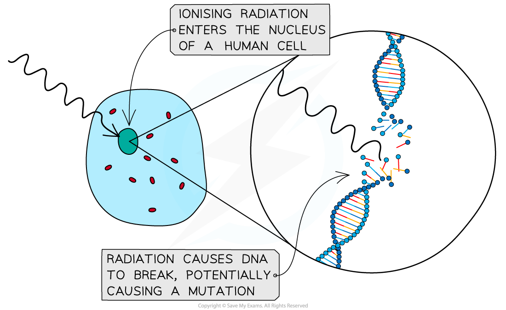
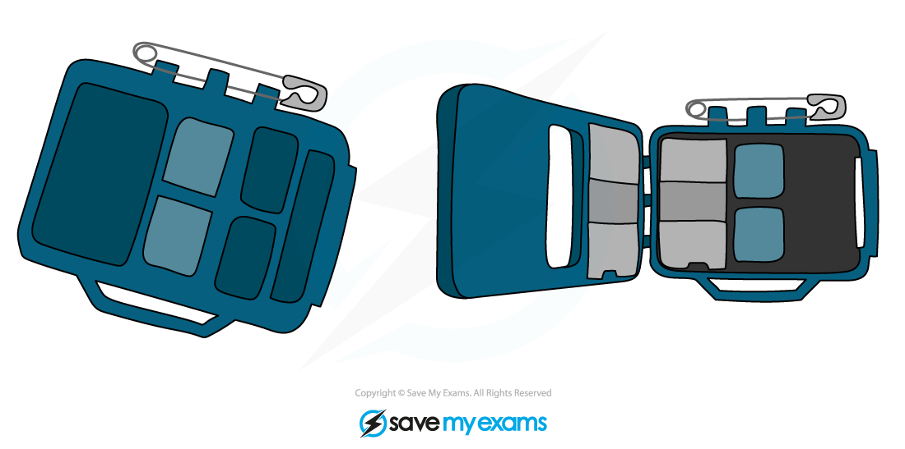
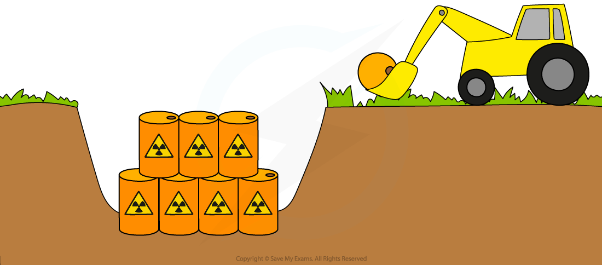

# Dangers of Radiation

## Dangers of radiation

> **Spec point** — `spcpt_483tNYgS2GX5pBCD` · describe the dangers of ionising radiations, including: 
• that radiation can cause mutations in living organisms
• that radiation can damage cells and tissue
• the problems arising from the disposal of radioactive waste and how the associated risks can be reduced.

## Dangers of radiation

- All types of ionising radiation pose a danger if mishandled as they can

  - damage living cells and tissues
  - cause mutations which can lead to cancer

#### Effect of radiation on a living cell

***Ionising radiation can cause damage to DNA. Sometimes the cell can successfully repair the DNA, but incorrect repairs can cause a mutation***

- Highly **ionising **types of radiation are more dangerous **inside **the body (if a radioactive source is somehow ingested)

  - Alpha sources are the **most ionising**, so they are likely to cause the **most harm** to living cells inside the body
  - Gamma sources are the **least ionising** (about 20 times lower than alpha particles), so they are likely to cause the **least harm** to living cells inside the body

- Highly **penetrating **types of radiation are more dangerous **outside **the body

  - Gamma sources are the **most penetrating**, so they are able to pass through the skin and reach living cells in the body
  - Alpha sources are **least penetrating**, so they would be absorbed by the air before even reaching the skin

### Safe handling of radioactive sources

- The risks of radiation exposure can be minimised by

  - handing sources of radiation safely
  - monitoring exposure to radiation

- To minimise the risks of **contamination**, safety practices must be followed, such as:

  - keeping radioactive sources in a **shielded container** when not in use, for example, a lead-lined box
  - wearing gloves and using **tongs** to handle radioactive materials
  - wearing **protective clothing** (particularly if the risk of inhalation or ingestion is high)
  - limiting the **time** that a radioactive source is outside of its container

- To minimise the risks of **irradiation **to workers, it is important to **monitor **their exposure to radiation

  - To protect against over-exposure, the dose received by different activities is measured
  - A dosemeter measures the amount of radiation in particular areas and is often worn by radiographers, or anyone working with radiation

#### Badge for monitoring radiation exposure

***A dosemeter, or radiation badge, can be worn by a person working with radiation in order to keep track of the amount of radiation they are receiving***

### Disposal of nuclear waste

- Nuclear waste must be treated appropriately, depending on the type of radiation it emits

  - **Alpha**-emitting nuclear waste is easily stored in plastic or metal canisters
  - **Beta**-emitting nuclear waste is stored inside metal canisters and concrete silos
  - **Gamma**-emitting nuclear waste requires storage inside lead-lined, thick concrete silos

- Radioactive waste of all types tends to emit dangerous levels of radiation for many years, so it must be stored securely for a very long time
- Typically, waste with the highest levels of radioactivity must be buried underground in secure, geologically stable locations

#### Dealing with radioactive waste

***Depending on the type of radiation emitted, nuclear waste is treated in different ways***

- Sources with** long half-lives** present a risk of contamination for a much longer time
- Radioactive waste with a long half-life can be buried underground to prevent radioactive from being released into the environment
- Radioactive waste must be stored in **strong **containers

  - The containers must be able to withstand harsh conditions over long periods

- Containers must be designed to resist **rust **and corrosion

  - Rust-proof containers are often expensive and challenging to manufacture

- The disposal site must have **high security** to prevent unauthorised access
- The location of the disposal site must have a **low risk of natural disasters**, e.g. earthquakes
- Carefully selecting the site and using strong containers will help prevent radioactive waste from leaking into **groundwater**
- Radioactive waste can also be diluted in large volumes of seawater

  - This helps to minimise the concentration of radioactive materials

> **Worked Example**
> A student plans to use a gamma source to conduct an experiment.
> 
> List **four **things that the student should do in order to minimise the risk to themselves when using the source.
> 
> **Answer:**
> 
> **Any four from:**
> 
> - Keep the source in a lead lined container until the time it is needed
> - Use tongs to move the source, rather than handling it directly
> - The source should be kept at as far a distance from the student as possible during the experiment
> - The time that the source is being used should be minimised
> - After the experiment the student should wash their hands
> - The date and the time that the radiation has been used for should be recorded
