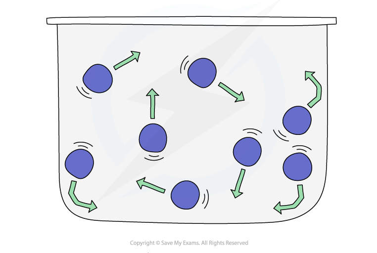
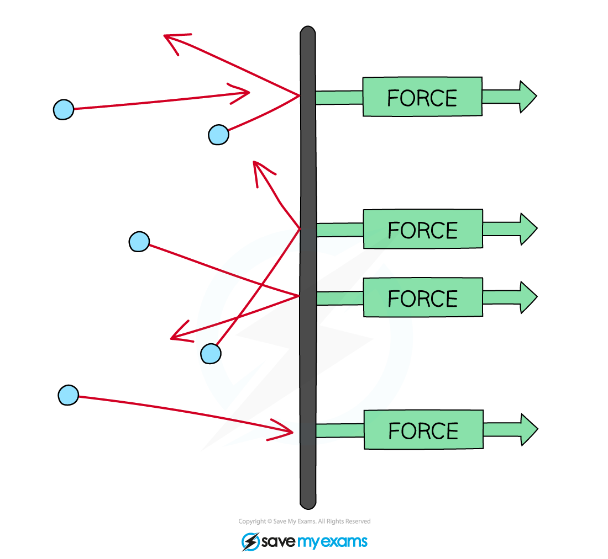

# Kinetic Theory

## Kinetic theory of gases

> **Spec point** — `spcpt_x74ZnVMDqxDSnPMg` · explain how molecules in a gas have random motion and that they exert a force, and hence a pressure, on the walls of a container

## Kinetic theory of gases

### Random motion

- Molecules in a gas are in constant **random** motion at high speeds
- Random motion means that the molecules are travelling in no specific path and undergo sudden changes in their motion if they collide:

  - with the walls of its container
  - with other molecules
- The random motion of tiny particles in a fluid is known as **Brownian motion**

***Random motion of gas molecules in a container, caused by collisions***

- Brownian motion provides **evidence** that air is made of small particles
- This is because when larger particles, such as smoke particles or pollen, are observed floating in the air:

  - the larger particles move with **random motion**
  - this is a result of the larger particles colliding with **smaller particles** that are invisible to the naked eye

### Pressure

- A feature of gases is that they fill their container
- The pressure is defined as the **force per unit area**

$p=\frac{F}{A}$

- Where:

  - *p* = pressure in pascals Pa
  - *F* = force in newtons N
  - *A* = area in metres-squared m2
- As the gas particles move about randomly they collide with the walls of their containers
- These collisions produce a **net force **at right angles to the wall of the gas container (or any surface)
- Therefore, a gas at **high** pressure has **more frequent collisions** with the container walls and a greater force

  - Hence the higher the pressure, the higher the **force** exerted per unit area

***Gas molecules colliding with the walls of a container, exerting a force over the area and hence generating pressure***
