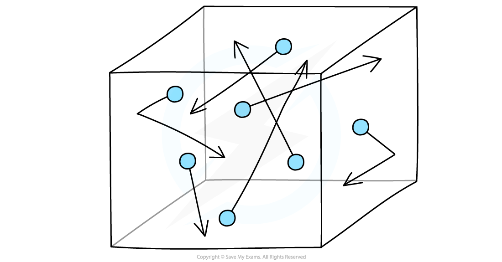
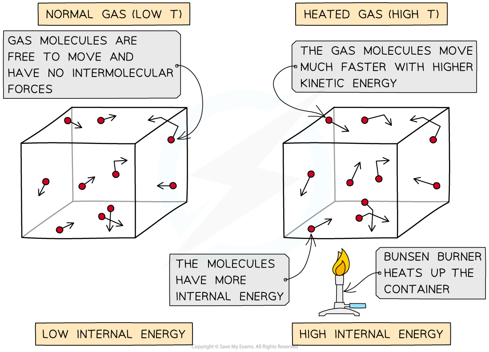

# Temperature

## Temperature & speed

> **Spec point** — `spcpt_t68nmkmN5NxhXx58` · understand why an increase in temperature results in an increase in the average speed of gas molecules

## Temperature & speed

- Imagine molecules of gas that are free to move around in a box
- The molecules in the gas move around randomly at high speeds, colliding with surfaces and exerting pressure upon them
- The **temperature** of a gas is a measure of the **average speed** of the molecules:

  - The** higher the temperature **of the gas, the **faster** the molecules move
  - This is because they have a greater average speed

***Gas molecules move about randomly at high speeds***

## Temperature & kinetic energy

> **Spec point** — `spcpt_tXGcQTmGgKWsPTvx` · know that the Kelvin temperature of a gas is proportional to the average kinetic energy of its molecules

## Temperature & kinetic energy

- The temperature of a substance is related to the average kinetic energy of its molecules
- The higher the temperature, the higher the average kinetic energy of the molecules, and vice versa

  - This means they move **faster** at higher temperatures
  - This applies to all states of matter, although the motion of particles in a solid is different from that of particles in a gas
- For a gas, the **internal energy** can be taken as the sum of the kinetic energies of all the molecules

  - In a gas, the intermolecular forces are negligible, so the contribution from potential energy can be taken as zero
  - This is different from a solid or liquid, where the internal energy includes contributions from both kinetic and potential energy

***As the container is heated up, the gas molecules move faster with higher kinetic energy. The energy stored within the system - the internal energy - therefore increases***

- If the temperature of a gas is increased, the particles move faster and gain **kinetic energy**

  - They collide more often with each other and the container walls, leading to an increase in **pressure**
- The temperature (in Kelvin) is **proportional** to the average kinetic energy of the molecules:

$T \propto K E$

> **Worked Example**
> When a liquid evaporates, molecules escape from the surface of the liquid.
> 
> What happens to the temperature of the liquid and the average kinetic energy of the molecules within it?
> 
> | ** ** | **Temperature / K** | **Average kinetic energy of the molecules** |
> |---|---|---|
> | A | Increases | Increases |
> | B | Decreases | Decreases |
> | C | Stays the same | Stays the same |
> | D | Decreases | Increases |
> 
> **Answer: B**
> 
> - When evaporation takes place, the more energetic molecules leave the surface of the liquid
> - Since the more energetic molecules have left, the **average kinetic energy per molecule** must **decrease**
> 
>   - Therefore, **A **& **D** are not correct
> - Temperature is **proportional** to the average kinetic energy per molecule, therefore, the **temperature** also **decreases**
