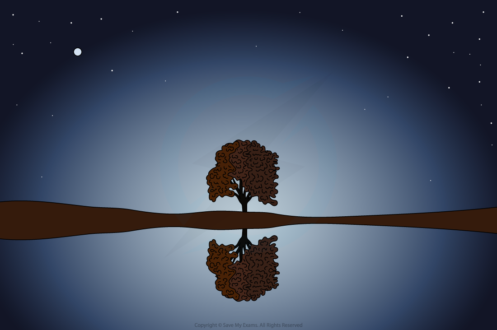
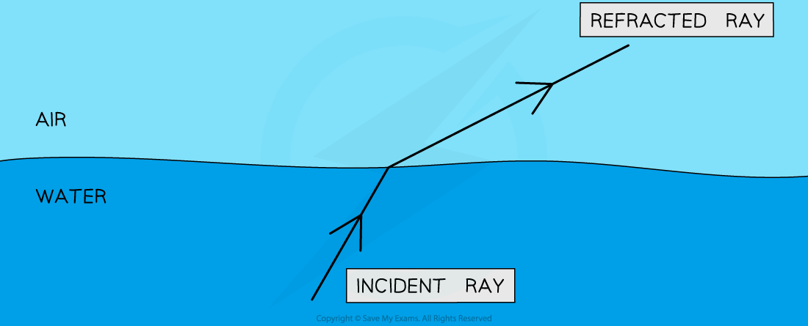
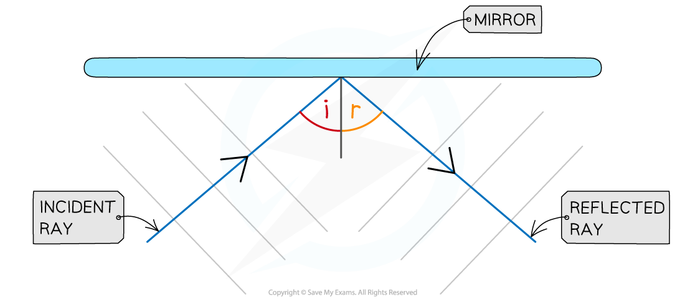
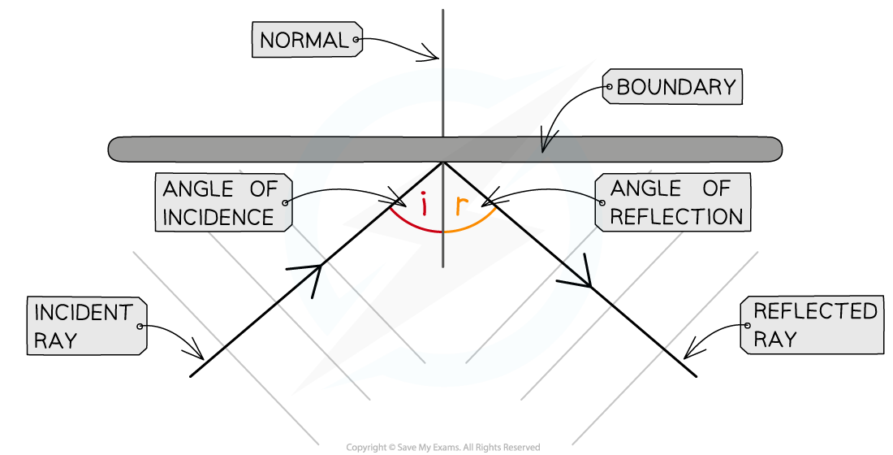
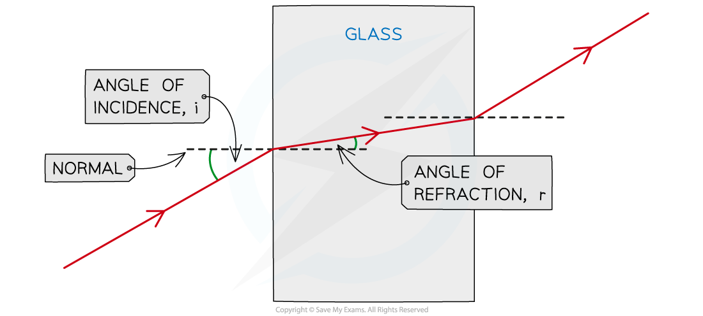

# Reflection & Refraction

## Reflection & refraction

> **Spec point** — `spcpt_DMBbFvJzKPPm6WcB` · explain that all waves can be reflected and refracted

## Reflection & refraction

- All waves, whether transverse or longitudinal, can be **reflected** and **refracted**
- Reflection occurs when:

**A wave hits a boundary between two media and does not pass through, but instead stays in the original medium**

- In optics the word **medium **is used to describe a material that transmits light

  - **Media** means more than one medium

#### An example of reflection

***An identical image of the tree is seen in the water due to reflection***

- Refraction occurs when:

**A wave passes a boundary between two different transparent media and undergoes a change in direction**

#### An example of refraction

***Waves can change direction when moving between materials with different densities***

## The law of reflection

> **Spec point** — `spcpt_HRk2sv9jmG8TKPzx` · use the law of reflection (the angle of incidence equals the angle of reflection)

## The law of reflection

- The **law of reflection** states that:

**Angle of incidence (i) = Angle of reflection (r)**

- Angles are measured between the wave direction (ray) and a line at 90 degrees to the boundary called the **normal**

  - The angle of the wave approaching the boundary is called the **angle of incidence (i)**
  - The angle of the wave leaving the boundary is called the **angle of reflection (r)**

#### An example of reflection in a plane mirror

***Ray diagram of the reflection of a wave in a mirror***

## Ray diagrams

> **Spec point** — `spcpt_mhY7msFPwnFBHT53` · draw ray diagrams to illustrate reflection and refraction

## Ray diagrams

### Reflection ray diagrams

- When drawing a ray diagram an arrow is used to show the direction the wave is travelling

  - An **incident** ray has an arrow pointing **towards** the boundary
  - A **reflected** ray has an arrow pointing **away** from the boundary

#### A diagram showing the law of reflection

***The angle of incidence and angle of reflection are equal in the law of reflection***

### Refraction ray diagrams

- The direction of the incident and refracted rays are also taken from the **normal **line
- The change in direction of the refracted ray depends on the difference in density between the two media:

  - From less dense to more dense (e.g air to glass), light bends **towards** the normal
  - From more dense to less dense (e.g. glass to air), light bends **away** from the normal
  - When passing along the normal (perpendicular) the light **does not bend** at all

#### A diagram of a ray refracted into and out of a glass block

***How to construct a ray diagram showing the refraction of light as it passes through a rectangular block***

- The change in direction occurs due to the change in speed when travelling in different substances

  - When light passes into a **denser** substance the rays will **slow down**, hence they bend towards the normal

- The only properties that change during refraction are speed and wavelength – the **frequency** of waves **does not change**

  - Different frequencies account for different **colours** of light (red has a low frequency, whilst blue has a high frequency)
  - When light refracts, **it does not change colour **(think of a pencil in a glass of water), therefore, the frequency does not change

> **Exam Hint**
> When drawing ray diagrams for reflection:
> 
> 1. A simple straight line **with an arrow** is enough to represent the wave
> 
>   - You do not need to draw the wavefronts unless asked to do so!
> 2. Take care to draw the angle correctly
> 
>   - If it is slightly out it won’t be a problem, but if there is an obvious difference between the angle of incidence and the angle of reflection then you will probably lose a mark!
> 
> Practice drawing refraction diagrams as much as you can! It's very important to remember which way the light bends when it crosses a boundary:
> 
> As the light **enters** the block it bends **towards** the normal line
> 
> **Remember: Enters Towards**
> 
> When it **leaves** the block it bends **away** from the normal line
> 
> **Remember: Leaves Away**
> 
> Don't forget to draw the arrows for the direction of the light rays and make sure they are drawn with a ruler and a sharp pointed pencil
