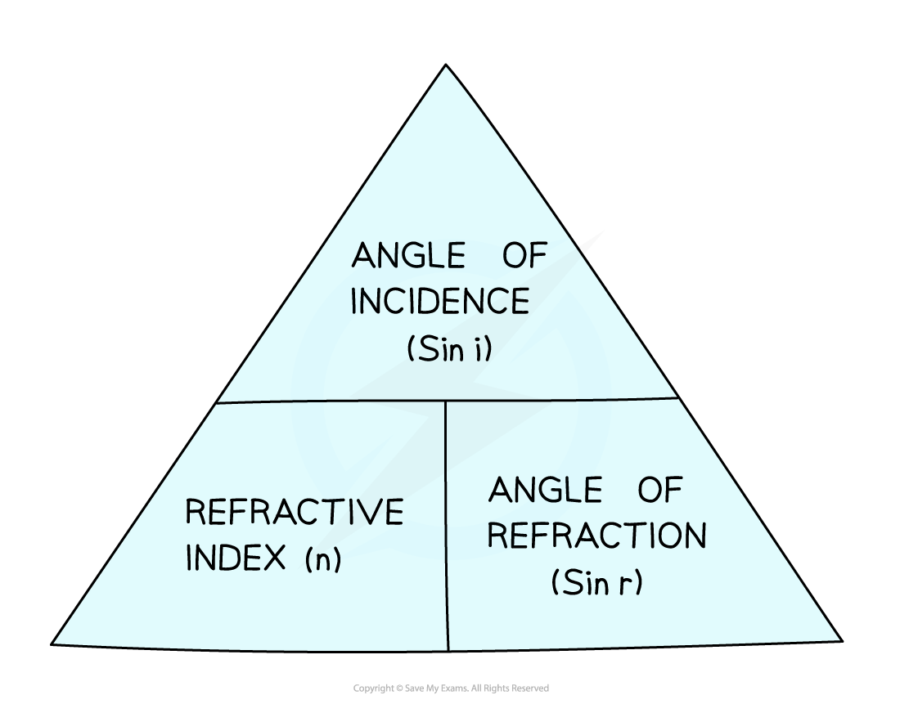

# Snell's Law

## Snell's law

> **Spec point** — `spcpt_7MGXvPyH2DKpbXHj` · know and use the relationship between refractive index, angle of incidence and angle of refraction: 
n = sin i / sin r

## Snell's law

- The angles of incidence and refraction are related to the** refractive index **of a medium by an equation known as **snell's Law:**

$n=\frac{\mathrm{sin}i}{\mathrm{sin}r}$

- Where:

  - *n* = the refractive index of the material
  - *i* = angle of incidence of the light (°)
  - *r* = angle of refraction of the light (°)

- 'Sin' is the trigonometric function 'sine' which is on a scientific calculator
- You can revise the concept of refraction using the revision notes [Reflection & refraction](https://www.savemyexams.com/igcse/physics/edexcel/19/revision-notes/3-waves/3-2-reflection-and-refraction/3-2-2-reflection-and-refraction/)

#### A formula triangle can help rearrange the snell's law equation

***Snell's law formula triangle***

- For more information on how to use a formula triangle refer to the revision note on [Speed](https://www.savemyexams.com/igcse/physics/edexcel/19/revision-notes/1-forces-and-motion/1-1-movement-and-position/1-1-2-speed/)

### Refractive index

- The **refractive index** is a number which is related to the speed of light in the material (which is **always less** than the speed of light in a vacuum):

$\mathrm{refractive} \mathrm{index},n=\frac{\mathrm{speed} \mathrm{of} \mathrm{light} \mathrm{in}a\mathrm{vacuum}}{\mathrm{speed} \mathrm{of} \mathrm{light} \mathrm{in} \mathrm{material}}$

- The refractive index is a number that is **always larger than 1** and is different for different materials

  - Objects which are more **optically dense** have a **higher** refractive index, eg. *n* is about 2.4 for diamond
  - Objects which are less **optically dense** have a **lower** refractive index, eg. *n* is about 1.5 for glass

- Since the refractive index is a **ratio**, it has **no units**

> **Worked Example**
> A ray of light enters a glass block of refractive index 1.53 making an angle of 15° with the normal before entering the block.
> 
> Calculate the angle it makes with the normal after it enters the glass block.
> 
> **Answer:**
> 
> **Step 1: List the known quantities**
> 
> - Refractive index of glass, *n* = 1.53
> - Angle of incidence, i = 15°
> 
> **Step 2: Write the equation for snell's law**
> 
> $n=\frac{\mathrm{sin}i}{\mathrm{sin}r}$
> 
> **Step 3: Rearrange the equation and calculate sin (r)**
> 
> $\mathrm{sin}r=\frac{\mathrm{sin}i}{n}$
> 
> `sin space r italic space equals space fraction numerator sin open parentheses 15 close parentheses over denominator 1.53 end fraction`
> 
> $\mathrm{sin}r=0.1692$
> 
> **Step 4: Find the angle of refraction (*****r*****) by using the inverse sin function**
> 
> $r=\mathrm{sin}^{--1}(0.1692)=9.7=10^{\circ}$

> **Exam Hint**
> **Important:** in snell's law $\frac{\mathrm{sin}i}{\mathrm{sin}r}$ is not the same as $\frac{i}{r}$. Incorrectly cancelling the sin terms is a common mistake!
> 
> When calculating the value of *i* or *r* start by calculating the value of sin* i* or sin* r. *You can then use the **inverse sin** function (sin–1 on most calculators by pressing 'shift' then 'sine') to find the angle.
> 
> One way to remember which way around *i *and *r* are in the fraction is remembering that 'i' comes before 'r' in the alphabet, and therefore is on the top of the fraction (whilst *r* is on the bottom).
