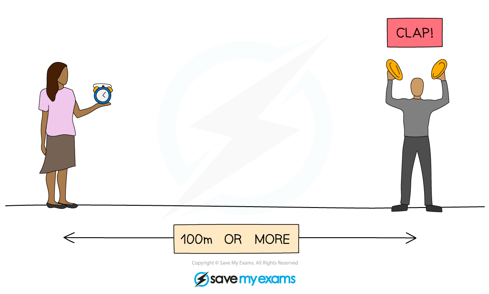
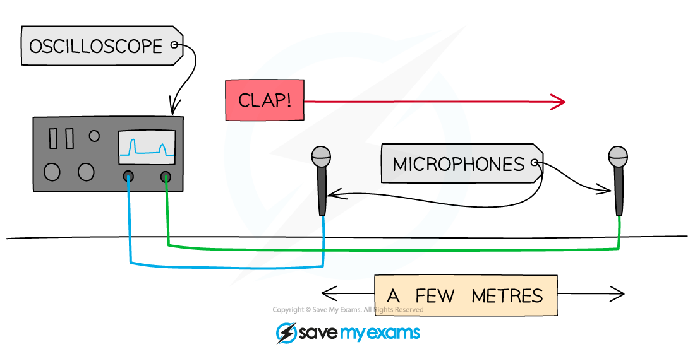

# Core Practical: Investigating the Speed of Sound

## Core practical 6: investigating the speed of sound

> **Spec point** — `spcpt_RMKzScnK4WbDC4sr` · Core practical 6: investigate the speed of sound in air (physics only)

## Core practical 6: investigating the speed of sound

### Equipment

#### Equipment List

| **Equipment** | **Purpose** |
|---|---|
| Trundle Wheel | To measure the distance travelled by the sound waves |
| Wooden Blocks | To create a sound when banged together |
| Stopwatch | To time how long it takes the sound waves to travel |
| Oscilloscope | To display the sound wave electronically |
| Microphones x2 | To detect sound waves and turn them into an electrical signal |
| Tape Measure | To measure the distance between microphones |

- ***Resolution*** of measuring equipment:

  - Trundle wheel = 0.01 m
  - Tape measure = 0.1 cm
  - Stopwatch = 0.01 s

### Experiment 1: measuring the speed of sound between two points

- The aim of this experiment is to measure the speed of sound in air between two points

#### Variables

- ***Independent variable*** = Distance
- ***Dependent variable*** = Time
- Control variables:

  - Same location to carry out the experiment

#### Method

#### Measuring the speed of sound in air

***Measuring the speed of sound directly between two points***

1. Use the trundle wheel to measure a distance of 100 m between two people
2. One of the people should have two wooden blocks, which they will bang together above their head to generate sound waves
3. The second person should have a stopwatch which they start when they see the first person banging the blocks together and stop when they hear the sound
4. This should be repeated several times and an average taken for the time travelled by the sound waves
5. Repeat this experiment for various distances, e.g. 120 m, 140 m, 160 m, 180 m

#### Results

#### An example results table for the speed of sound in air

| **Distance / m** | **Time 1 / s** | **Time 2 / s** | **Time 3 / s** | **Average time / s** |
|---|---|---|---|---|
| 100 |   |   |   |   |
| 120 |   |   |   |   |
| 140 |   |   |   |   |
| 160 |   |   |   |   |
| 180 |   |   |   |   |

#### Analysis of results

- The speed of sound can be calculated using the equation:

$\mathrm{average} \mathrm{speed}=\frac{\mathrm{distance} \mathrm{moved}}{\mathrm{time} \mathrm{taken}}$

- The speed of sound in the air should work out to be about 340 m/s

### Experiment 2: measuring the speed of sound with oscilloscopes

- The aim of this experiment is to measure the speed of sound in air between two points using an oscilloscope

#### Variables

- ***Independent variable*** = Distance
- ***Dependent variable*** = Time
- Control variables:

  - Same location to carry out the experiment
  - Same set of microphones for each trial

#### Method

#### Measuring the speed of sound with an oscilloscope

***Measuring the speed of sound using an oscilloscope***

1. Connect two microphones to an oscilloscope
2. Place them about 2 m apart using a tape measure to measure the distance between them
3. Set up the oscilloscope so that it triggers when the first microphone detects a sound, and adjust the time base so that the sound arriving at both microphones can be seen on the screen
4. Make a large clap using the two wooden blocks next to the first microphone
5. Use the oscilloscope to determine the time at which the clap reaches each microphone and the time difference between them
6. Repeat this experiment for several distances, e.g. 2 m, 2.5 m, 3 m, 3.5 m

#### Results

#### An example results table for obtaining the speed of sound using an oscilloscope

| **Distance / m** | **Time 1 / s** | **Time 2 / s** | **Time 3 / s** | **Average time / s** |
|---|---|---|---|---|
| 2.0 |   |   |   |   |
| 2.5 |   |   |   |   |
| 3.0 |   |   |   |   |
| 3.5 |   |   |   |   |
| 4.0 |   |   |   |   |

#### Analysis of results

- The speed of sound can be calculated using the equation:

$\mathrm{average} \mathrm{speed}=\frac{\mathrm{distance} \mathrm{moved}}{\mathrm{time} \mathrm{taken}}$

- The speed of sound in the air should work out to be about 340 m/s

### Evaluating the experiments

***Systematic Errors***:

- In experiment 2, ensure the scale of the time base is accounted for correctly

  - The scale is likely to be small (e.g. milliseconds) so ensure this is taken into account when calculating speed

***Random errors***:

- The main cause of error in experiment 1 is the measurement of time

  - Ensure to take repeat readings when timing intervals and calculate an average to keep this error to a minimum
  - Maximise the distance between the two people where possible. This will reduce the error in measurements of time because the time taken by the sound waves to travel will be greater

> **Exam Hint**
> When answering questions about methods to measure waves, the question could ask you to comment on the accuracy of the measurements.
> 
> In the case of measuring the speed of sound:
> 
> - Experiment 2 is the **most** accurate because the timing is done automatically
> - Experiment 1 is the **least** accurate because the time interval is very short
> 
> Whilst this may not be too important when giving a method, you should be able to explain why each method is accurate or inaccurate and suggest ways of making them better (use bigger distances)
> 
> - For example, if a manual stopwatch is being used there could be variation in the time measured which can be up to 0.2 seconds due to a person's reaction time
> - The time interval could be as little as 0.3 seconds for sound travelling in the air
> - This means that the variation due to the stopwatch readings has a big influence on the results and they may not be reliable
