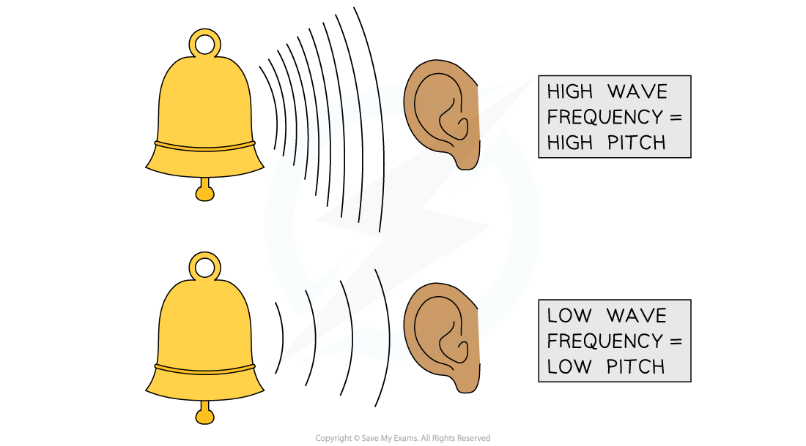
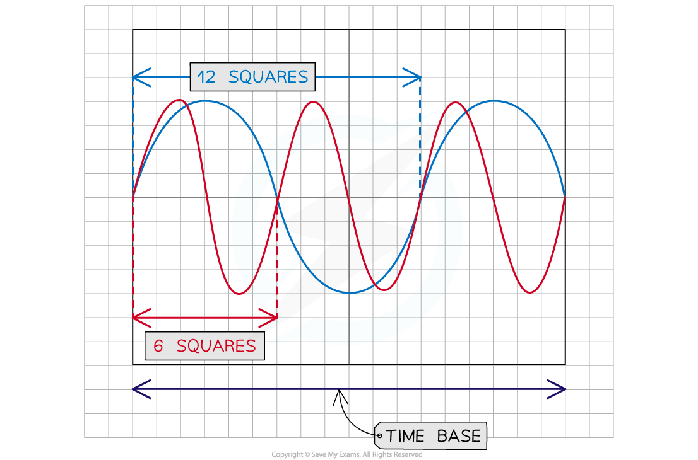
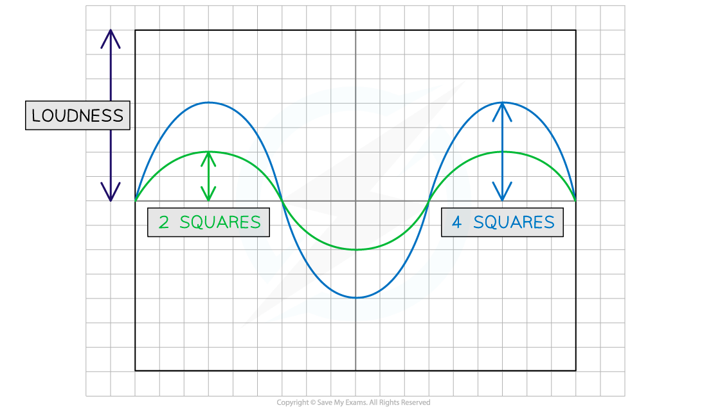
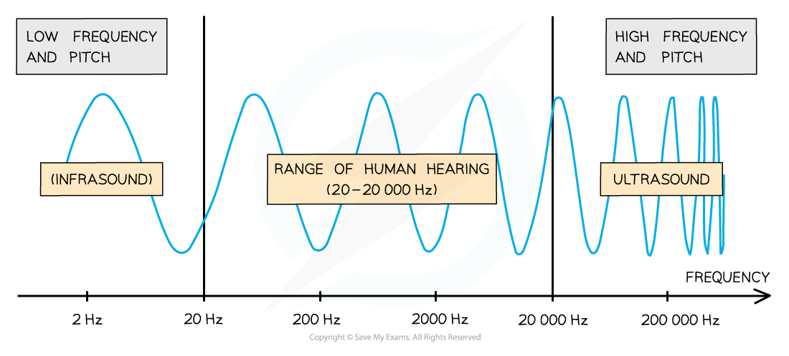

# Pitch & Loudness

## Pitch

> **Spec point** — `spcpt_QSKcgDy6JCnTqDzT` · understand how the pitch of a sound relates to the frequency of vibration of the source (physics only)

## Pitch

- The **pitch** of a sound is related to the **frequency** of the vibrating source of sound waves

  - If the **frequency** of vibration is **high**, the sound wave has a **high** **pitch**
  - If the **frequency** of vibration is **low**, the sound wave has a **low** **pitch**

#### The relationship between the pitch and frequency of sound

***The pitch of the sound is related to the frequency of the sound waves***

#### Comparing the pitch of sound displayed on an oscilloscope

***This image shows two sound waves displayed on an oscilloscope. The red wave has smaller wavelength than the blue wave hence it has higher frequency and higher pitch***

## Loudness

> **Spec point** — `spcpt_YDsZp4n4HY7MWYJq` · understand how the loudness of a sound relates to the amplitude of vibration of the source (physics only)

## Loudness

- The **loudness** of a sound is related to the **amplitude** of the vibrating source of sound waves

  - If the sound is **loud**, the sound wave has a **large** **amplitude**

#### Comparing the volume of sound displayed on an oscilloscope

***This image shows two sound waves displayed on an oscilloscope. The blue wave has twice the amplitude of the green wave because the blue wave is louder***

## Range of human hearing

> **Spec point** — `spcpt_ZZjrzGGJKRb9sdff` · know that the frequency range for human hearing is 20–20 000 Hz (physics only)

## Range of human hearing

- The human ear responds to the vibrations caused by sound waves
- The frequency range for human hearing is **20 Hz** to **20 000 Hz**

  - Below the frequencies that humans can hear is infrasound
  - Above the frequencies that humans can hear is ultrasound

#### The infrasound, human hearing and ultrasound frequency ranges

***The range of human hearing is between 20 – 20 000 Hz. Below 20 Hz is known as infrasound. Above 20 000 Hz is known as ultrasound***

> **Exam Hint**
> Remember that altering the frequency of a sound wave does not affect the volume, only the wave pitch. Changing the amplitude of the wave changes the volume.
