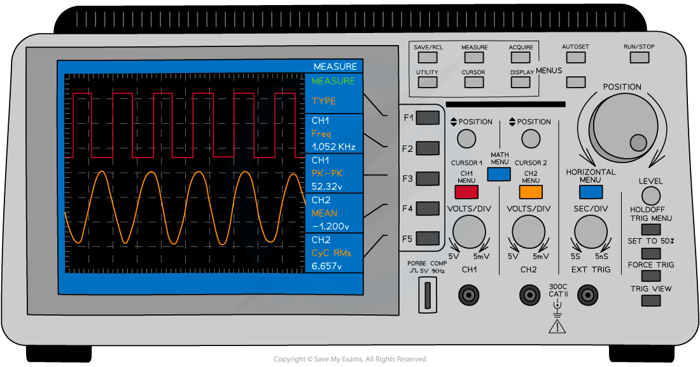
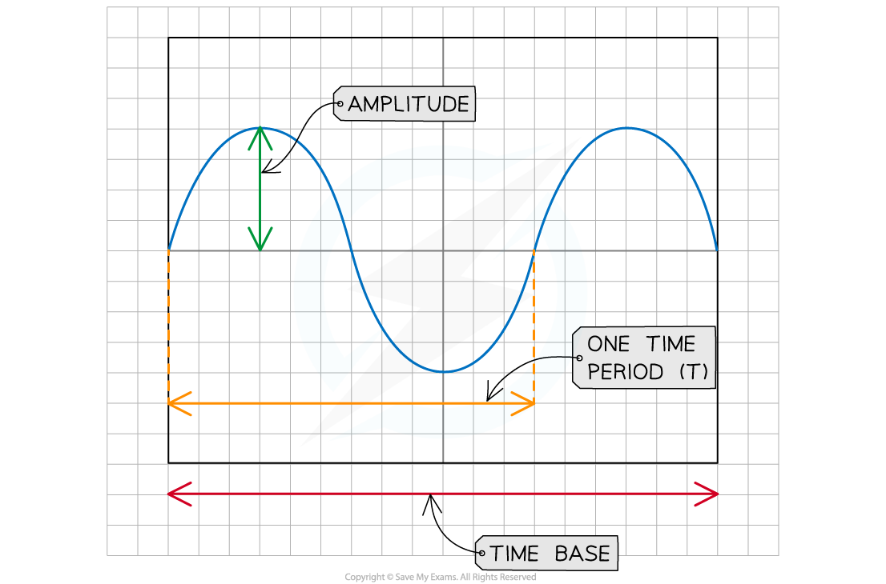

# Sound & Oscilloscopes

## Sound & oscilloscopes

> **Spec point** — `spcpt_gdVbJ224JHR76Jn6` · understand how an oscilloscope and microphone can be used to display a sound wave (physics only)

## Sound & oscilloscopes

- An **oscilloscope** is a device that can be used to study a rapidly **changing** **signal**, such as:

  - A **sound** **wave**
  - An **alternating** **current**

#### An oscilloscope is used to display sound as a waveform

***Oscilloscopes have lots of dials and buttons, but their main purpose is to display and measure changing signals like sound waves and alternating current***

- When a microphone is connected to an **oscilloscope**, the (longitudinal) sound wave is displayed as though it were a transverse wave on the screen

  - The properties of longitudinal and transverse waves are explained in the revision note [Transverse & longitudinal waves](https://www.savemyexams.com/igcse/physics/edexcel/modular/24/unit-2/revision-notes/waves/waves-the-electromagnetic-spectrum/transverse-longitudinal-waves/)
- The **time** **base** (like the 'x-axis') is used to measure the **time** **period** of the wave

#### An explanation of the sound waveform as displayed on an oscilloscope

***A sound wave is displayed as though it were a transverse wave on the screen of the oscilloscope. The time base can be used to measure a full time period of the wave cycle***

- The height of the wave (measured from the centre of the screen) is related to the **amplitude** of the sound The number of entire waves that appear on the screen is related to the **frequency** of the wave

  - If the frequency of the sound wave **increases**, **more** waves are displayed on screen

> **Exam Hint**
> Take time to understand how the oscilloscope displays sound as a waveform, as it is more complicated than you think. Make sure you know what happens to the wave if you change either the horizontal or vertical axis.
