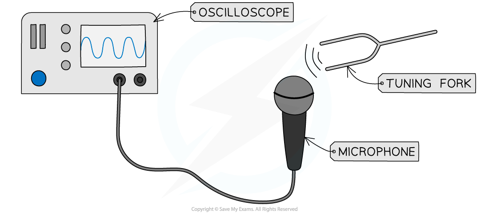
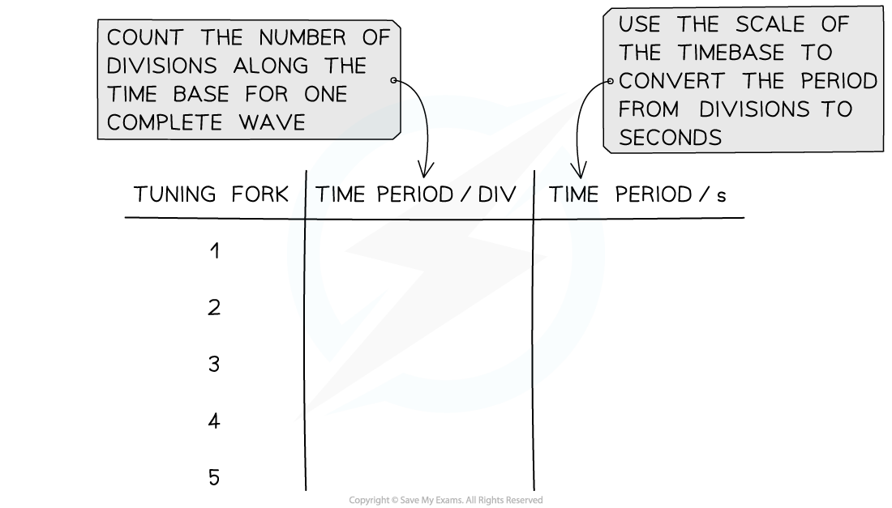

# Core Practical: Using an Oscilloscope

## Core practical 7: using an oscilloscope

> **Spec point** — `spcpt_3NWwZvMv6GzSJ334` · Core practical 7: investigate the frequency of a sound wave using an oscilloscope (physics only)

## Core practical 7: using an oscilloscope

### Aims of the experiment

- The aim of this experiment is to investigate the frequency of a sound wave using an oscilloscope

### Variables

- ***Independent variable*** = Tuning forks of different frequencies
- ***Dependent variable*** = Time period

### Equipment

#### Equipment List

| **Equipment** | **Purpose** |
|---|---|
| Tuning fork | To generate sound waves of different frequencies |
| Microphone | To detect sound waves from the tuning fork |
| Oscilloscope | To display the sound waves electronically |
| Wires | To connect the microphone to the oscilloscope |

### Method

#### A diagram of the oscilloscope and tuning fork set up

***Measuring the frequency of a sound wave using an oscilloscope***

1. Connect the microphone to the oscilloscope as shown in the image above
2. Test the microphone displays a signal by humming
3. Adjust the time base of the oscilloscope until the signal fits on the screen - ensure that multiple complete waves can be seen
4. Strike the tuning fork on the edge of a hard surface to generate sound waves of a pure frequency
5. Hold the tuning fork near to the microphone and observe the sound wave on the oscilloscope screen
6. Freeze the image on the oscilloscope screen, or take a picture of it
7. Measure and record the time period of the wave signal on the screen by counting the number of divisions for one complete wave cycle
8. Repeat steps 4-6 for a variety of tuning forks

### Results

#### An example results table of the oscilloscope display

#### Analysis of results

- To convert the time period of the wave from the number of divisions into seconds, use the scale of the time base. For example:

  - The time base is usually measured in units of ms/cm (milliseconds per centimetre)
  - This would mean a wave with a time base of 4 cm has a time period of 4 ms

- To calculate the frequency of the sound waves produced by the tuning forks, use the equation:

$f=\frac{1}{T}$

- This is explained in more detail in the revision note [The wave equation](https://www.savemyexams.com/igcse/physics/edexcel/modular/24/unit-2/revision-notes/waves/waves-the-electromagnetic-spectrum/wave-equation/)

### Evaluating the experiment

***Systematic Errors***:

- Ensure the scale of the time base is accounted for correctly

  - The scale is likely to be small (e.g. milliseconds) so ensure this is taken into account when calculating the time period

***Random Errors***:

- A cause of random error in this experiment is noise in the environment, so ensure it is carried out in a quiet location

> **Exam Hint**
> You have a lot of core practicals to know about. Make sure you don't get those relating to sound confused with each other. To succeed in questions about this particular practical you need to know exactly how an oscilloscope works. To do that revise this in the revision note about [Sound & oscilloscopes.](https://www.savemyexams.com/igcse/physics/edexcel/modular/24/unit-2/revision-notes/waves/sound/sound-oscilloscopes/)
