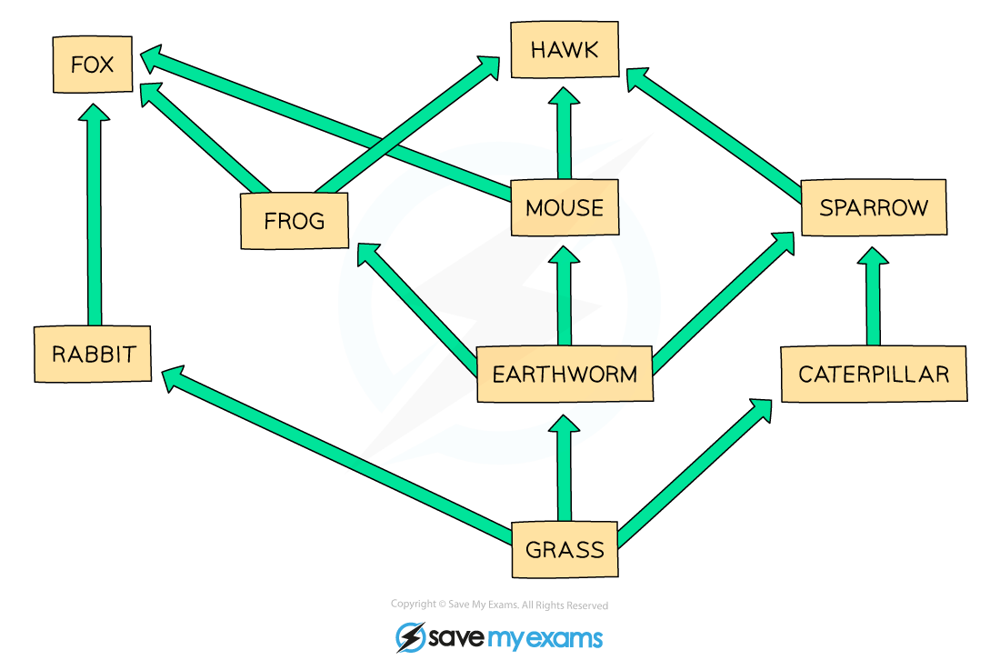
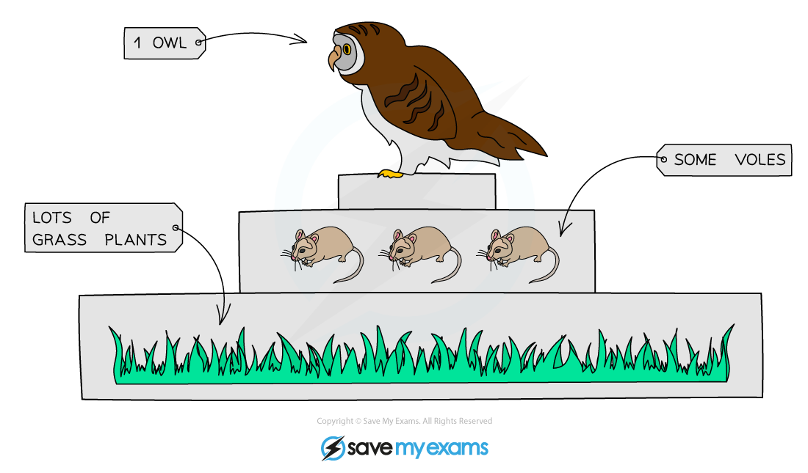
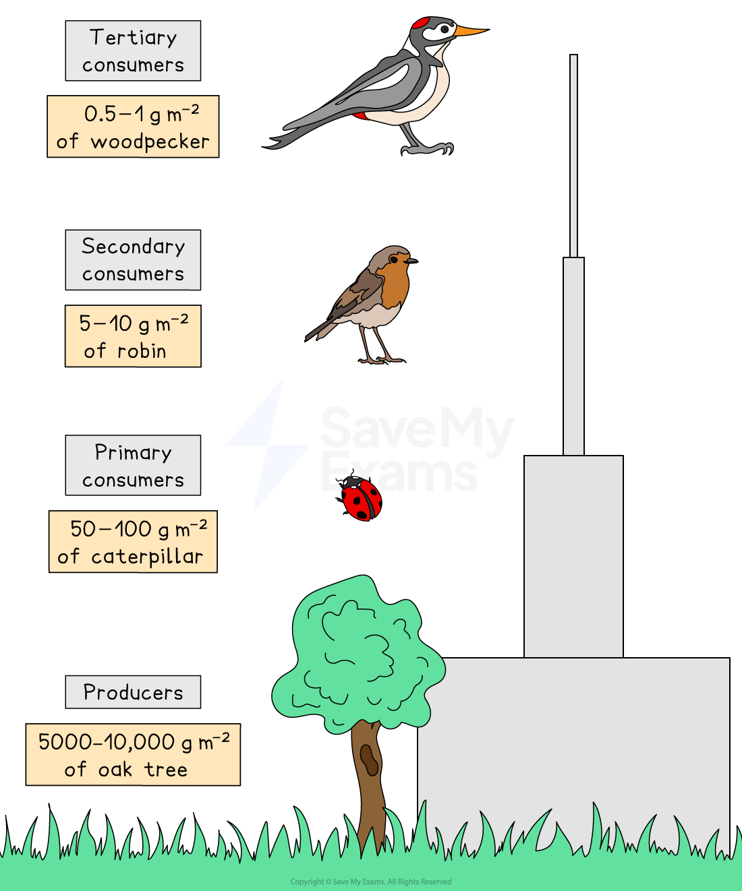
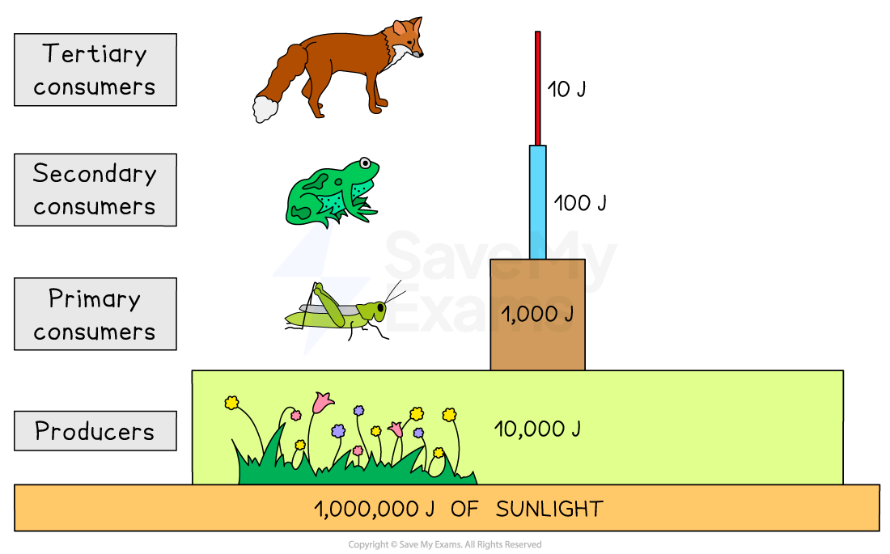

# Food chains, Food webs & Pyramids

## Food Chains

> **Spec point** — `spcpt_fDzzXZ3ThppGVySz` · understand the concepts of food chains, food webs, pyramids of number, pyramids of biomass and pyramids of energy transfer

## Food Chains

- Food chains are diagrams that show the** energy flow** between organisms in an ecosystem

  - The **arrows** in a food chain represent the** transfer of energy** between trophic levels
- **All food chains start with producers**; this is because they convert energy into a form that can be used by other organisms, e.g. plants convert light energy into chemical energy

***Food chains show the transfer of energy that occurs when organisms feed***

## Food Webs

> **Spec point** — `spcpt_bD2GJFkg664kHF64` · understand the concepts of food chains, food webs, pyramids of number, pyramids of biomass and pyramids of energy transfer

## Food Webs

- Food webs are networks of **interconnected food chains**
- Food webs can aid in the understanding of the **complexity of feeding relationships** in ecosystems

  - Note: within a food web an organism can be in different food chains and have a different trophic level for each

***Food web shows the complex feeding relationships within ecosystems***

- A change in one population within a food web can affect other populations, e.g. for the food web above **a decrease in the rabbit population **might lead to:

  - an increase in grass growth, due to decreased feeding
  - a decrease in the fox population, due to reduced food availability
  - an increase in caterpillars and earthworms, due to increased growth of grass
  - a decrease in the frog and mouse populations, as foxes would need to compensate for the reduction in rabbits

> **Exam Hint**
> Exam questions about food webs are common, so be sure that you know how to follow chains of events through each food chain within a food web.
> 
> When describing events in a food web it is a good idea to avoid stating that an animal or plant population would ‘die out’, as this is unlikely to happen; you should instead state to increases or decreases in population size.

## Food Pyramids

> **Spec point** — `spcpt_Gwc6PDhdC6dzwQpN` · understand the concepts of food chains, food webs, pyramids of number, pyramids of biomass and pyramids of energy transfer

## Food Pyramids

### Pyramids of numbers

- Pyramids of numbers show **how many organisms** are present at each trophic level of a food chain

  - The **size of each bar** indicates the **number of organisms** present
- A food chain containing three organisms can be represented in a pyramid of numbers with three bars:

**grass → vole → owl**

***The bars in a pyramid of numbers indicate the number of organisms present at each trophic level***

- In some food chains many small organisms may feed on few large organisms; in this case a pyramid of numbers will **not be pyramid shaped**
- E.g. for the food chain:

**oak tree → caterpillar → robin → woodpecker**

### Pyramids of biomass

- Pyramids of biomass show **the mass of living organisms** present at each level of a food chain

  - Biomass = mass of living matter
- Pyramids of biomass are **always pyramid-shaped**; this is because the **available biomass always decreases** at higher trophic levels of a food chain
- E.g. for the same food chain shown above:

**oak tree → ladybird → woodpecker**

*The bars in a pyramid of biomass represent the mass of living matter at each trophic level of a food chain, and are always pyramid shaped*

### Pyramids of energy

- Pyramids of energy illustrate the **stored energy within the biomass** at each trophic level
- As with pyramids of biomass, pyramids of energy are **always pyramid-shaped**

  - This is because [energy is lost from food chains](https://www.savemyexams.com/igcse/biology/edexcel/19/revision-notes/4-ecology--the-environment/feeding-relationships/4-9-energy-loss-between-trophic-levels/) at each trophic level
- E.g. for the food chain:

**grass → snail → frog → wolf**

*Pyramids of energy show the stored energy at each trophic level of a food chain; they are always pyramid shaped*

### Drawing food pyramids

- When drawing any type of food pyramid, there are several conventions that should be followed:

  - the trophic levels of the organisms must stay in the same order as in the food chain, with **producers at the bottom**, followed by primary consumers, then secondary consumers, then tertiary consumers etc.
  - **each bar must be labelled** to indicate the trophic level
  - the **length/width of a bar** reflects the unit represented by the pyramid; a longer/wider bar indicates:
  
    - more organisms
    - greater biomass
    - more stored energy
  - bars should be the **same height**
  - if graph paper is provided then bars should be **drawn to scale**

> **Exam Hint**
> Remember that pyramids of biomass and energy are always pyramid-shaped, but pyramids of number can be any shape, depending on the size of the organisms involved.
