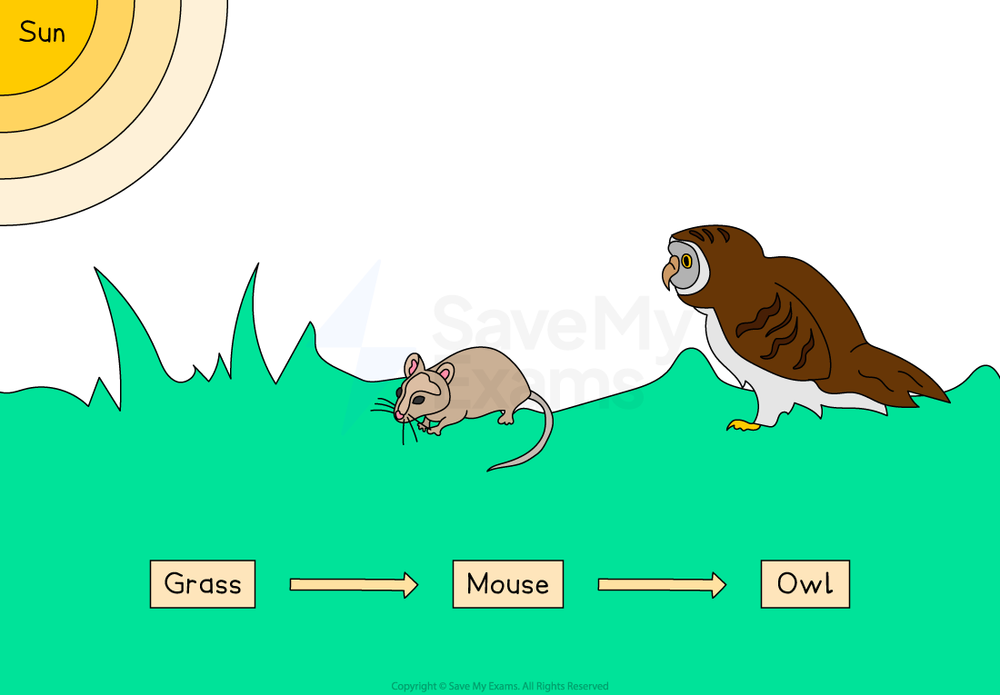

# Transfers Along a Food Chain

## Transfer of Energy

> **Spec point** — `spcpt_36P8TTMv4np6sC47` · understand the transfer of substances and energy along a food chain

## Transfer of Energy

- Light energy from the **sun** enters the **first trophic level** of food chains when **producers** convert **light energy into chemical energy**

  - Light energy is transferred to chemical energy in the form of **carbon-containing compounds** within the **biomass **of producers
- Energy and chemical substances are then **transferred through food chains** when:

  - **primary consumers** eat producers, breaking down the carbon compounds within their biomass and using the energy and substances released to **build new biomass** within their own tissues
  - **secondary consumers** eat primary consumers, again breaking down the molecules that make up their biomass and using the energy and substances to build their own tissues
  - this process is repeated at each trophic level
- Some energy and substances are [lost to the environment](https://www.savemyexams.com/igcse/biology/edexcel/19/revision-notes/4-ecology--the-environment/feeding-relationships/4-9-energy-loss-between-trophic-levels/) between trophic levels

***Energy and chemical substance are transferred through food chains when organisms consume other organisms***

## Energy Loss Between Trophic Levels

> **Spec point** — `spcpt_JT7x333mqB58NfGS` · understand why only about 10% of energy is transferred from one trophic level to the next

## Energy Loss Between Trophic Levels

- When organisms consume other organisms, not all of the stored energy is passed to the next trophic level; **only around 10%** of the energy available at each trophic level is **converted into biomass** at the next level

  - This explains why food chains are short; the energy available eventually becomes too small to support another trophic level

***Energy is lost at each trophic level of a food chain***

### Explaining energy loss from food chains

- Energy may be lost from food chains because consumers are **not able to digest and absorb** all of the chemical energy stored in food organisms

  - Organisms** rarely eat every part** of the organism they are consuming, e.g. many predators do not consume the bones, fur, teeth or claws of their prey, so energy stored in uneaten body parts does not pass to the consumer
  - **Not all the ingested material is digested** and absorbed, some is egested as **faeces**, e.g. plant material can be difficult to digest and passes through the digestive system of herbivores
- Once a consumer has digested and absorbed its food, **not all of the energy will be converted to biomass**; energy may be unavailable for building biomass due to:

  - **Heat loss** during respiration, movement
  - Excretion e.g. urea (a metabolic waste product of protein breakdown)
  - death and decomposition

### Calculating the efficiency of energy or biomass transfer

- You may be asked to calculate the efficiency of energy and biomass transfers between trophic levels using percentages

> **Worked Example**
> The food chain below contains four trophic levels, and indicates the total biomass present at each level.
> 
> 
> 
> Calculate the efficiency of biomass transfer from the first to the second trophic level. Give your answer to 3 significant figures.
> 
> Use the equation:
> 
> $\mathrm{percentage} \mathrm{efficiency}=\frac{\mathrm{biomass} \mathrm{in} \mathrm{higher} \mathrm{trophic} \mathrm{level}}{\mathrm{biomass} \mathrm{in} \mathrm{lower} \mathrm{trophic} \mathrm{level}}\times100$
> 
> **Answer**
> 
> **Step 1: determine the biomass of the first and second trophic levels**
> 
> - first trophic level = clover = 1450 kg
> - second trophic level = snails = 138 kg
> 
> **Step 2: calculate percentage efficiency: **
> 
> 

> **Exam Hint**
> Note that **energy** and **biomass** are very closely related (energy is stored within the biomass of an organism); this means that:
> 
> - efficiency of energy transfer can be calculated in exactly the same way as efficiency of biomass transfer
> - loss of energy results in loss of biomass at each trophic level
