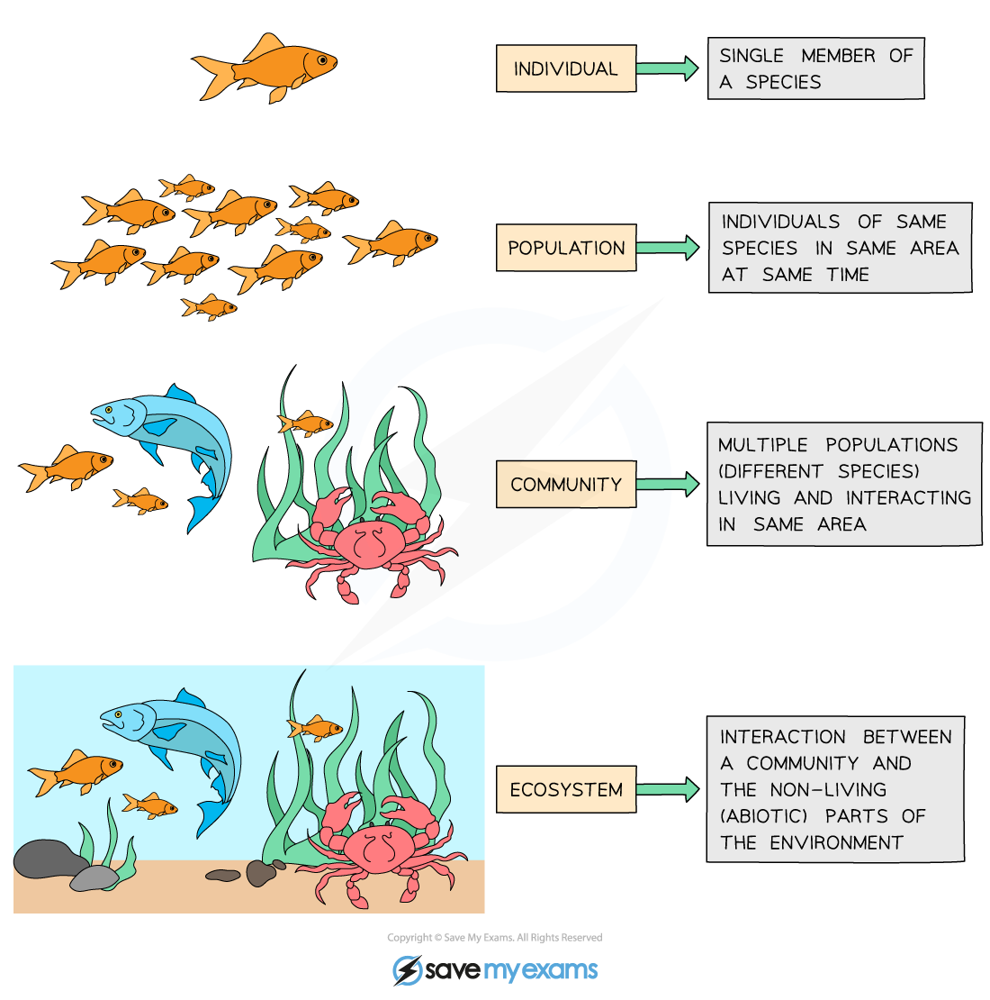

# Population, Community, Habitat & Ecosystem

## Key Terms in Ecology

> **Spec point** — `spcpt_4msqx3nb8mWrDpPN` · understand the terms population, community, habitat and ecosystem

## Key Terms in Ecology

- There are several key terms that we use when referring to the various different components of an ecosystem and their levels of organisation:

  - **A population **is defined as a group of organisms of the **same species** living in the **same place** at the** same time**
  - **A community** includes **all** of the **populations** living in the **same area** at the **same time**
  
    - Within a community, each species depends on other species for food, shelter, pollination, seed dispersal etc
    - If one species is removed it can affect the **whole community**
  - **A habitat** is the place where an **organism lives**
  
    - E.g. badgers, deer, oak trees and ants are all species that would live in a woodland habitat
  - **An ecosystem** is defined as all the **biotic factors** and all the **abiotic factors** that interact within an area at one time
  
    - The term 'biotic factors' includes all the **living** components such as plants and animals
    - The term 'abiotic factors' includes all the** non-living** components such as light intensity, mineral ions, water availability
    - Ecosystems can **vary greatly in size and scale**
    
      - A small ecosystem might be a garden pond
      - A large ecosystem might be the whole of Antarctica

***Levels of organisation in an ecosystem***
