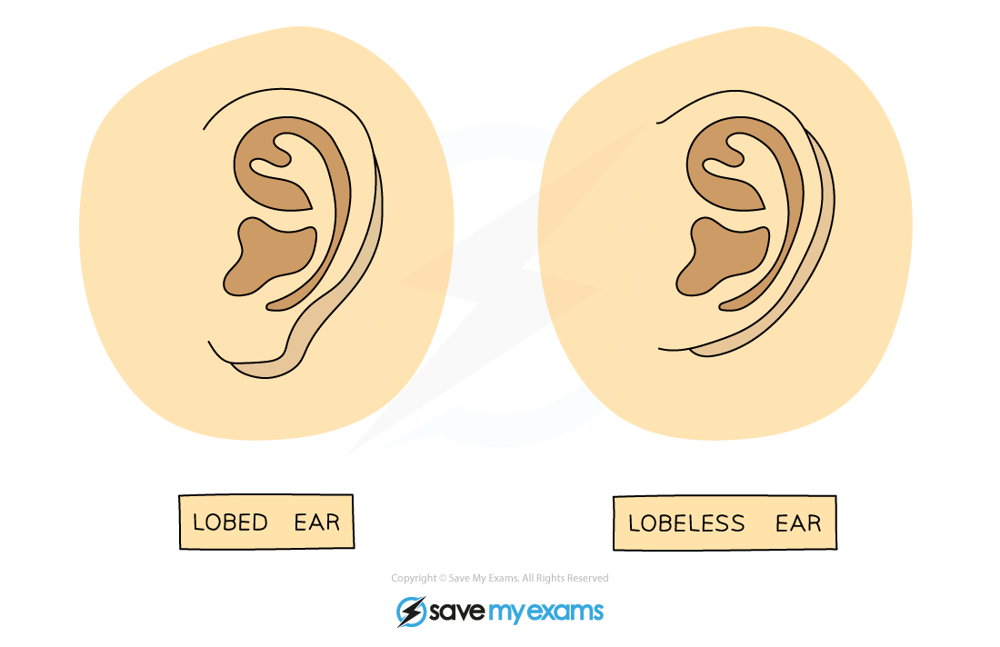

# Random Fertilisation & Genetic Variation

## Random Fertilisation & Genetic Variation

> **Spec point** — `spcpt_YjqqHz4bsrg7bGzN` · understand how random fertilisation produces genetic variation of offspring

## Random Fertilisation & Genetic Variation

- Meiosis creates **genetic** variation **between the gametes** produced by an individual
- This means each gamete carries substantially **different alleles**
- During **fertilisation**, any male gamete can fuse with any female gamete to form a zygote
- This **random fusion of gametes at fertilisation creates genetic variation between zygotes** as each will have a unique combination of alleles
- Zygotes eventually grow and develop into adults
- Examples of genetic variation in humans include:

  - Blood group
  - Eye colour
  - Ability to roll tongue
  - Whether ear lobes are free or fixed

***Whether earlobes are attached (lobeless) or free (lobed) is an example of genetic variation***
