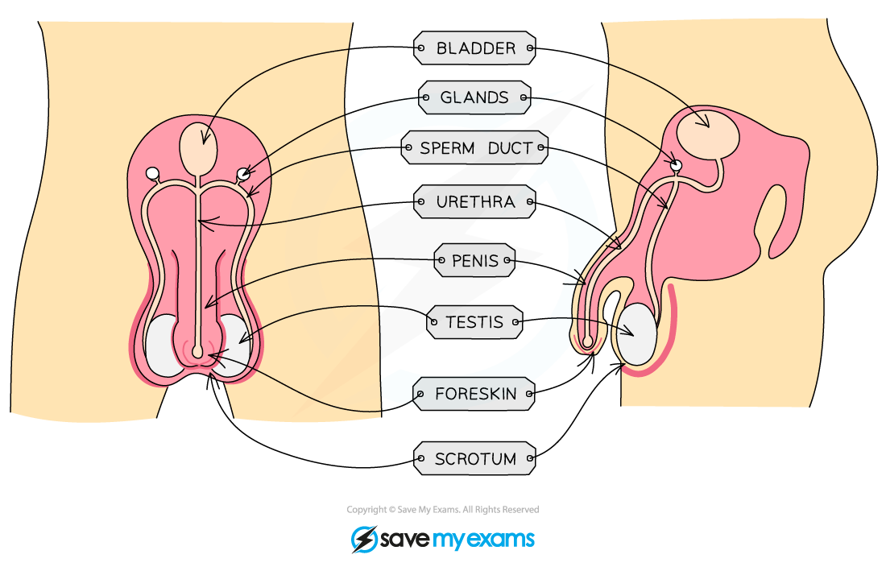
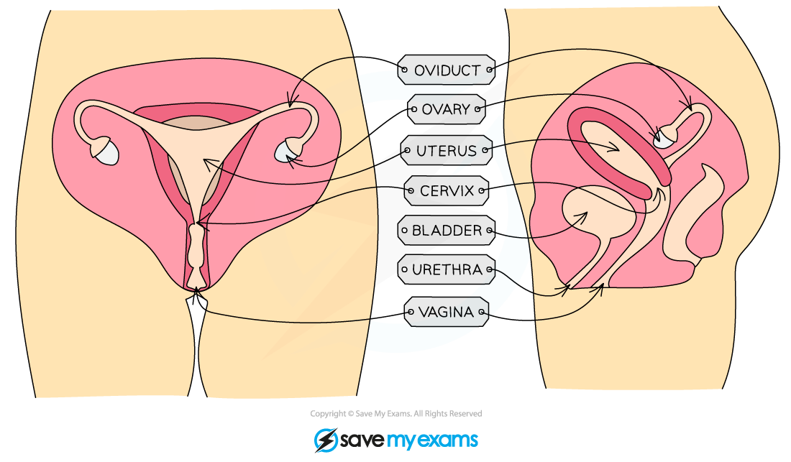

# Human Reproductive Systems

## The Male Reproductive System

> **Spec point** — `spcpt_ygHSD2zT3mp3qPHk` · understand how the structure of the male and female reproductive systems are adapted for their functions

## The Male Reproductive System

- The male reproductive system consists of several key components:

  - **Sperm duct**: Sperm passes** through the sperm duct **to be mixed with fluids produced by the glands before being passed into the urethra for ejaculation
  - **Urethra**: Tube running down the centre of the penis that can carry **urine or semen**. A ring of muscle in the urethra prevents them from mixing
  - **Testis**: Contained in a bag of skin (scrotum) and** produces sperm **(male gamete) and** testosterone** (hormone)
  - **Scrotum**:** Sac supporting the testes **outside the body to ensure sperm are kept at a temperature slightly lower than body temperature
  - **Penis**: Passes** urine **out of the body from the bladder and allows semen to pass into the vagina during sexual intercourse

#### Diagram of the male reproductive system

## The Female Reproductive System

> **Spec point** — `spcpt_gV7Fq3ZDjWX5638m` · understand how the structure of the male and female reproductive systems are adapted for their functions

## The Female Reproductive System

- The female reproductive system consists of several key components:

  - **Oviducts**: Connects **ovary** to the** uterus**, lined with ciliated cells to push released ovum, fertilisation occurs here
  - **Ovaries**: Contains **ova** (female gametes) that mature and develop when hormones are released
  - **Uterus**: **Muscular sac** with soft lining where embryo implants to develop into foetus
  - **Cervix**: **Ring of muscle **at the lower end of the uterus to keep the developing foetus in place during pregnancy
  - **Vagina**: Muscular tube leading to inside of woman's body, where male's penis enters and sperm are deposited during intercourse

#### Diagram of the female reproductive system

