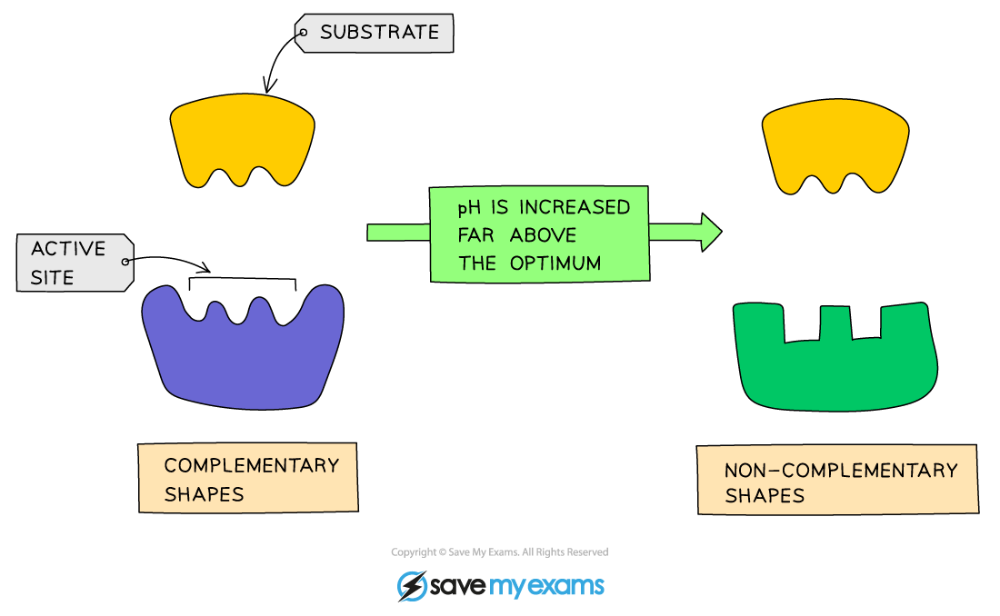

# pH & Enzyme Function

## Factors Affecting Enzyme Action: pH

> **Spec point** — `spcpt_m7vwgZhD22s9hX5J` · understand how enzyme function can be affected by changes in pH altering the active site

## Factors Affecting Enzyme Action: pH

- The **optimum **pH for most enzymes is 7

  - Some enzymes that are produced in acidic conditions, such as the stomach, have a lower optimum pH (pH 2)
  - Some that are produced in alkaline conditions, such as the duodenum, have a higher optimum pH (pH 8 or 9)
- If the **pH is too high or too low**, the **bonds** that hold the amino acid chain together to make up the protein can be **disrupted/destroyed**
- This will **change the shape of the active site**, so the **substrate can no longer fit** into it, reducing the rate of activity
- Moving too far away from the optimum pH will cause the enzyme to denature and activity will stop

***Effect of pH on enzyme activity***

***Graph showing the effect of pH on the rate of activity for an enzyme from the duodenum***

> **Exam Hint**
> Remember the terminology when writing about enzymes is very important. Make sure you refer to an enzyme becoming 'denatured' not 'dying'.Being able to describe AND explain the effect of each environmental condition on enzyme action is key.Practise describing and explaining using the graphs and then check your descriptions against your notes.
