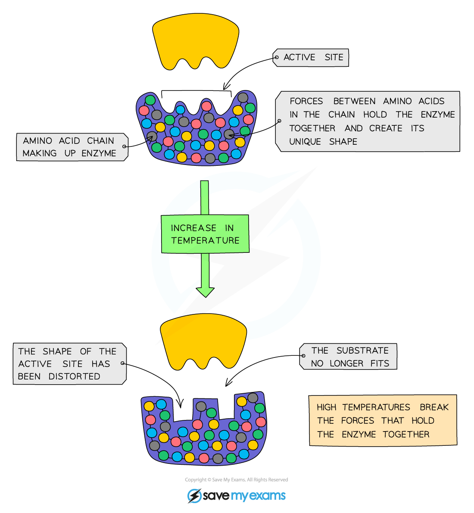
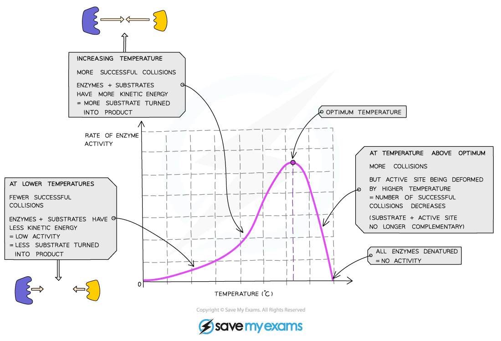

# Temperature & Enzyme Function

## Factors Affecting Enzyme Action: Temperature

> **Spec point** — `spcpt_x4Z3XtDZxHx4gr6v` · understand how temperature changes can affect enzyme function, including changes to the shape of active site

## Factors Affecting Enzyme Action: Temperature

- Enzymes are **proteins** and have a **specific shape**, determined by the **amino acids** that make the enzyme and held in place by **bonds**
- This is extremely important around the **active site** as the specific shape is what ensures the **substrate will fit into the active site** and enable the reaction to proceed
- Enzymes work fastest at their ‘**optimum temperature**’

  - In the human body, the optimum temperature is 37⁰C
- Heating to high temperatures (beyond the optimum) will **break the bonds** that hold the enzyme together and it will lose its shape

  - This is known as **denaturation**
- Substrates cannot fit into denatured enzymes as the shape of their active site has been lost
- Denaturation is **irreversible** - once enzymes are denatured they cannot regain their proper shape and activity will stop

***Effect of temperature on enzyme activity***

- Increasing the temperature towards the optimum increases the activity of enzymes as **the more kinetic energy the molecules have the faster they move and the number of collisions with the substrate molecules increases**, leading to a faster rate of reaction
- This means that **low temperatures do not denature enzymes**, they just make them work more slowly due to a lack of kinetic energy

***Graph showing the effect of temperature on the rate of enzyme activity***
