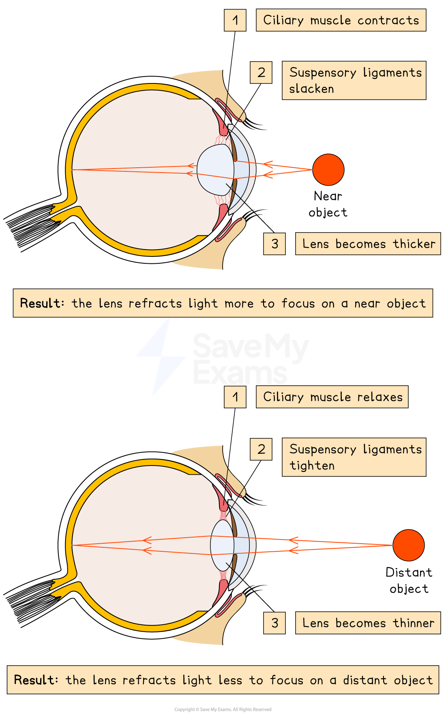
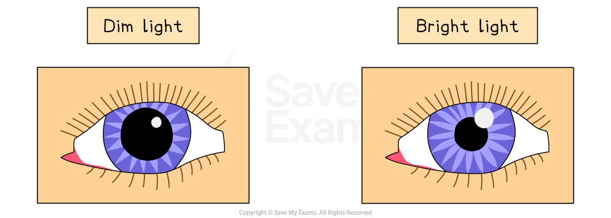
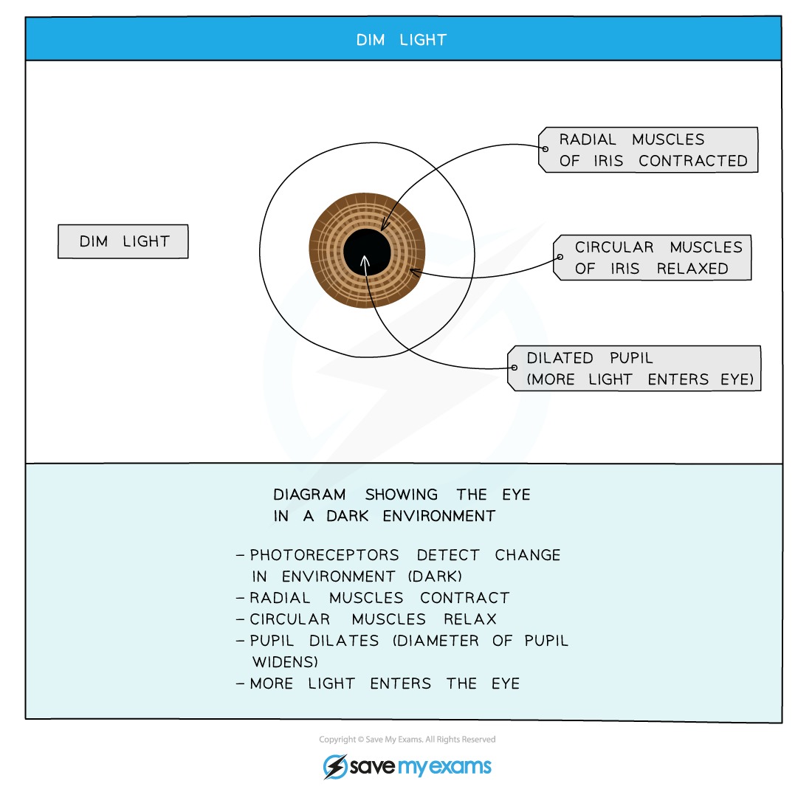
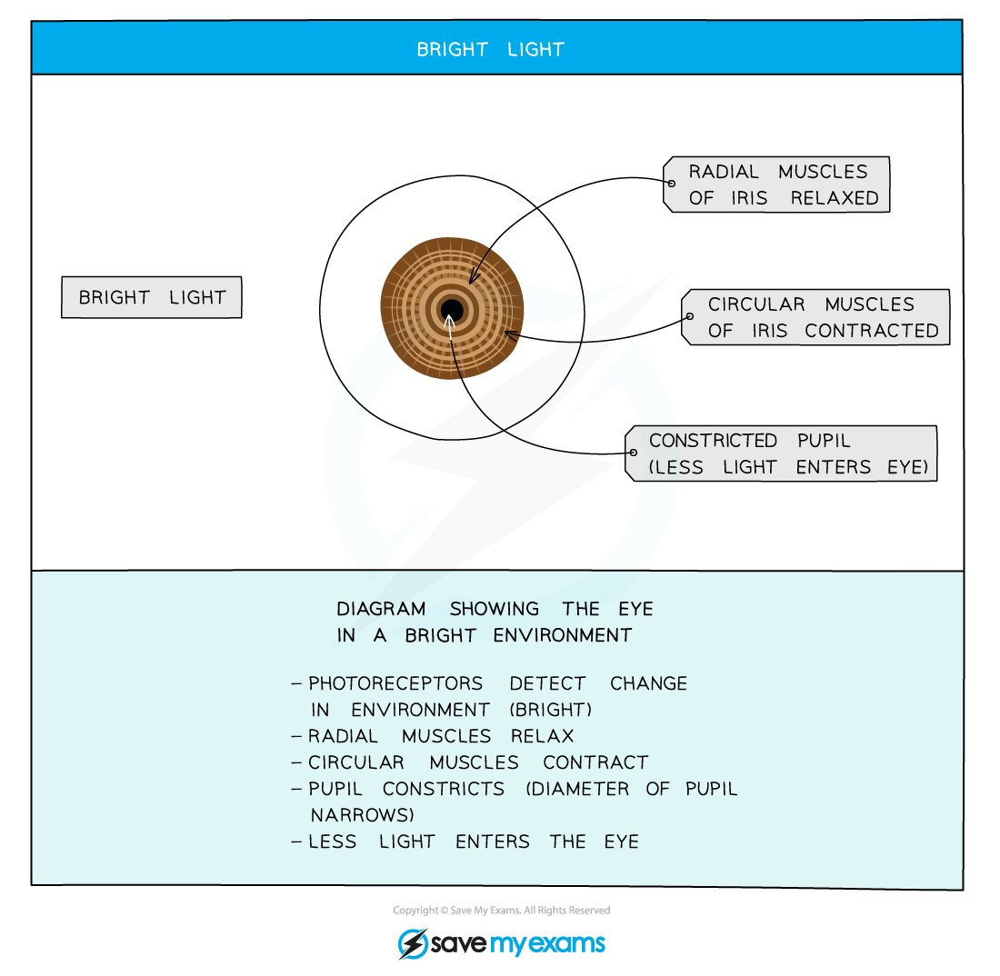

# The Human Eye: Function

## The Human Eye: Function

> **Spec point** — `spcpt_7JgzcsxZ3VW8Xqjf` · understand the function of the eye in focusing on near and distant objects, and in responding to changes in light intensity

## The Human Eye: Function

### The function of the eye in focusing on near and distant objects

- The way the **lens** brings about** fine focusing** is called **accommodation**
- The lens is **elastic** and its shape can be changed when the **suspensory ligaments **attached to it become **tight** or **loose**
- The changes are brought about by the **contraction** or **relaxation** of the **ciliary muscles**
- When an object is **close up**:

  - The ciliary muscles contract (the ring of muscle decreases in diameter)
  - This causes the suspensory ligaments to loosen
  - This stops the suspensory ligaments from pulling on the lens, which allows the lens to become thicker
  - Light is refracted more
- When an object is **far away**:

  - The ciliary muscles relax (the ring of muscle increases in diameter)
  - This causes the suspensory ligaments to tighten
  - The suspensory ligaments pull on the lens, causing it to become thinner
  - Light is refracted less

#### Focusing on distant and near objects table

|   | **Near objects** | **Distant objects** |
|---|---|---|
| **Ciliary muscles** | Contract | Relax |
| **Suspensory ligaments** | Loose / slack | Tight / taut |
| **Lens shape** | Fatter | Thinner |
| **Light refraction** | More | Less |

> **Exam Hint**
> A common mistake is to refer to the suspensory ligaments contracting and relaxing. This is incorrect because suspensory ligaments are not muscles. You must say that the ligaments tighten or loosen/slacken instead.

### The function of the eye in responding to changes in light intensity

- The** pupil reflex** is a **reflex action** carried out to **protect the retina from damage**

  - In **dim light,** the pupil **dilates** (widens) in order to allow as much light into the eye as possible to improve vision
  - In **bright light,** the pupil **constricts** (narrows) in order to prevent too much light from entering the eye and damaging the retina

| **Stimulus** | **Radial muscles** | **Circular muscles** | **Pupil size** | **Light entering eye** |
|---|---|---|---|---|
| Bright light | Relaxed | Contracted | Narrow | Less |
| Dim light | Contracted | Relaxed | Wide | More |
